# XHyper EL2 内建 virtio 框架设计（Gunyah 对标，路径 A 复活）

- 日期：2026-09-23
- 状态：设计稿（待评审）
- 目标仓库：`10.42.27.86:/media/test/USR-DATA/work/2030/gunyah/xhyper`（EL2 框架）+ `xhyper-mgr`（唤醒休眠脚手架）+ `xhyper-abi`（Stage 3 扩展）
- 实施环境：`xhyper-dev:2026.08` 容器，QEMU 10.2.1，AArch64 virt，Rust 1.95
- 插图：下文 Mermaid 图需支持 Mermaid 的 Markdown 预览（GitHub / VS Code Markdown Preview Mermaid 等）
- 验证基线：xhyper `main@d67e6f5e`、xhyper-mgr `main@0a39089`、xhyper-abi
  `main@cba464c`（2026-09-23 拉新后复核；早期基于 detached HEAD 的结论已修正）

---

## 1. 背景与证据基础

### 1.1 xhyper 现状：两条 virtio 路径

- **路径 B（活跃）**：EL2 不碰 virtio，`crosvm`（Host VM 用户态）全套仿真；guest MMIO 触发
  `FaultKind::Vmmio` → `VCPU_RUN` 状态退出 → crosvm 回填（`hypervisor/memory/address_space/src/fault.rs`
  的 `ResumeRequest::vmmio_read/write`）。phase-d4-2 已验证 virtio-blk。
- **路径 A（休眠）**：Gunyah 式"EL2 内建框架 + RM 管 backend 对象"。
  `xhyper-abi/src/operation.rs` 已有管理面 hypercall 封装；`xhyper-mgr-core/src/domains/`
  有 `VirtioMmioRecord` / `VirtioBackendResourceProjection` / `secondary_configuration`
  的 `VirtioMmio`/`VirtioPci`/`VirtioIommu` 配置项（默认 `Unavailable`）；
  EL2 侧 `hypervisor/` 全树零实现。

本设计复活路径 A，与路径 B 以 feature-gate 并存。

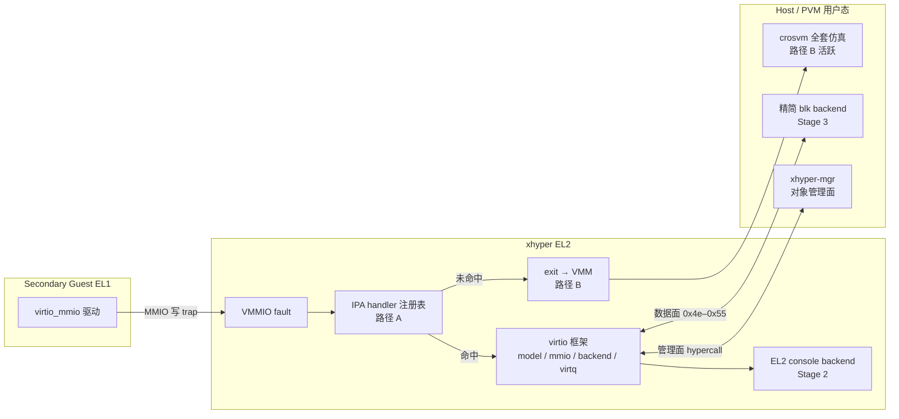

> 读图：guest 的 MMIO 访问先经 EL2 查表；命中走路径 A（框架内处理），未命中保持路径 B（exit 给 crosvm）。两条路用 `CONFIG_HYPERVISOR_VIRTIO` 并存。注意：路径 A 区**读不 trap**（guest Stage-2 RO 映射直读，见 Stage 0 时序图），只有写 fault；路径 B 区读写都 exit。


### 1.2 Gunyah 事实（已逐文件验证，修正此前调研的两处偏差）

1. **`virtio_input` / `virtio_iommu` 的 backend 逻辑在 EL2 内部**，不在 RM VM。
   证据：`hyp/vm/virtio_input/src/hypercalls.c` 的 `hypercall_virtio_input_configure`
   是 EL2 侧 handler（`cspace_lookup_virtio_backend` + 直接操作 `virtio_backend_t`）。
   RM 经 hypercall 配置并注入事件。
2. **RM（resource-manager）没有设备 backend 实现**。`resource-manager/src/` 里
   virtio 相关仅出现在 `vm_config/vm_config.c`（33 处引用，管理面：按 VM 配置
   创建/配置/激活 virtio backend 对象）。
3. 结论：开源 Gunyah = **EL2 框架（生产级）+ RM 对象管理（生产级）+ EL2 内
   两个简单 backend（input/iommu）**；blk/net/gpu 的 backend **无 OSS 实现**，
   生产形态是 HLOS 用户态进程走同一套 hypercall ABI。

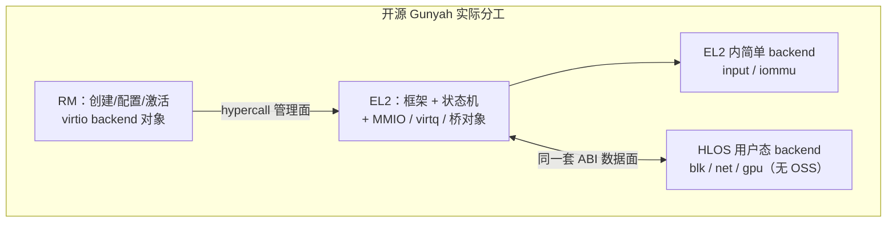

> 修正点：backend「干活」多半在 EL2 或 HLOS；RM 不当设备驱动。xhyper Stage 2 对标 input（EL2 内），Stage 3 对标生产 blk（用户态 + ABI）。


### 1.3 ABI 基准（已冻结的合同）

Gunyah `hyp/interfaces/virtio_backend/virtio_backend.hvc`（call_num 为权威编号）：

| call_num | hypercall | 方向 | 作用 |
|---|---|---|---|
| — | `partition_create_virtio_backend` | RM→EL2 | 在 partition cspace 里创建对象 |
| 0x49 | `virtio_backend_configure` | RM→EL2 | transport 类型/memextent/vqs_num/flags |
| 0x4c | `virtio_backend_bind_virq` | RM→EL2 | frontend vIRQ 绑 VIC |
| 0x4d | `virtio_backend_unbind_virq` | RM→EL2 | 解绑 |
| 0x4e | `virtio_backend_notify` | backend→EL2 | 置 interrupt_status/触发 config 更新 |
| 0x4f | `virtio_backend_set_dev_features` | backend→EL2 | 设备 feature 字（须待复位） |
| 0x50 | `virtio_backend_set_queue_size_max` | backend→EL2 | 每 VQ 最大长度（须待复位） |
| 0x51 | `virtio_backend_get_drv_features` | backend→EL2 | 取驱动协商的 feature |
| 0x52 | `virtio_backend_get_queue_info` | backend→EL2 | 取 VQ size/ready/desc/drv/dev |
| 0x53 | `virtio_backend_get_notification` | backend→EL2 | 取 vqs_bitmap + reason（拉模型） |
| 0x54 | `virtio_backend_acknowledge_reset` | backend→EL2 | 确认复位完成 |
| 0x55 | `virtio_backend_update_status` | backend→EL2 | 后端改 status（如 NEEDS_RESET） |

**ABI 现状**（2026-09-23 按最新代码复核，修正早期调研结论）：

- **定义层完整**：xhyper-abi 冻结快照（`generated/hypercalls.rs`）已含全部
  11 条 `virtio_backend_*`（0x49–0x55，管理面 + 数据面），编号与 Gunyah
  逐条一致；`virtio_backend_notify_reason`（new_buffer / reset_request /
  driver_ok / failed）等位域类型一比一移植。xhyper 的 `hypervisor/abi`
  crate include 的正是这份快照——**EL2 侧派发常量已可用**。
- **消费层缺口**：xhyper-mgr 内嵌的 `crates/xhyper-abi`（operation.rs）
  只封装管理面；数据面封装缺（mgr 正在迁移到共享 codegen 输出，
  `abi: Consume shared codegen outputs` 等提交已在铺路）。
- **实现层缺口**：EL2 runtime 分发表里没有任何 `VIRTIO_BACKEND_*`
  handler（grep 零命中）。

### 1.4 Gunyah 参考实现（C 版逐行对照物）

| Gunyah 模块 | 行数 | 职责 | Rust 落点（本设计） |
|---|---|---|---|
| `hyp/vm/virtio/src/frontend.c` | 617 | virtio_t 状态机 + Frontend API | `virtio/model` + `virtio/mmio` |
| `hyp/vm/virtio/src/backend.c` | — | Backend API（供 RM/backend 推进状态） | `virtio/model` + hypercall 层 |
| `hyp/vm/virtio_mmio/` | — | MMIO transport + trap 入口 + banked 寄存器 | `virtio/mmio` + vdevice 派发 |
| `hyp/vm/virtio_virtq/` | 201 | 描述符链遍历 + used 回写 + release fence | `virtio/virtq`（基于 useraccess） |
| `hyp/vm/virtio_backend/` | 223 | 桥对象：reason 位图 + virq 通知 | `virtio/backend`（接 object model） |
| `hyp/vm/virtio_pci/` | 382 | PCI transport（BAR/cap/MSI-X） | **不做**（非目标） |

---

## 2. 目标与非目标

### 目标

1. xhyper EL2 内建 virtio 框架：状态机 + MMIO transport + backend 桥对象 + virtq
   辅助，**逐条匹配 1.3 的 ABI 语义**（管理面优先，数据面语义按 Gunyah 行为实现为
   内部 API，Stage 3 再对 ABI 外发）。
2. MMIO transport only。
3. 首个真实 backend：**virtio-console，完全在 EL2 内**（对标 virtio_input 形态）。
4. 第二个：**virtio-blk，backend 放 Host/PVM 用户态精简进程**（走 hypercall，不是
   crosvm 全套），同时补异步通知（ioeventfd/irqfd 等价物）。
5. 与 crosvm 路径 B 通过 Kconfig feature-gate 并存，路径 B 既有门禁零回归。

### 非目标

- VPCI / virtio-pci（xhyper-abi 有 `vpci_*` 也先不动；Gunyah 自己 pci 路径的
  `virtio_ack_features_ok` 都是 `ERROR_UNIMPLEMENTED`）。
- virtio-iommu（EL2 backend 复杂度上限参照，Gunyah 侧 1600+ 行：硬依赖
  `platform/smmuv3` 物理 SMMU，把 guest 的 ATTACH/MAP/UNMAP 翻译成 STE/CD/TLB
  编程；QEMU virt 无 SMMUv3，无验证载体。N80/N90 有 Phytium SMMU 后再评估）。
- mgr 内嵌块设备/网络栈（方案 C 已否决：no_std 写驱动栈是重量级错误方向）。
- 替换或禁用路径 B。
- virtio-net/gpu 等其它设备（Stage 4 按需）。

### 成功标准

- Stage 2 结束：Secondary guest Linux 标准 `virtio_mmio` 驱动 probe 成功、
  feature 协商到 `DRIVER_OK`、`/dev/hvc0` 双向可交互，全链路不依赖任何 VM。
- Stage 3 结束：guest 内 ext4 读写回读（对齐 phase-d4-2 的验证强度）+ IOPS
  基准显著优于同步 exit 模式。
- 全程：`make phase-d4-verify` 及既有门禁在 feature 关闭时不变绿转红。

---

## 3. 分阶段总体设计

```text
Stage 0  基建：EL2 MMIO 派发框架（vdevice 等价物）+ 只读 mirror 映射
Stage 1  框架：virtio_t 状态机 + mmio transport + backend 桥 + virtq + 管理面 hypercall
Stage 2  首个 backend：virtio-console（EL2 内），端到端验证
Stage 3  virtio-blk：Host 用户态 backend 进程 + 数据面 ABI 扩展 + 异步通知
Stage 4  （展望）net 等设备、VPCI、需求驱动
```

每阶段独立可验证、风险递进；Stage 0/3 的基建（MMIO 派发、异步通知）对路径 B
亦有收益，中途转向不白做。

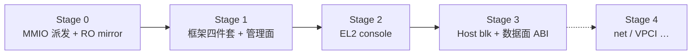


### Stage 0 · EL2 MMIO 派发框架

**问题**（已按代码现状修正，2026-09-23 复核）：xhyper **并非没有** EL2 内
MMIO 仿真——vGIC 的 GICD/GICR aperture、vITS 的 vdevice 窗口、vRTC
（PL031/Phytium）都在 EL2 内走三态派发（`Unhandled`/`Fault`/`Emulated`，
与 Gunyah vdevice 合同同构，见 `hypervisor/device/vrtc/src/store.rs` 的
`access_mmio`），范围注册经 `ADDRSPACE_CONFIGURE_RANGE(ADD_VMMIO)`。
真正缺的是两样：**通用的多设备注册表**（vRTC 是固定地址单窗口，写死在
runtime 派发点里）与 **per-object 动态窗口**（virtio 设备的数量与位置由
mgr 配置决定，config cache 页经 memextent 捐赠，不是固定地址）。

**设计**：

- **不新建派发框架，泛化现有的**：把 `ADD_VMMIO` 范围注册 + 三态派发
  （vRTC/vITS 已在被 `phase-d4-probe`、`qemu-vits-msi`、`qemu-wired-spi`
  门禁验证的机制）泛化为按 `(addrspace, IPA range)` 的注册表，支持多设备
  动态注册；runtime 在 VMMIO fault 路径上先查注册表，命中则调用 EL2
  handler，未命中走现有 exit-to-VMM 路径（路径 B 行为不变）。
- **只读 mirror 方案**（Gunyah 同款，单映射而非双映射）：guest Stage-2 把
  config cache 页映射为 RO。guest **读**直接命中 RO 映射（不 trap，零成本，
  数据来自真实页）；**写**触发 permission fault 进 EL2 handler。config cache 页
  由 backend 创建方（mgr）经 memextent 捐赠，EL2 经自己的 hyp 映射（RW）维护
  页内容。需要 `address_space` 支持"把经 memextent 捐赠的页以 RO 映射进
  guest addrspace"。

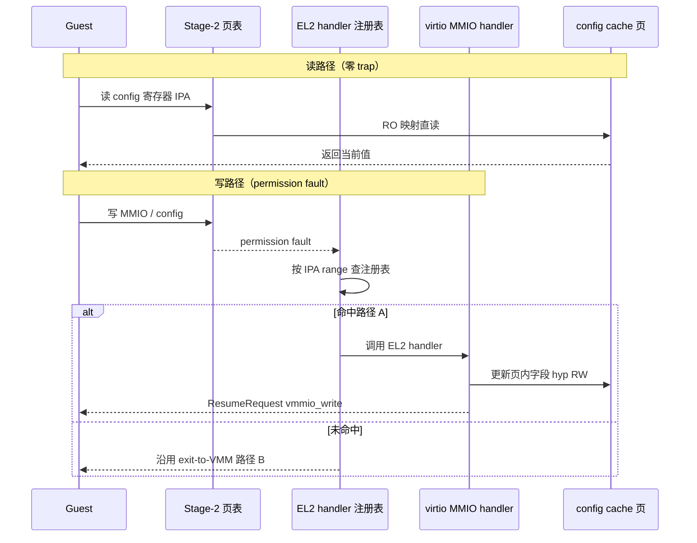

- 派发 handler 签名对齐现有 `FaultRecord`/`ResumeRequest` 模型：
  read → `ResumeRequest::vmmio_read(value, Default)`；write → 设备侧处理后
  `vmmio_write(Default)`；handler 报错 → `ResumeAction::Fault`。
- **最小验证设备**：一页 trivial 寄存器（读返回已知模式、写翻转计数），
  不牵 virtio，先验证派发框架与回归面。

**验收**：新门禁（`phase-e0-vdevice`，命名沿用 phase 体系）验证测试设备
读写语义 + 既有 phase-d4 系列全绿（feature 默认关闭）。

**风险**：动 runtime/execution/address_space 核心路径。缓解：改动收敛在
fault 分支前的查表点 + model 层单测先行。

### Stage 1 · 框架核心（六部件做四件）

crate 布局（遵守 xhyper 约定"model 层纯逻辑、runtime 是唯一组合根"）：

```text
hypervisor/virtio/
├── model/      # 纯状态机：无 unsafe、无硬件依赖、穷尽单测
├── mmio/       # transport：寄存器布局/派发/config cache 页
├── backend/    # 桥对象：object model 接入、reason 位图、virq
├── virtq/      # 描述符遍历 + used 回写（驱动 useraccess）
└── （console 后端在 Stage 2 另立 backend crate）
runtime/        # hypercall 分发接入（唯一组合根）
```

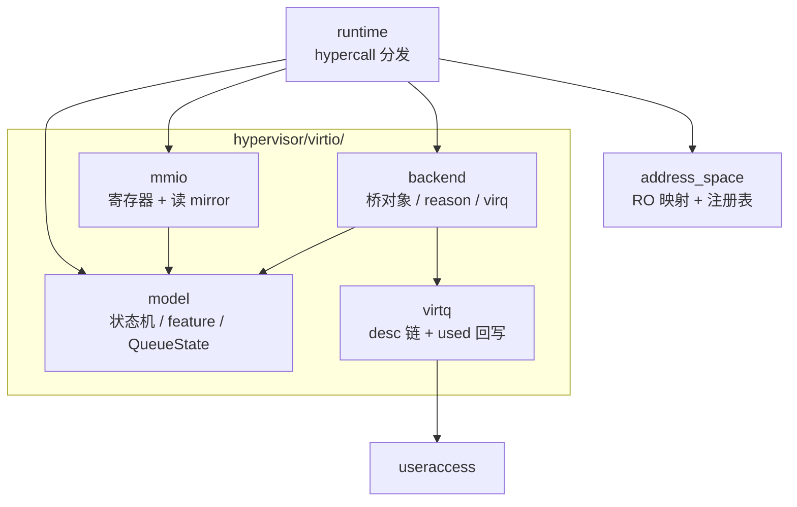

- **model**：`VirtioStatus`（enum 穷尽：ACK→DRIVER→FEATURES_OK→DRIVER_OK
  递进校验，未知位拒绝）、feature 协商（banked sel + features_ok 门）、
  `QueueState`（sel/num/num_max/ready/desc/drv/dev，64 位地址 hi/lo 拼接）、
  `ConfigUpdate`（generation 计数器：begin 置位、end 自增并触发 config IRQ）、
  复位状态（请求→等待→完成，对 backend 的通知时机）。

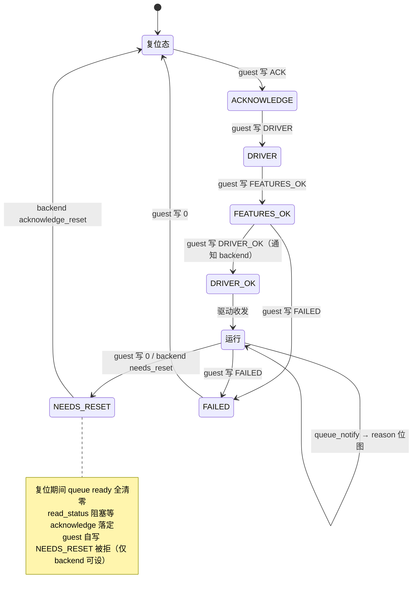

- **mmio**：virtio-mmio 寄存器布局（0x000 common + 0x100 device config）、
  写派发大 switch 的类型化版本、读 mirror 维护（写 handler 同时更新页内
  对应字段，保证 guest 读到新值）。
- **backend**：object model 新对象类型（capability rights 对齐 Gunyah
  `CAP_RIGHTS_VIRTIO_BACKEND_*`）；通知 reason 位图
  （`AtomicU64::fetch_or(Release)`，拉取侧 Acquire）；`get_notification`
  拉模型 + virq 推模型的组合。
- **virtq**：`virtio_virtq_read_desc_chain`（split VQ 规则：read-only 段、
  write-only 段、write 后 read 即断链）与 `virtio_virtq_write_reply`
  （写回复 → `fence(Release)` → 写 used head idx）的 Rust 版，全部经
  `hypervisor/memory/useraccess` 访问 guest IPA。
- **管理面 hypercall**：runtime 分发 `partition_create_virtio_backend` /
  `configure`(0x49) / `bind_virq`(0x4c) / `unbind_virq`(0x4d) / `object_activate` /
  cspace ops，语义逐条对齐 1.3 表（错误码映射到 `xhyper_error.rs`）。
  activate 的核心动作：memextent 校验 → config cache 页 RO 映射进 guest
  addrspace → Stage 0 注册表挂 handler。

**验收**：model 层穷尽单测；QEMU 冒烟（带 stub backend）：Linux guest 的
`virtio_mmio` 驱动 probe、feature 协商到 `DRIVER_OK`、队列 ready。

### Stage 2 · virtio-console backend（EL2 内）

- device_id=3，两个 virtqueue（rx/tx）+ 极小 config。
- **tx（guest→host）**：queue_notify → reason 位图 → EL2 console backend 消费：
  useraccess 读描述符 → 输出到现有 console 基建（xhyper runtime 已有
  `guest_uart.rs` 的 PL011 桥接通路，virtio-console 复用同一出口）→
  used 回写 + release fence → frontend vIRQ。
- **rx（host→guest）**：host 控制台输入源 → EL2 backend 注入 rx 队列 →
  vIRQ 唤醒 guest。
- console 特定 hypercall（对标 `virtio_input_configure` 形态）：mgr 经
  hypercall 配置/激活 console backend；事件流在 EL2 内部直调 Backend API
  （不经 0x4e–0x55，绕开数据面 ABI 缺口）。
- mgr 侧：唤醒 `virtual_device` 域的 console 配置路径（`Unavailable` →
  实装），按 VM 配置创建 backend 对象并绑定 vIRQ。

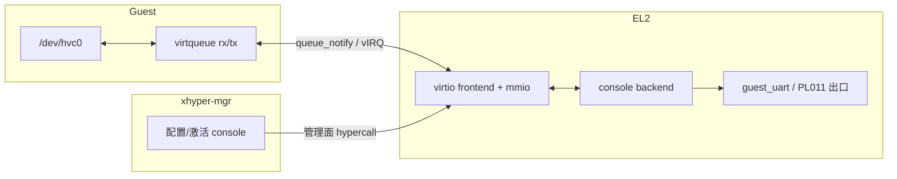

> tx：guest → queue_notify → reason → backend 读描述符 → 复用现有 console 出口 → used + vIRQ。  
> rx：host 输入 → EL2 注入 rx 队列 → vIRQ。数据面不经 `0x4e–0x55`（EL2 内直调）。


**验收**：Secondary guest `/dev/hvc0` 双向交互；`phase-e2-console` 门禁
（类比现有 `qemu-secondary-console`）。

### Stage 3 · virtio-blk：backend 宿主正面解法

三件并行的事：

1. **mgr 数据面 ABI 封装**（小活，非跨仓冻结变更）：ABI 定义已在
   xhyper-abi 快照里（0x4e–0x55 全套，编号与 Gunyah 一致），只需给
   mgr 的 operation.rs 补数据面封装（mgr 迁移到共享 codegen 输出后
   这部分可能自动获得）。EL2 侧常量同样现成。
2. **Host 用户态 backend 进程**：精简设备模型进程（非 VMM）：blk 请求处理
   （读写镜像文件）+ 经 0x4f–0x55 推进 EL2 状态 + 消费 notification。
   宿主形态（新进程 vs 扩展 xhyper-vmm）为开放问题 #2。
3. **异步通知（ioeventfd/irqfd 等价物）**：EL2 注册表允许"命中即异步通知
   backend（不退出 vCPU）"的注册类型 + backend 异步注入 vIRQ 的通路。
   涉及 `/dev/xhyper` UAPI（Host Linux 内核仓，跨仓）。
   该基建与路径 B 共用（crosvm 同样受益），是两路汇合点。

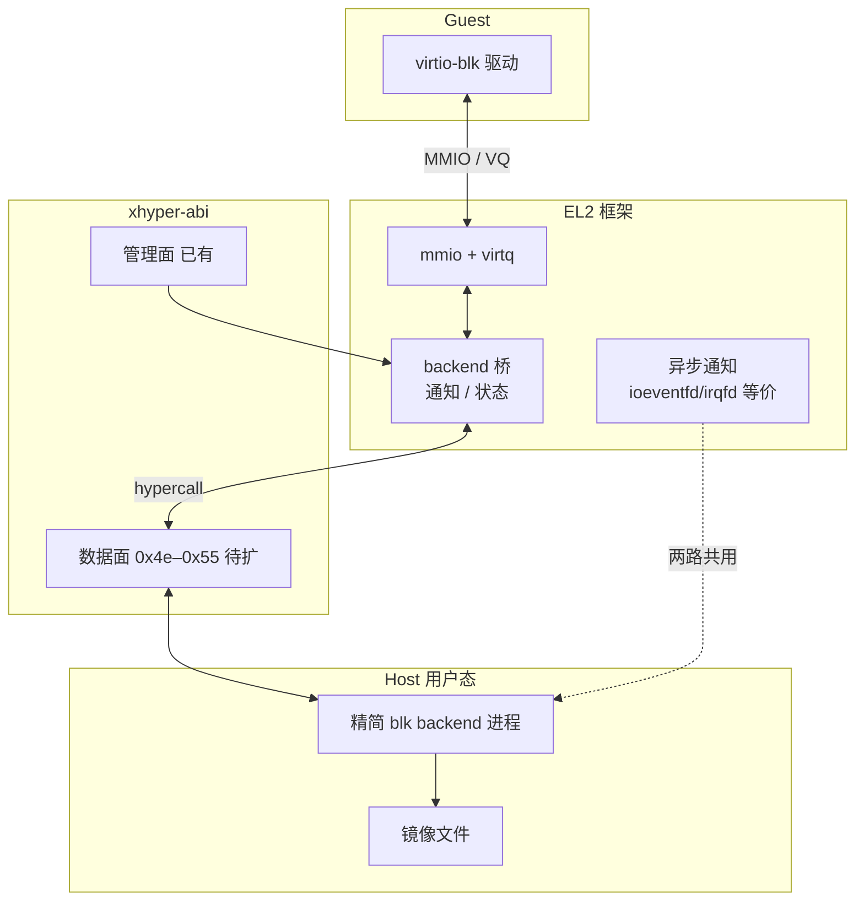


**验收**：guest ext4 读写回读（对齐 phase-d4-2 强度）；IOPS 基准报告
（异步 vs 同步 exit 对比数字）。

---

## 4. 关键机制决策

### 4.1 并发与内存序（逐条对齐 Gunyah）

| 机制 | Gunyah 实现 | Rust 决策 |
|---|---|---|
| 通知 reason 位图 | 原子 union，`memory_order_release` | `AtomicU64::fetch_or(Ordering::Release)`，拉取 `Acquire` |
| used ring 更新顺序 | 数据写 → `atomic_thread_fence(release)` → head idx | `fence(Ordering::Release)` 同款顺序，写测试先行 |
| status 互斥 | `status_lock` 自旋锁 | per-device spinlock（xhyper `spinlock_ticket`） |
| 阻塞复位 | `virtio_read_status` 等 reset 落定（drop RCU） | guest vCPU 线程挂起等 backend `acknowledge_reset`；接 xhyper 线程/FPRR 模型；**对象销毁必须先唤醒再回收**（失败测试覆盖） |
| config 非原子读 | generation 计数器 | model 层实现 + 单测 |

上表对应的完整时序（一次 `queue_notify` 往返，含 fence 落点）：

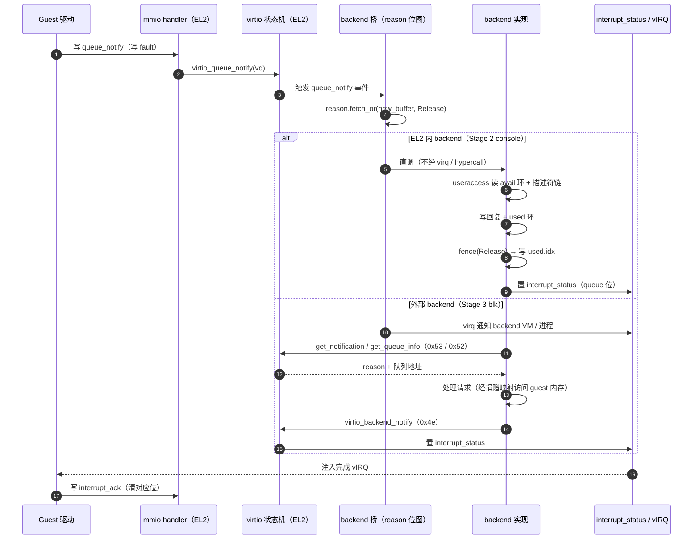

### 4.2 共享 config cache 页（unsafe 重灾区）

一页三用：guest（RO Stage-2 映射，直读）、EL2（hyp 映射 RW）、mgr/backend
（经 memextent 捐赠 + hypercall 驱动，**无直接映射**）：

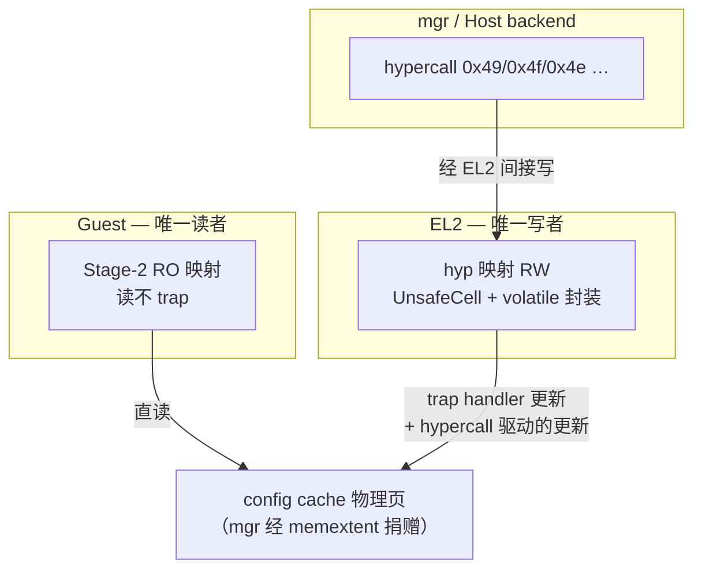

> 安全论证就一句话：**只有 EL2 写、只有 guest 直读、其余全走 EL2**。
> 无 data-race 的论证范围因此收敛到 EL2 单侧。

Rust 侧：

- 页封装为专用类型（内部 `UnsafeCell<[u8; PAGE]>`），只暴露
  `volatile_read/write_reg<T>(offset)` 接口；寄存器字段访问一律 volatile。
- 每个 unsafe 块配 `SAFETY:` 注释（xhyper 硬性规范）；无 data-race 论证写进
  模块文档（谁在什么上下文写哪个字段）。

### 4.3 生命周期与错误处理

- `object_activate` 失败回滚：Gunyah 手工 `unwind_object_activate`；Rust 侧
  用 RAII guard（激活事务对象，Drop 时按已完成的步骤逆序回滚）类型化。
- 错误码：对齐 Gunyah `ERROR_*` 语义映射表（`ERROR_ARGUMENT_INVALID` /
  `ERROR_OBJECT_CONFIG` / `ERROR_DENIED` / `ERROR_NORESOURCE` →
  `xhyper_error.rs` 对应码），映射表进设计附录并单测。

### 4.4 feature-gate（双路径并存）

- Kconfig：`CONFIG_HYPERVISOR_VIRTIO`（默认 off）。qemu_defconfig 不动；
  新增 `qemu_virtio_defconfig` 或 phase 脚本内开。
- 路径 B 的门禁（phase-d4-2 等）在 feature off 下必须零变化；
  路径 A 门禁（phase-e* 系列）独立新增。

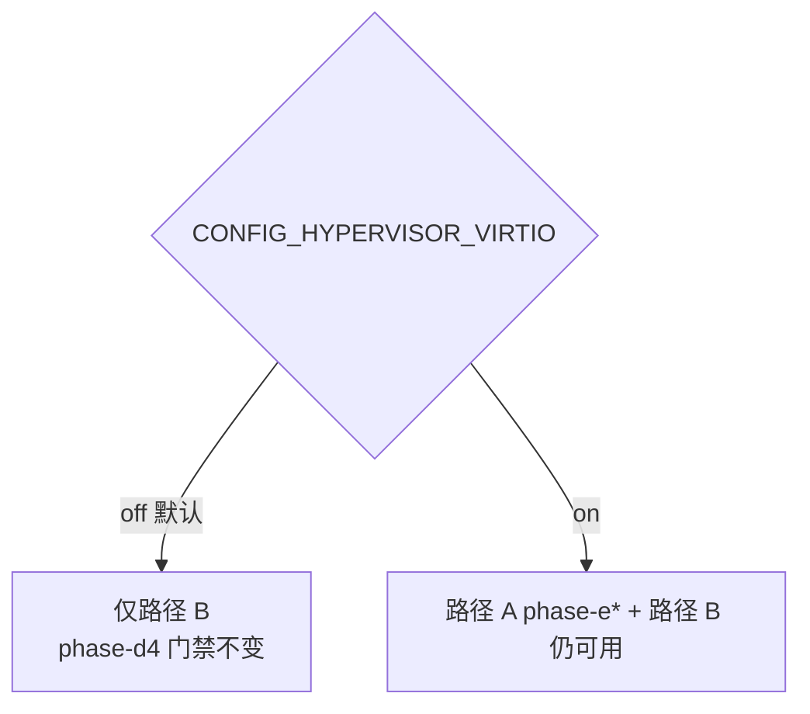


---

## 5. 测试与门禁

| 层 | 手段 | 覆盖 |
|---|---|---|
| model 层 | crate 内 `tests/`（纯逻辑，红绿先行） | 状态机穷尽、feature 协商边界、复位时序、错误码映射 |
| 组件层 | QEMU 内内核单元测试（`make unittest`） | mmio 派发、virtq 遍历、reason 位图内存序 |
| 门禁层 | `phase-e0-vdevice` / `phase-e1-probe` / `phase-e2-console` / `phase-e3-blk`（新 make 目标，沿用现有脚本骨架） | 端到端：probe→协商→DRIVER_OK→数据面→生命周期（创建/退出/回收三轮，对齐 phase-d4-probe 强度） |
| 回归 | 既有全部门禁在 feature off 下跑 | 路径 B 零回归 |

提交规范沿用 xhyper：`子系统: 祈使句`、`git commit -s`（DCO）、提交前
`cargo fmt --all && make clippy && make unittest`。

---

## 6. 风险与缓解

| # | 风险 | 等级 | 缓解 |
|---|---|---|---|
| 1 | Stage 0 动 runtime/execution/address_space 核心路径，回归面大 | 中高 | **建立在既有被验证机制上**（vGIC aperture / vITS vdevice 窗口 / vRTC 三态派发 + ADD_VMMIO 注册，均过门禁）；feature-gate 默认 off；model 层单测先行；phase-d4 回归作为硬门禁 |
| 2 | ABI 语义漂移（与休眠 mgr 代码 / Gunyah 行为对不上） | 高 | 1.3 对照表为合同；每条 hypercall 配语义单测（对齐 Gunyah 错误码路径） |
| 3 | 阻塞复位死锁 / 对象销毁竞态 | 中高 | 先写失败测试（超时、销毁并发复位）；销毁路径先唤醒后回收 |
| 4 | 双路径长期并存维护成本 | 中 | mgr 侧路径 A 域代码整体在 feature 后；文档明示两路边界（沿用调研报告路径 A/B 划分） |
| 5 | Stage 3 跨仓协调（Host Linux UAPI 仓；xhyper-abi 已无缺口） | 低–中 | 数据面 ABI 已在 xhyper-abi 快照（0x4e–0x55 与 Gunyah 一致），mgr 消费迁移团队在做；仅 /dev/xhyper UAPI 一处需提前对齐 |
| 6 | 只读 mirror 与路径 B 的 VMMIO 区域语义仲裁（同一 addrspace 混用两类区域） | 中 | Stage 0 注册表按 IPA range 精确匹配，未命中默认 exit-to-VMM；混用场景进门禁 |

---

## 7. 规模预估

按一名熟悉 xhyper 的工程师全职（含测试与门禁，不含跨仓评审等待）：

| 阶段 | 预估 | 说明 |
|---|---|---|
| Stage 0 | 1.5–2.5 周 | 泛化既有派发机制 + RO 映射 + 测试设备 + 新门禁 |
| Stage 1 | 4–6 周 | 四个 crate + 管理面 hypercall + 语义单测 |
| Stage 2 | 1–2 周 | console backend + mgr 域唤醒 |
| Stage 3 | 5–8 周 | mgr ABI 封装 + backend 进程 + 异步通知 + IOPS 基准 |
| 合计 | ~3–4.5 个月 | Stage 3 的异步通知与路径 B 共用，可并行 |

参照：Gunyah C 侧对应实现约 1400 行 + 接口声明/模板/测试（**不含**
virtio_iommu，其 1600+ 行在范围外，见非目标）；Rust 侧估
3000–4500 行含测试（model 穷尽测试占比高）。

---

## 8. 工程落地前置（第 0 步）

~~服务器上 xhyper checkout 处于 detached HEAD 编译失败测试提交~~
**已解决（2026-09-23 拉新后）**：xhyper 已回到 `main` 干净跟踪 `origin/main`
（`d67e6f5e`）。实施直接从干净基线开分支即可：

```bash
git -C xhyper checkout -b virtio-el2 origin/main
```

---

## 9. 开放问题（进入实现前需关闭）

1. ~~xhyper-abi 数据面 immediate 是否沿用 Gunyah call_num 0x4e–0x55~~
   **已关闭（2026-09-23 复核）**：快照已沿用 Gunyah 编号（0x49–0x55 全套，
   含位域类型），无需决策。
2. **Stage 3 backend 进程宿主**：独立新进程，还是扩展 `xhyper-vmm`？
   倾向独立进程（职责单一：设备模型而非 VMM），但 xhyper-vmm 已有
   hypercall 通路可复用。
3. **阻塞复位的等待落点**：等 mgr 的哪条路径（hypercall 上下文 vs 独立
   线程）？涉及 xhyper 线程模型的挂起/唤醒 API 选型。
4. **console rx 输入源**：host 控制台输入当前挂在哪个常驻路径，是否可
   分流给 Secondary console。
5. **`CONFIG_HYPERVISOR_VIRTIO` 与 defconfig/phase 脚本的具体集成形态**。
