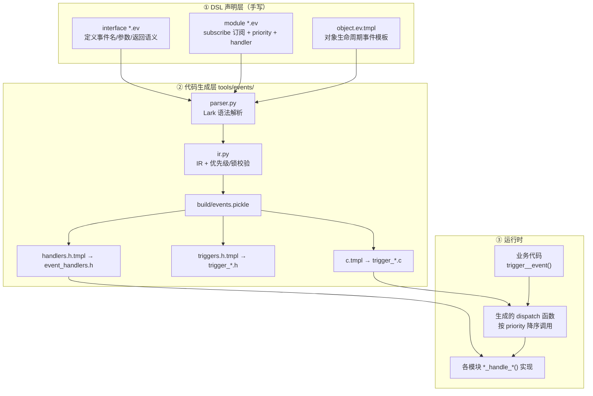
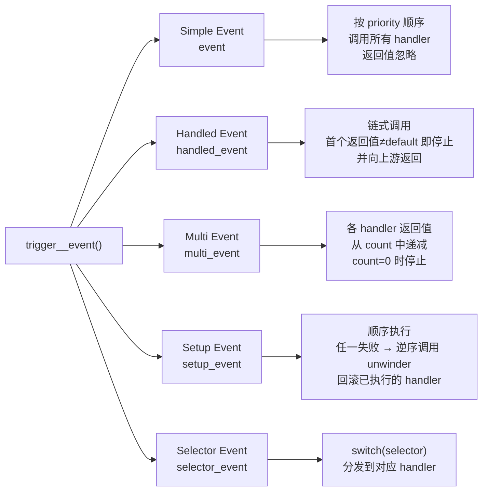
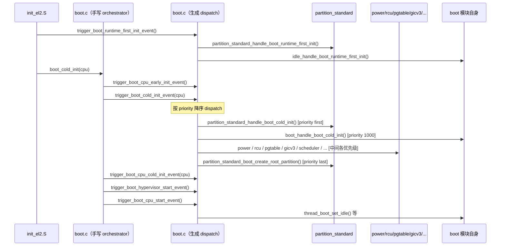
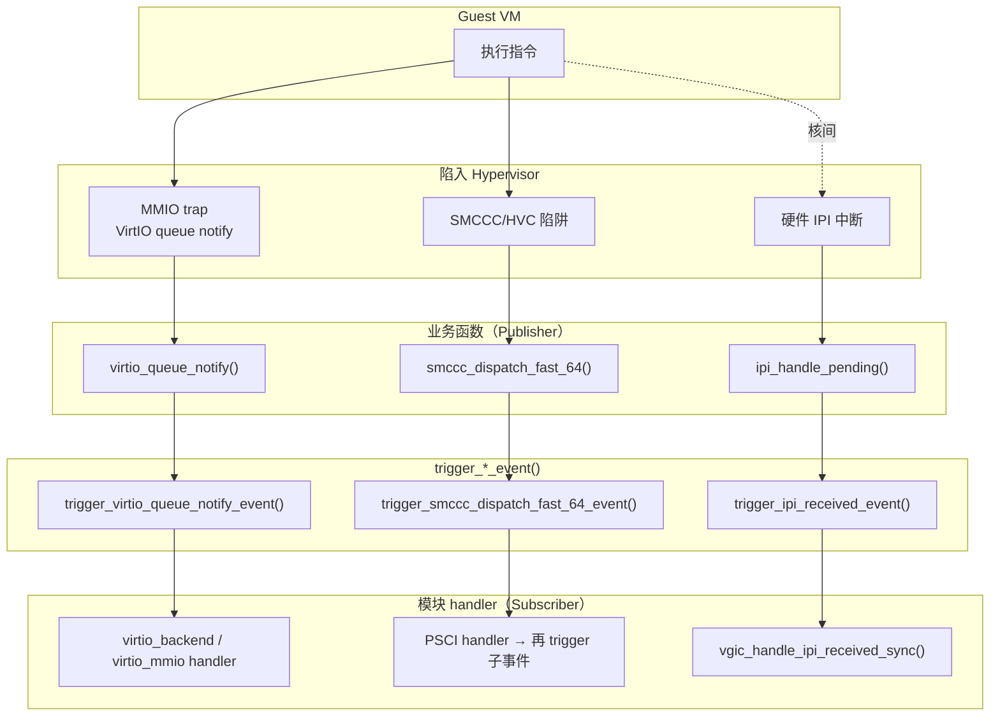
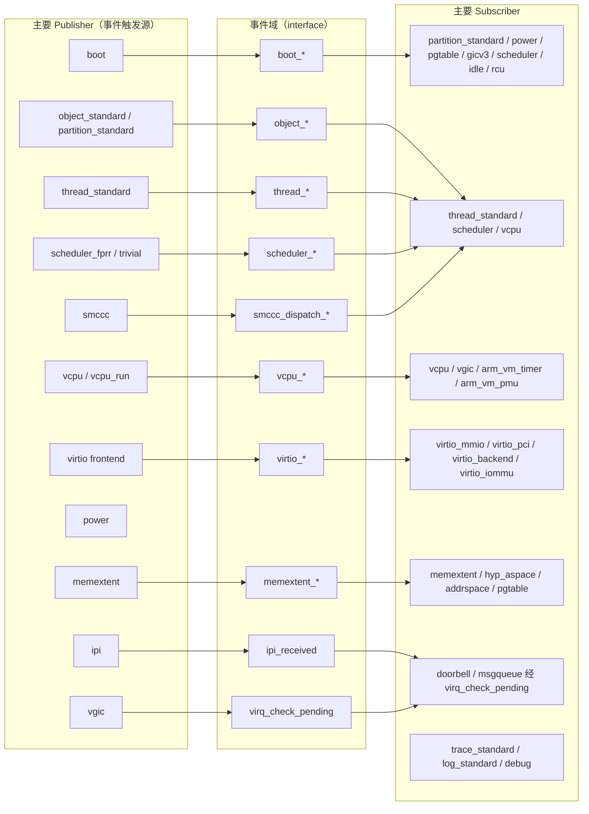

根据对 Gunyah 代码库的彻底探索，我已经摸清了它的事件订阅发布机制。下面用一组流程图来说明它的运行方式。

## 核心结论

Gunyah 的「事件订阅发布」**不是运行时动态注册表**，而是一套**编译期 DSL 驱动的静态 pub/sub**：

- 订阅在 `.ev` 文件里声明（编译期绑定）
- 构建时由 Python 代码生成器生成 `trigger_<event>_event()` dispatch 函数
- 运行时业务代码调用 `trigger_*_event()`，按 priority 顺序调用各模块 handler

---

## 图 1：整体架构（构建期 + 运行期）



---

## 图 2：五种事件类型的 dispatch 语义



---

## 图 3：Boot 冷启动完整链路（最典型的订阅发布场景）



---

## 图 4：对象生命周期事件链（hypercall 触发路径）

```mermaid
sequenceDiagram
    participant G as Guest VM
    participant HC as hypercall / API
    participant PART as partition_standard
    participant GEN as object.c（生成 dispatch）
    participant SUB as 各模块 handler<br/>thread/scheduler/vcpu/...

    G->>HC: hypercall_object_activate()
    HC->>PART: object_activate()
    PART->>GEN: trigger_object_init_<type>_event()
    PART->>GEN: trigger_object_create_<type>_event()
    Note over GEN: setup_event: 任一失败 → 逆序 unwind
    GEN->>SUB: thread_standard_handle_object_create_thread()
    GEN->>SUB: scheduler_fprr_handle_object_create_thread()
    GEN->+>SUB: vcpu_handle_object_create_thread()
    PART->>GEN: trigger_object_activate_<type>_event()
    GEN->>SUB: 各订阅者 handle_object_activate_<type>()
    Note over PART: deactivate 时: trigger_object_deactivate_<type>_event()<br/>RCU 后: trigger_object_cleanup_<type>_event()
```

---

## 图 5：Guest 交互场景（VirtIO / SMCCC / IPI）



---

## 图 6：模块发布者 / 订阅者全景



---

## 关键要点总结

| 维度 | 说明 |
|------|------|
| **绑定时机** | 编译期（`.ev` DSL 静态绑定），非运行时注册 |
| **触发 API** | `trigger_<event>_event(...)`，由代码生成器产出 |
| **handler 命名** | 默认 `<module>_handle_<event>`，可在 DSL 中用 `handler <func>` 覆盖 |
| **执行顺序** | 按 `priority` 降序；`first`/`last` 为特殊极值 |
| **失败处理** | `setup_event` 类型有 `unwinder`，失败时逆序回滚 |
| **跨 VM？** | 否。事件是 hypervisor 内部回调链；VM 间通信走 hypercall/MMIO trap → 业务函数 → trigger 事件 → handler → virq/msgqueue/共享内存 |
| **`build_preview/events/boot.c`** | 自动生成的 dispatch 预览代码，展示 `trigger_boot_*` 的完整 handler 调用顺序，用于学习/文档 |
| **`hyp/core/boot/src/boot.c`** | 手写的 boot orchestrator，是 `trigger_boot_*_event()` 的实际调用入口 |

如果你想针对某一条链路（例如完整的 `boot_cold_init` handler 优先级表，或 VirtIO hypercall 后端全链路）进一步细化，告诉我具体接口名即可。