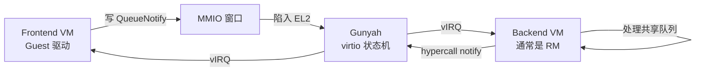

# VirtIO 第 1 课 · 前端驱动 + 后端设备；传输 ≠ 设备类型

上一课：[第 27 课](../第27课.md) doorbell 讲完，L6 点了 VirtIO 这个方向。本课只解决两件事：**VirtIO = 前端驱动 + 后端设备**；以及 **传输（MMIO）≠ 设备类型（net / block）**。

---

## 1. 先拆成两边：Guest 里的驱动，对面的设备实现

VirtIO **不是某一种设备的名字**（不是「一张叫 VirtIO 的网卡」）。它是一套约定：Guest 里跑一个知道自己在虚拟机里的驱动（**前端**），对面有人真正实现这台设备（**后端**）。两边靠 **virtqueue** 传活——描述符环，指向共享页上的缓冲区。

一张 virtio-net、一块 virtio-blk，都是「用这套约定做成的某种设备」。先记住两边角色，再谈它是网卡还是磁盘。

谁干什么：


| 角色     | 它是谁                              | 它干什么               | 它不干什么            |
| ------ | -------------------------------- | ------------------ | ---------------- |
| **前端** | Guest 里的驱动（Linux `virtio_net` 等） | 填队列、写门铃、收 used     | 不实现网卡/块设备逻辑      |
| **后端** | 真正处理队列数据的那一方                     | 读描述符、干活、写 used、再按铃 | 不是「传输怎么接到 Guest」 |
| **传输** | Guest 怎样看见寄存器                    | MMIO 窗口或 PCI BAR   | 不是设备类型           |


QEMU / 很多 Type-2 里，后端常常就是宿主机上的 hypervisor 自己。**Gunyah 不是这样。** 本仓库这条主路径里：

```text
Frontend VM（Guest 驱动）
    ↕  MMIO 寄存器窗口（只读 map + 写则陷入 EL2）
Gunyah EL2（状态机 + 两边的铃）
    ↕  hypercall（CapID，第 25–26 课）
Backend VM（通常是 RM；真正处理队列数据）
```

hyp 传的是 **控制面状态** 和 **铃**（vIRQ，第 23、27 课）。队列里的 payload 在两边都 map 过的共享物理页上（第 18–21 课），hyp **一般不拷、也不解析** 描述符链。

和 doorbell 对照一句即可：同一份 hyp 对象、两边各持 cap、铃是 vIRQ。VirtIO 只是中间多了 MMIO 窗口和队列地址本。对象怎么造、铃怎么绑，是后面的课。




---


## 2. 传输 ≠ 设备类型

两套独立的分类，代码里也是两个枚举：


|                                | 问的是什么         | 本课记住的值                            | 定义在哪                               |
| ------------------------------ | ------------- | --------------------------------- | ---------------------------------- |
| **传输** `virtio_transport_type` | Guest 怎样碰到寄存器 | 主路径：**MMIO**（`= 0`）；PCI 是另一条      | `virtio_mmio.tc` / `virtio_pci.tc` |
| **设备类型** `virtio_device_type`  | 这台设备是什么       | NETWORK / BLOCK / INPUT / IOMMU … | `hyp/interfaces/virtio/virtio.tc`  |


同一张网卡可以走 MMIO，也可以走 PCI。MMIO 只是「寄存器窗口长什么样」：公共寄存器占前 256 字节（`0x100`），后面才是 device config。PCI 则是 BAR + capability。设备类型（是网卡还是块设备）和走哪条传输无关。

本阶段 **只跟 MMIO +** `virtio_backend` **对象**。PCI、virtio-iommu、hyp 里的 virtio-input，第 10 课再点名。

`hyp/vm/virtio_virtq/` 是给 **virtio-iommu** 用的（hyp 自己当后端、会读队列），**不是** 这条主路径。

三件不要混：

1. **Gunyah 不是网卡后端。** EL2 做窗口和铃；干活的是 Backend VM。
2. **MMIO 不是一种设备。** 它是传输；NETWORK / BLOCK 才是设备类型。
3. **不要读规范全文、不要跟 PCI。** 本课只要能分开「谁驱动、谁实现、怎样接到 Guest」。

---


## 本课你要带走的三句话

1. **VirtIO = 前端驱动 + 后端设备**：两边用 virtqueue 传活；通知是按铃。
2. **传输 ≠ 设备类型**：MMIO / PCI 是 Guest 怎样看见寄存器；net / block 是这台设备是什么。
3. **Gunyah 这条主路径**：hyp 管窗口和铃，后端在另一个 VM（通常是 RM）；payload 在共享页上，hyp 不解析。

---


## 小练习

请用自己的话回答下面两题（一两句就行）：

1. 为什么不能说「这是一台 MMIO 设备」来代替「这是一台 virtio-net」？拆开之后，传输和设备类型各指什么？
2. Guest 往 virtqueue 里塞了一包要发给网卡的数据。在 Gunyah 这条主路径上，是 hyp 解析这包，还是 Backend VM？hyp 在中间做了什么？

回答：
1.
2.

答完后，下一课进 Gunyah 对象：`virtio_t` **是核心状态机**，`virtio_backend` 是对外对象；MMIO 只是它的一种 frontend。

---


## 关键源文件


| 文件                                          | 作用                                              |
| ------------------------------------------- | ----------------------------------------------- |
| `hyp/interfaces/virtio/virtio.tc`           | `virtio_device_type`（NETWORK / BLOCK / …）；本课只认脸 |
| `hyp/interfaces/virtio_mmio/virtio_mmio.tc` | 传输枚举：`MMIO = 0`                                 |
| `hyp/interfaces/virtio_pci/virtio_pci.tc`   | 传输枚举：`PCI = 1`（本阶段不跟）                           |
| [大纲-virtio.md](../大纲-virtio.md)             | 10 课总图；主路径是 MMIO + `virtio_backend`             |
| [第 27 课](../第27课.md)                        | doorbell：同一 hyp 对象、两边 cap、铃是 vIRQ               |
| [第 1 课](../第1课.md)                          | RM 是策略 / 建 VM 的那一方，常当 VirtIO 后端                 |
| [第 20–21 课](../第20课.md)                     | 共享页是 memextent + Stage-2，下一课才会碰到                |


