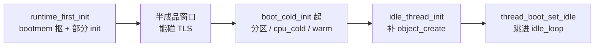

# 第 10 课 · idle 线程是半成品

上一课在 `boot_cold_init` 上把分区和账本搭好。本课只解决一件事：**Boot CPU 的 idle 线程其实更早就建了，而且当时是半成品**。不讲 FPRR，也不讲怎样真正切到 VCPU。

---

## 1. 它不在 `boot_cold_init` 上创建

`thread_standard` **没有**订阅 `boot_cold_init` 来造 idle。真正动手的是 `idle` 模块，挂在更早的 `boot_runtime_first_init` 上（第 6 课：还在汇编里触发）。

原因和第 6 课同一句：切到合法当前线程之前，不能碰 TLS。所以 idle 必须在进普通 C（`boot_cold_init`）**之前**就存在。可那时 partition / allocator 都还没有（第 9 课才建），不能走正常的 `partition_allocate_thread`。

`hyp/core/idle/src/idle.c` 顶部注释：*we perform part of the boot with an incomplete idle thread structure*。

---

## 2. 先抠一块，后补全

`idle_handle_boot_runtime_first_init`：

```c
ret = bootmem_allocate(thread_size, thread_align);
boot_thread = (thread_t *)ret.r;
memset_s(...);
trigger_object_init_thread_event(...);   // 只做部分初始化
boot_thread->cpulocal_current_cpu = boot_cpu_index;
thread_switch_boot_thread(boot_thread);  // 必须是本事件最后一步
```

要点：

- 内存来自 **bootmem**，不是 hyp allocator。
- 只触发 `object_init_thread`，完整的 `object_create_thread`（栈、调度字段等）还没有。
- `thread_switch_boot_thread` 是最后一句：切过去之后，当前栈 / TPIDR 换了，本函数不能再做事。

从这里到后面补全之间，有一段**半成品窗口**：能跑、TLS 合法，对象不完整。

补全发生在 `boot_hypervisor_start` 上的 `idle_thread_init()`（默认优先级，第 13 课会再碰到）：Boot CPU 那条只补 `object_create`；其他核的 idle 这时才能走正常 `partition_allocate_thread`。补完之后执行流仍在 `boot_cold_init()` 里往下走——**造好对象 ≠ 已经跳进 `idle_loop`**。真正 `br` 进去是最后的 `thread_boot_set_idle()`。



三件不要混：

1. **早建是为了 TPIDR，不是为了调度。** 此时还没有 FPRR 就绪表那回事。
2. **半成品就能当「当前线程」。** 完整对象要等 allocator 能用。
3. **不要去跟 `scheduler_yield` 怎么切到 RootVM。** 那是第 16 课。本课停在「它为什么必须早、为什么一次建不完」。

其他 CPU 的 idle 没有这段窗口：它们上电时 allocator 已经能用，直接走正常创建。

---

## 本课你要带走的三句话

1. **Boot CPU 的 idle 在 `boot_runtime_first_init` 就从 bootmem 抠出来了**，早于 `boot_cold_init`。
2. **当时只做了部分 `object_init`**：allocator 还没有，不能一次建完。
3. **半成品窗口里已经能碰 TLS**；补全和跳进 `idle_loop` 是后面的两步，不是创建当时。

---

## 小练习

请用自己的话回答下面两题（一两句就行）：

1. 为什么 idle 不用 `partition_alloc`，而用 `bootmem_allocate`？
2. 「idle 已经是当前线程」和「已经进入 `idle_loop`」是不是一回事？差在哪一步？

回答：
1.
2.

答完后，下一课往下走 per-CPU：**preempt 的启动锁**，以及 **`boot_cpu_cold_init` 怎样搭每颗 CPU 的软件骨架**。

---

## 关键源文件

| 文件 | 作用 |
|------|------|
| `hyp/core/idle/src/idle.c` | 早期创建、`idle_thread_init`、注释里的半成品 |
| `hyp/core/idle/idle.ev` | 订阅 `boot_runtime_first_init`（`last`） |
| `hyp/core/thread_standard/src/init.c` | `thread_boot_set_idle`（跳进去；第 13 课） |
| [第 5 课](第5课.md) | idle 也是一种线程 |
| [第 6 课](第6课.md) | 为什么 runtime_first_init 必须在汇编里 |
