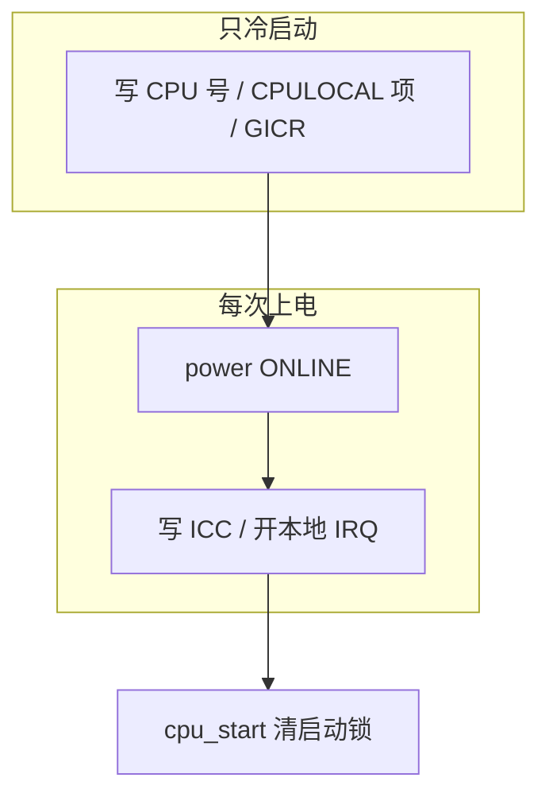

# 第 12 课 · CPULOCAL；`cpu_warm` 给硬件通电

上一课：启动锁拉着，cold 把 CPU 号和 per-CPU 软件项写好了。本课只解决两件事：**CPULOCAL 这套软件 CPU-local 怎么用**；以及 **`boot_cpu_warm_init` 给硬件通电**。不造 RootVM。

---

## 1. CPULOCAL：一排柜子，钥匙在线程上

ARM64 没有一块「方便读的当前 CPU 号」寄存器可当 GS。Gunyah 用软件数组模拟：大小 `PLATFORM_MAX_CORES`，用 CPU index 当下标。

`hyp/interfaces/cpulocal/include/cpulocal.h`：

```c
#define CPULOCAL_DECLARE(type, name)  type cpulocal_##name[PLATFORM_MAX_CORES]
#define CPULOCAL(name)                cpulocal_##name[cpulocal_get_index()]
#define CPULOCAL_BY_INDEX(name, i)    cpulocal_##name[cpulocal_check_index(i)]
```

`cpulocal_get_index()` 读的就是上一课写进当前线程的 `cpulocal_current_cpu`。启动期常用 `CPULOCAL_BY_INDEX(..., cpu)`，因为事件把 cpu 号当参数传来，不一定走「当前」。

它要求抢占关掉（`REQUIRE_PREEMPT_DISABLED`）：抢占开着，线程可能被迁到另一颗 CPU，下标会过期。启动链被第 11 课的 `cpu_init` 位锁着，所以 boot handler 里访问是安全的。

切线程之后，`cpulocal_handle_thread_context_switch_post`（`priority first`）会把新线程的字段改成「现在这颗 CPU」，旧线程改成非法。本课只要知道：**钥匙牌跟着「当前正在跑的那条线程」**，不是跟某个永远不变的全局。

---

## 2. `cpu_warm`：每次上电都通电

三条入口对比（空虚 = 这条入口不跑）：

| 入口 | 场景 | cpu_cold | cpu_warm | hypervisor_start |
|------|------|----------|----------|------------------|
| `boot_cold_init` | Boot CPU 第一次 | 跑 | 跑 | **跑（仅此）** |
| `boot_secondary_init` | 其他 CPU 第一次 | 跑 | 跑 | 不跑 |
| `boot_warm_init` | 休眠 / 热插拔回来 | 不跑 | 跑 | 不跑 |

口诀补全：**cold 建账（只一次），warm 开闸（每次上电）。** 硬件寄存器断电会丢，所以热启动也要再写一遍。

`boot_cpu_warm_init` 上要先记住两个 `first` / 高优先级：

- **`power`（first）**：确认本 CPU 已不在 `OFF`，标成 `ONLINE`。后面的人假定「这颗核已经在线上」。
- 然后才是写系统寄存器、`irq_enable_local`。

和 cold 的分工，用 GICv3 就能看清：cold 配的是本 CPU 的 **GICR（redistributor，软件侧分发结构）**；warm 配的是 **ICC_*（CPU interface 系统寄存器）** 并打开 IPI。前者是账，后者是闸。定时器、VGIC 维护 IRQ 也是同一模式：对象在全局阶段已经有了，warm 只在本 CPU 上 enable。

`boot_cpu_start`（仍是第 11 课那把锁的另一头）在 warm（以及 Boot CPU 上的 `hypervisor_start`）之后触发，**last** 清掉 `cpu_init`。热启动结尾不是 `thread_boot_set_idle`，而是 `thread_boot_restore_frozen`：回到休眠前那条线程，不是回到 idle。



三件不要混：

1. **CPULOCAL 不是硬件 TLS。** 它是数组 + 线程上的 index。
2. **warm 不分配新对象。** 用 cold / 全局阶段已经建好的，只是重新写寄存器、enable。
3. **不要在本课跟 `rootvm_init`。** `hypervisor_start` 只出现在表里，好区分「谁跑一次」。

---

## 本课你要带走的三句话

1. **CPULOCAL 是按 CPU 下标的数组**；下标来自当前线程的 `cpulocal_current_cpu`，访问时要关抢占。
2. **`boot_cpu_warm_init` 每次上电都跑**：写会丢失的硬件寄存器、enable 本地 IRQ。
3. **cold 建账，warm 开闸**；热启动只开闸。启动锁在 `boot_cpu_start` 才解开。

---

## 小练习

请用自己的话回答下面两题（一两句就行）：

1. 为什么 `CPULOCAL(name)` 内部要 `cpulocal_get_index()`，而不能在编译期写死「我是 0 号核」？访问时为什么要关抢占？
2. 副核第一次上电、以及某核从休眠回来：各会不会跑 `cpu_cold` / `cpu_warm` / `hypervisor_start`？

回答：
1.
2.

答完后，下一课收尾：**造出 RootVM 并 `vcpu_poweron`**，再 **跳进 idle**，L1 启动链结束。

---

## 关键源文件

| 文件 | 作用 |
|------|------|
| `hyp/interfaces/cpulocal/include/cpulocal.h` | `CPULOCAL*` 宏 |
| `hyp/core/cpulocal/src/cpulocal.c` | 读/写 `cpulocal_current_cpu`；切线程后更新 |
| `hyp/core/power/src/power.c` | `boot_cpu_warm_init` 的 first：标 ONLINE |
| `hyp/core/boot/src/boot.c` | 三条入口各自跑哪些事件 |
| [第 11 课](第11课.md) | 启动锁 + cold 骨架 |
