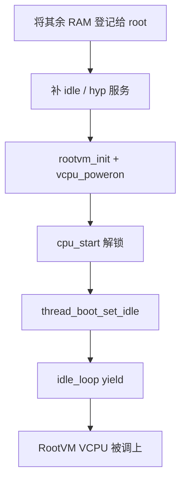

# 第 13 课 · 造出 RootVM 并进 idle

上一课：per-CPU 骨架和硬件闸都齐了。本课只解决两件事：**造出 RootVM 并 `vcpu_poweron`**；以及 **跳进 idle，启动链结束**。不讲 guest 里怎么跑，也不讲 VGIC 怎么注入。

---

## 1. `boot_hypervisor_start`：只 Boot CPU 一次

`boot.ev`：这条事件只在 Boot CPU 第一次上电跑，用来搭高层服务、尤其是 RootVM 的运行时环境。副核醒来后直接进自己的 idle，等着被调度。

仍被第 9-12 课的启动锁锁着。RootVM 就算 poweron 了，也要等 `boot_cpu_start` 解锁、再进 idle yield，才会真正占住物理 CPU。

按第 8 课的规则（数字越大越早）：

| 顺序 | 优先级 | 干什么 |
|------|--------|--------|
| 1 | 100 | 把非 hyp 镜像占用的 RAM **登记给** root partition |
| 2 | 0 | 补完 idle 对象、给 hyp 自己分配 hwirq |
| 3 | last | `rootvm_init`：创建 RootVM 并 `vcpu_poweron` |

第 9-12 课造出的 root partition 当时只有一块启动堆；这里才把平台探测到的其余 RAM 登记进去。后面加载 package、建对象都从这块堆拿。

注意：这是 `partition_add_ram_range(..., partition_root)` **给 root 新登记无主 RAM**，不是从 `partition_hyp` 过户。hyp 只接管自己的镜像/私有堆；其余 RAM 从未先归 hyp。造 root 时 hyp 只 donate 过一小块启动堆（第 9-12 课第 3 节 ④）。

`idle_thread_init`（第 9-12 课第 1 节的「补全」）也在默认 0 这一档：对象齐了，**还没有**跳进 `idle_loop`。同档还有 hyp 自己的维护中断等，本课不展开；VGIC 注入是第 22–23 课。

---

## 2. `rootvm_init`（last）：对象备好，再 poweron

`hyp/vm/rootvm/rootvm.ev`：`handler rootvm_init()`，`priority last`。前面 RAM、idle、hyp 自己的服务都要齐。

`hyp/vm/rootvm/src/rootvm_init.c` 骨架可以缩成：

1. 分配并激活 root **cspace**（capability 空间）。
2. 分配一条线程，配成 VCPU，绑到 Boot CPU，挂上这个 cspace。
3. 给 RM 能用的对象建 **master cap**；写进环境的是 CapID，不是 hyp 指针（第 26 课）。
4. 广播 `rootvm_init`：加载 GPKG（Runtime + Resource Manager ELF）、建 Stage-2 地址空间等。hyp 不解析 DTB 去直接启 Linux。
5. `vcpu_poweron(root_thread, entry_ipa, env_ipa, ...)`。

`vcpu_poweron`（`hyp/vm/vcpu/aarch64/src/aarch64_init.c`）做两件关键的事：把 guest 入口写成 Runtime 的 IPA；**`scheduler_unblock(..., SCHEDULER_BLOCK_VCPU_OFF)`**。这条 VCPU 创建时带着 OFF，清掉才能进就绪表。

此刻 guest **还没开始跑**。当前 CPU 仍在 `boot_cold_init()` 里。

---

## 3. 跳进 idle，链结束

```c
trigger_boot_cpu_start_event();  // 清 cpu_init
thread_boot_set_idle();          // noreturn
```

| | `idle_thread_init` | `thread_boot_set_idle` |
|--|-------------------|------------------------|
| 何时 | `hypervisor_start` 中间 | 链结束、解锁之后 |
| 做什么 | 创建 / 激活**对象** | **跳转**进 idle 入口 |
| 返回？ | 返回 | 不返回 |

`thread_boot_set_idle` 确认当前就是 idle，然后 `thread_arch_set_thread` 丢掉引导栈上的执行态，`br` 到该线程的入口 → `idle_loop`。循环里 `scheduler_yield()`：就绪表上已经有被 poweron 解阻塞的 RootVM VCPU，就会切过去。怎么切栈、FPRR 怎么选，是第 15–16 课。



L1 到这里结束：复位进来的这条 CPU，已经把模块拼好、把第一台 VM 放进调度器能看见的位置。

三件不要混：

1. **造 idle ≠ 进 idle。** 一个是对象，一个是跳转。
2. **`vcpu_poweron` ≠ guest 正在跑。** 只是清掉 OFF；真跑要等解锁 + yield。
3. **不要跟 VGIC、不要跟 guest 里的第一条指令。** 本课停在「启动链把 RootVM 交给调度器」。

---

## 本课你要带走的三句话

1. **`boot_hypervisor_start` 只在 Boot CPU 冷启动跑一次**：先把其余 RAM 登记给 root（不是从 hyp 过户），再补服务，最后 `rootvm_init`。
2. **`vcpu_poweron` 清掉 `VCPU_OFF`**，把 RootVM 的 VCPU 线程变成可调度；当时并不在跑 guest。
3. **`thread_boot_set_idle` 不再返回**：启动链结束，idle yield 之后系统才开始「跑起来」。

---

## 小练习

请用自己的话回答下面两题（一两句就行）：

1. 为什么 `rootvm_init` 必须是 `priority last`？
2. `vcpu_poweron` 之后、`thread_boot_set_idle` 之前，RootVM 的 VCPU 会不会已经在 Boot CPU 上跑 guest 代码？为什么？

回答：
1.
2.

答完后，L1 结束。下一课进入 **L2 内核基座**：线程对象怎么造出来（还不到调度算法）。

---

## 关键源文件

| 文件 | 作用 |
|------|------|
| `hyp/interfaces/boot/boot.ev` | `boot_hypervisor_start` 合同 |
| `hyp/core/boot/src/boot.c` | 触发事件 + `thread_boot_set_idle` |
| `hyp/core/idle/src/idle.c` | `idle_thread_init` / `idle_loop` |
| `hyp/core/thread_standard/src/init.c` | `thread_boot_set_idle` |
| `hyp/core/partition_standard/src/init.c` | `boot_hypervisor_start`：`partition_add_ram_range` 给 root |
| `hyp/vm/rootvm/src/rootvm_init.c` | RootVM 创建与 `vcpu_poweron` |
| `hyp/vm/vcpu/aarch64/src/aarch64_init.c` | `vcpu_poweron`：入口 + unblock |
| [第 1 课](第1课.md) | RootVM / RM 是谁 |
| [第 5 课](第5课.md) | VCPU 也是线程 |
| [第 9-12 课](第9-12课.md) | hyp 只认领镜像；其余 RAM 本课才登记给 root |
| [第 9-12 课](第9-12课.md) | 造 idle 对象 vs 本课跳进去 |
