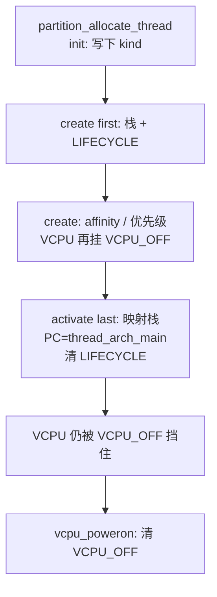

# 第 14 课 · 线程对象怎么造出来（对象链）

上一课：RootVM 已经 `vcpu_poweron`，启动链进了 idle。本课只解决一件事：**一条线程对象经过怎样的对象链才造出来**。

---

## 1. `thread_t` 是拼出来的，生命周期是三条事件

Gunyah 里几乎所有内核对象都走同一条链：`object_init` → `object_create` → `object_activate`。线程也是。调用方通常是 `partition_allocate_thread`（从某个 partition 的堆里抠出对象并走完 init/create），然后再 `object_activate_thread`。

`thread_t` 不是一个 C 文件写完的结构体。各模块用 `.tc` 的 `extend thread` 往上贴字段：基础在 `hyp/interfaces/thread/thread.tc`，调度字段在 `scheduler_fprr.tc`，Guest 寄存器在 `vcpu.tc`。读到 `thread->scheduler_affinity` 或 `thread->vcpu_regs_el2`，就是拼装结果。

三条事件各自干什么：


| 阶段       | 事件                       | 本课要记住的                   |
| -------- | ------------------------ | ------------------------ |
| init     | `object_init_thread`     | 写下 `thread->kind`        |
| create   | `object_create_thread`   | 分配内核栈；挂上「还不许跑」的 block    |
| activate | `object_activate_thread` | 映射栈、写好首次 PC，清掉生命周期 block |


和第 7 课一样：`trigger_*` 是广播，不是单呼一个函数。造线程没有另搞一套。合同在 `object.ev.tmpl`，线程对应三个事件：

| 阶段 | 事件 | 谁 `trigger` | 本课会看到的 `subscribe` |
|------|------|----------------|--------------------------|
| init | `object_init_thread` | `partition_allocate_thread` 里 `trigger_object_init_thread_event` | `thread_standard` |
| create | `object_create_thread` | 紧接着 `trigger_object_create_thread_event` | `thread_standard` / `scheduler_fprr` / `idle` / `vcpu` |
| activate | `object_activate_thread` | `object_activate_thread()` 里 `trigger_object_activate_thread_event` | `thread_standard`（last）、`vcpu`、调度器等 |

`partition_allocate_thread` 自己不写死「先调 thread、再调 scheduler」。它只点名这两次广播；activate 同理。各模块在自己的 `.ev` 里 `subscribe`，构建期生成分发表，运行时按 `priority` 调用 `<模块>_handle_<事件>`，例如 `thread_standard_handle_object_create_thread`。

两点别混：

1. **广播会叫到所有订阅者，不只课文点名的四个。** vgic、psci、cpulocal 等也订了 create / activate。本课只跟栈、block、affinity，所以盯 thread / scheduler / idle / vcpu。
2. **被叫到 ≠ 每条线程都干活。** idle 的 handler 先看 `THREAD_KIND_IDLE`，是才挂 `BLOCK_IDLE`；vcpu 的 handler 只对 VCPU 挂 `VCPU_OFF`。事件人人收到，各自判断要不要动手。

---


## 2. `block` 是什么

`block` **不是一块内存，是线程身上一组「不能跑」的原因位。**

每条线程有 `scheduler_block_bits`。每一位对应一种原因（`scheduler_block` 枚举）。调度器入队前只问一件事：这张表是不是全 0。

- **全 0** → `can_be_scheduled()` 为真 → 可以进就绪表
- **任意一位是 1** → 不进 runqueue；已经在队列里会被摘掉

`scheduler_block` / `unblock` 只置/清某一位。同名原因不嵌套，一次 unblock 就清掉。真正入队发生在**最后一位被清掉**时：刚才不能跑、现在能跑，才 `add_thread_to_scheduler`。

本课会碰到的三位：


| 位                                  | 谁挂上                       | 谁清掉            | 含义               |
| ---------------------------------- | ------------------------- | -------------- | ---------------- |
| `SCHEDULER_BLOCK_THREAD_LIFECYCLE` | create（`thread_standard`） | activate       | 对象还没激活，栈/PC 还没配完 |
| `SCHEDULER_BLOCK_VCPU_OFF`         | VCPU 的 create             | `vcpu_poweron` | Guest 还没上电       |
| `SCHEDULER_BLOCK_IDLE`             | idle 的 create             | **永远不清**       | 待机线程，永不入队        |


两点别混：

1. **挡的是「能不能被选中」**，不是马上换人。当前线程自己 block 了，调用方还要再 `schedule` / `yield`，CPU 才会切走。
2. **idle 是例外**：它永远带着 `BLOCK_IDLE`，所以永不入队；队列空时调度器硬回退到它（第 15 课），不是从 runqueue 里把它弹出来。

怎么排队是第 15 课。本课只要记住：对象造出来 ≠ 能跑；`block_bits` 全清，调度器才看得见这条线程。

---


## 3. 跟着 handler 走一遍

`hyp/core/thread_standard/thread.ev`：create 是 **first**，activate 是 **last**。

1. `thread_standard_handle_object_init_thread`：`thread->kind = thread_create.kind`。
2. `thread_standard_handle_object_create_thread`**（first）**：从 `thread->header.partition` 分配内核栈；`scheduler_block_init(..., SCHEDULER_BLOCK_THREAD_LIFECYCLE)`。create 必须 first：后面调度器的 create 会断言 `block_bits` 已经非空。
3. `scheduler_fprr_handle_object_create_thread`**（priority -100，靠后）**：初始化 affinity、priority、timeslice、scheduler lock。
4. **VCPU 专用** `vcpu_handle_object_create_thread`：再挂 `SCHEDULER_BLOCK_VCPU_OFF`。idle 则挂永久的 `SCHEDULER_BLOCK_IDLE`（第 9-12 课）。
5. **activate（last）**：给栈找 VA 并映射；`thread_arch_init_context` 把 PC 写成 `thread_arch_main`、SP 写成栈顶；`state = READY`；清掉 `THREAD_LIFECYCLE`。

activate 必须 last：清掉生命周期 block 之后，这条线程**有可能立刻被远程 CPU 选中**。前面的人必须先把对象配完。

对 VCPU：lifecycle 清了，`VCPU_OFF` **还在**，所以 activate 完仍然不能进就绪表。要等第 13 课的 `vcpu_poweron()`：

```c
ret = scheduler_unblock(vcpu, SCHEDULER_BLOCK_VCPU_OFF);
```

block 全清了，调度器才会 `add_thread_to_scheduler`，按 affinity 挂到那颗物理 CPU。怎么排队是第 15 课。




三件不要混：

1. **allocate / create ≠ 已经能跑。** 栈有了，`block_bits` 还非空，调度器看不见它。
2. **activate ≠ VCPU 正在跑 guest。** 只清掉生命周期；VCPU 还要 poweron。
3. **不要去跟 FPRR 选谁、不要去跟 ERET。** 本课停在「对象齐了、block 还可能挡着」。

---


## 本课你要带走的三句话

1. **线程和别的内核对象走同一条链，也是第 7 课那套广播**：`partition_allocate_thread` / `object_activate_thread` 只 `trigger_*`；thread / scheduler / idle / vcpu 在各自 `.ev` 里 `subscribe`。`init` 写 kind，`create` 分配栈并挂上「还不许跑」，`activate` 映射栈并清掉生命周期 block。
2. `block` **是** `scheduler_block_bits`**，不是一块内存。** 全 0 才能入队；有任何一位，调度器就不选这条线程。
3. **VCPU 多一道** `VCPU_OFF`：activate 之后仍不能进就绪表，要等 `vcpu_poweron`。

---


## 小练习

请用自己的话回答下面两题（一两句就行）：

1. 为什么 `object_create_thread` 里 thread_standard 必须是 `priority first`？调度器的 create 靠什么断言「已经有人挂过 block」？
2. `object_activate_thread` 之后、`vcpu_poweron` 之前，这条 VCPU 线程为什么还不会被调度器选中？

回答：
1.
2.

答完后，下一课只跟一件事：**FPRR 每颗 CPU 一张就绪表**（还不到切栈）。

---


## 关键源文件


| 文件                                               | 作用                                                    |
| ------------------------------------------------ | ----------------------------------------------------- |
| `hyp/interfaces/thread/thread.tc`                | `thread_t` 基础字段                                       |
| `hyp/interfaces/object/templates/object.ev.tmpl` | init / create / activate 合同；生成 `trigger_object_*_thread_event` |
| `hyp/core/thread_standard/thread.ev`             | `subscribe`：create first、activate last |
| `hyp/core/scheduler_fprr/scheduler_fprr.ev`      | `subscribe object_create_thread`（priority -100） |
| `hyp/core/idle/idle.ev`                          | `subscribe object_create_thread`（只对 IDLE 挂 `BLOCK_IDLE`） |
| `hyp/vm/vcpu/vcpu.ev`                            | `subscribe` create / activate |
| `hyp/core/thread_standard/src/thread.c`          | 栈、LIFECYCLE、activate                                  |
| `hyp/core/scheduler_fprr/src/scheduler_fprr.c`   | `block_bits`、`can_be_scheduled`；create：affinity / 优先级 |
| `hyp/vm/vcpu/src/vcpu.c`                         | create：挂 `VCPU_OFF`                                   |
| `hyp/vm/vcpu/aarch64/src/aarch64_init.c`         | `vcpu_poweron` 清 `VCPU_OFF`                           |
| [第 5 课](第5课.md)                                  | VCPU 也是线程                                             |
| [第 7 课](第7课.md)                                  | `trigger_*` 是广播；本课是同一套用在对象链上 |
| [第 9-12 课](第9-12课.md)                            | idle 的 create 挂永久 `BLOCK_IDLE`                        |
| [第 13 课](第13课.md)                                | RootVM 的 allocate / activate / poweron                |


