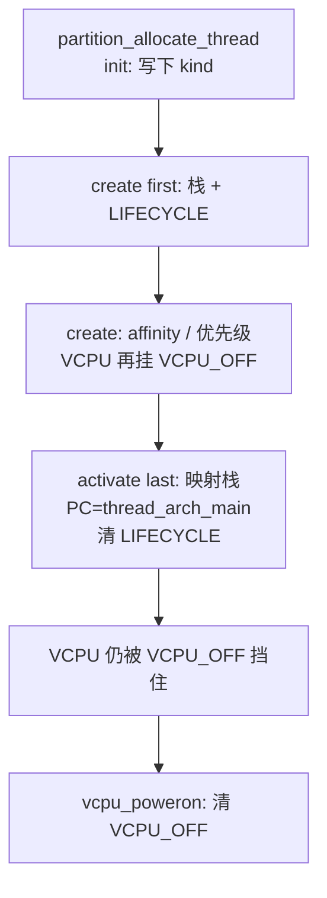

# 第 14 课 · 线程对象怎么造出来（对象链）

上一课：RootVM 已经 `vcpu_poweron`，启动链进了 idle。本课只解决一件事：**一条线程对象经过怎样的对象链才造出来**。不讲 FPRR 怎么选下一个，也不讲 ERET 进 guest。

---

## 1. `thread_t` 是拼出来的，生命周期是三条事件

Gunyah 里几乎所有内核对象都走同一条链：`object_init` → `object_create` → `object_activate`。线程也是。调用方通常是 `partition_allocate_thread`（从某个 partition 的堆里抠出对象并走完 init/create），然后再 `object_activate_thread`。

`thread_t` 不是一个 C 文件写完的结构体。各模块用 `.tc` 的 `extend thread` 往上贴字段：基础在 `hyp/interfaces/thread/thread.tc`，调度字段在 `scheduler_fprr.tc`，Guest 寄存器在 `vcpu.tc`。读到 `thread->scheduler_affinity` 或 `thread->vcpu_regs_el2`，就是拼装结果。

三条事件各自干什么：

| 阶段 | 事件 | 本课要记住的 |
|------|------|----------------|
| init | `object_init_thread` | 写下 `thread->kind` |
| create | `object_create_thread` | 分配内核栈；挂上「还不许跑」的 block |
| activate | `object_activate_thread` | 映射栈、写好首次 PC，清掉生命周期 block |

和第 7 课一样：`trigger_*` 是广播。造一条线程时，thread / scheduler / idle / vcpu 各模块都会被叫到。

---

## 2. 跟着 handler 走一遍

`hyp/core/thread_standard/thread.ev`：create 是 **first**，activate 是 **last**。

1. **`thread_standard_handle_object_init_thread`**：`thread->kind = thread_create.kind`。
2. **`thread_standard_handle_object_create_thread`（first）**：从 `thread->header.partition` 分配内核栈；**`scheduler_block_init(..., SCHEDULER_BLOCK_THREAD_LIFECYCLE)`**。create 必须 first：后面调度器的 create 会断言 `block_bits` 已经非空。
3. **`scheduler_fprr_handle_object_create_thread`（priority -100，靠后）**：初始化 affinity、priority、timeslice、scheduler lock。
4. **VCPU 专用** `vcpu_handle_object_create_thread`：再挂 **`SCHEDULER_BLOCK_VCPU_OFF`**。idle 则挂永久的 `SCHEDULER_BLOCK_IDLE`（第 9-12 课）。
5. **activate（last）**：给栈找 VA 并映射；`thread_arch_init_context` 把 PC 写成 `thread_arch_main`、SP 写成栈顶；`state = READY`；清掉 `THREAD_LIFECYCLE`。

activate 必须 last：清掉生命周期 block 之后，这条线程**有可能立刻被远程 CPU 选中**。前面的人必须先把对象配完。

对 VCPU：lifecycle 清了，**`VCPU_OFF` 还在**，所以 activate 完仍然不能进就绪表。要等第 13 课的 `vcpu_poweron()`：

```c
ret = scheduler_unblock(vcpu, SCHEDULER_BLOCK_VCPU_OFF);
```

block 全清了，调度器才会 `add_thread_to_scheduler`，按 affinity 挂到那颗物理 CPU。怎么排队是第 15 课。



三件不要混：

1. **allocate / create ≠ 已经能跑。** 栈有了，门禁还挂着。
2. **activate ≠ VCPU 正在跑 guest。** 只清掉生命周期；VCPU 还要 poweron。
3. **不要去跟 FPRR 选谁、不要去跟 ERET。** 本课停在「对象齐了、block 还可能挡着」。

---

## 本课你要带走的三句话

1. **线程和别的内核对象走同一条链**：`init` 写 kind，`create` 分配栈并挂上「还不许跑」，`activate` 映射栈并清掉生命周期 block。
2. **`thread_t` 是各模块 `extend thread` 拼出来的**；调度字段、Guest 寄存器都不在同一个 `.tc` 里。
3. **VCPU 多一道 `VCPU_OFF`**：activate 之后仍不能进就绪表，要等 `vcpu_poweron`。

---

## 小练习

请用自己的话回答下面两题（一两句就行）：

1. 为什么 `object_create_thread` 里 thread_standard 必须是 `priority first`？调度器的 create 靠什么断言「已经有人挂过 block」？
2. `object_activate_thread` 之后、`vcpu_poweron` 之前，这条 VCPU 线程为什么还不会被调度器选中？

回答：
1.
2.

答完后，下一课只跟一件事：**FPRR 每颗 CPU 一张就绪表**（还不到切栈）。

---

## 关键源文件

| 文件 | 作用 |
|------|------|
| `hyp/interfaces/thread/thread.tc` | `thread_t` 基础字段 |
| `hyp/interfaces/object/templates/object.ev.tmpl` | init / create / activate 合同 |
| `hyp/core/thread_standard/thread.ev` | create first、activate last |
| `hyp/core/thread_standard/src/thread.c` | 栈、LIFECYCLE、activate |
| `hyp/core/scheduler_fprr/src/scheduler_fprr.c` | create：affinity / 优先级 |
| `hyp/vm/vcpu/src/vcpu.c` | create：挂 `VCPU_OFF` |
| `hyp/vm/vcpu/aarch64/src/aarch64_init.c` | `vcpu_poweron` 清 `VCPU_OFF` |
| [第 5 课](第5课.md) | VCPU 也是线程 |
| [第 9-12 课](第9-12课.md) | idle 的 create 挂永久 `BLOCK_IDLE` |
| [第 13 课](第13课.md) | RootVM 的 allocate / activate / poweron |
