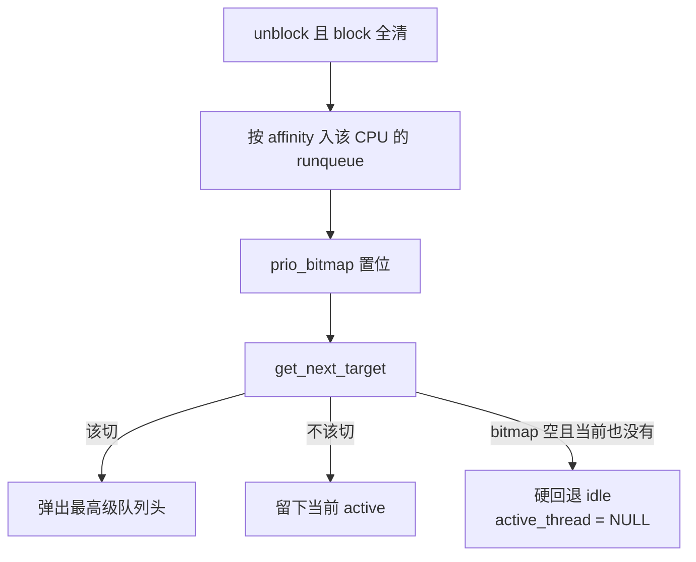

# 第 15 课 · FPRR：每 CPU 一张就绪表

上一课：线程对象造出来了，block 清干净才会进调度器。本课只解决一件事：**FPRR 怎样按每颗物理 CPU 一张就绪表选出下一个**。不讲切栈汇编。

---

## 1. 调度器不认识「虚拟机」

实现在 `hyp/core/scheduler_fprr/src/scheduler_fprr.c`。每颗物理 CPU 一个 `scheduler_t`，放在 `CPULOCAL(scheduler)` 里（第 9-12 课的数组）。

FPRR = Fixed Priority Round Robin：固定优先级 + 同级轮转。

| 规则 | 值 |
|------|-----|
| 优先级 | 0…63，**数值越大越高**；默认 32（`SCHEDULER_DEFAULT_PRIORITY`） |
| RootVM | `ROOTVM_PRIORITY`，等于默认 32 |
| 时间片 | 默认约 5ms；用尽且同级有人 → 轮转 |
| 入队位置 | 只进 **自己 affinity 那颗 CPU** 的表 |

`scheduler_t` 里两件关键东西：

- `prio_bitmap`：64 位，哪一级有人就绪就置位。`bitmap_ffs` 找**最高**级（最低 index）。
- `runqueue[64]`：同级 FIFO。下标 `i = MAX_PRIO - priority`，所以最高优先级在最低 index。

线程只进自己 affinity 那张表。在别的核上 `unblock` 时，若需要立刻重调度，就给目标核发 `IPI_REASON_RESCHEDULE`。

---

## 2. `get_next_target`：有人就选，没人就回 idle

`can_be_scheduled()` 看 `block_bits` 是否全空。有任何一位，就不进 runqueue。

选出下一个（骨架）：

```c
// 先假定继续跑当前的 active_thread（可能是 NULL）
if (bitmap_ffs(scheduler->prio_bitmap, ..., &i)) {
	// 队列上有人：更高优先级，或时间片用尽且同级有人 → 才弹出队列头
	if (should_switch)
		target = pop_runqueue_head(scheduler, i);
}

if (target != NULL) {
	scheduler->active_thread = target;
} else {
	target			 = idle_thread();
	scheduler->active_thread = NULL;
}
```

队列空时不是「把 idle 入队再选它」，而是 **硬回退** 到 `idle_thread()`，并且 `active_thread = NULL`。idle 带着永久的 `SCHEDULER_BLOCK_IDLE`（第 10、14 课），这就是它永远不进 runqueue 的原因。

常用 API，本课先认脸：

| 调用 | 行为 |
|------|------|
| `scheduler_yield()` | 当前时间片置 0，再 `scheduler_schedule()` |
| `scheduler_schedule()` | 有更高优先级才切；当前仍可跑就留下 |
| `scheduler_block` / `unblock` | 置/清某一位；全清且可跑则入队 |
| `scheduler_trigger()` | 本地记一笔「需要重调度」（常配合 IPI） |

`yield` 和 `schedule` 的差别：`schedule` 只在有人比当前更高时才换；`yield` 先丢掉剩余时间片，同级队列头也能把自己换下去。怎么切过去是第 16 课。



三件不要混：

1. **FPRR 选的是线程，不是 VM。** VCPU 只是 kind 不同的线程（第 5 课）。
2. **idle 永不入队。** 队列空时回退到它，不是从 64 级里把它弹出来。
3. **不要在本课读切栈汇编。** 选出 `target ≠ current` 之后才 `thread_switch_to`，那是第 16 课。

---

## 本课你要带走的三句话

1. **每颗物理 CPU 一张 FPRR 就绪表**（`CPULOCAL(scheduler)`）：64 级优先级，数值越大越高，同级 FIFO。
2. **线程只进自己 affinity 那颗 CPU 的队列**；远程 unblock 靠 `IPI_REASON_RESCHEDULE`。
3. **idle 带着永久 `BLOCK_IDLE`，不进 runqueue**；队列空时 `get_next_target` 硬回退到它。

---

## 小练习

请用自己的话回答下面两题（一两句就行）：

1. 为什么 idle 线程不进 runqueue？如果把它也入队，和「队列空时回退到 idle」相比会出什么概念上的问题？
2. 一条 VCPU 的 affinity 是 1 号核，现在 0 号核上调用了 `scheduler_unblock`。这条线程会出现在哪张就绪表上？0 号核自己会不会直接切过去？

回答：
1.
2.

答完后，下一课把选出的那条线程真正切上去：**`thread_switch_to`**，以及 **idle yield 怎样切到 RootVM**。

---

## 关键源文件

| 文件 | 作用 |
|------|------|
| `hyp/core/scheduler_fprr/src/scheduler_fprr.c` | FPRR、`get_next_target`、yield / block |
| `hyp/core/scheduler_fprr/scheduler_fprr.tc` | 64 级、默认时间片、`scheduler_t` |
| `hyp/interfaces/scheduler/include/scheduler.h` | schedule / yield / block API |
| `hyp/vm/rootvm/rootvm.tc` | `ROOTVM_PRIORITY` |
| [第 5 课](第5课.md) | 调度器只认识线程 |
| [第 9-12 课](第9-12课.md) | `CPULOCAL(scheduler)` 这套数组 |
| [第 14 课](第14课.md) | 什么时候才会 `add_thread_to_scheduler` |
