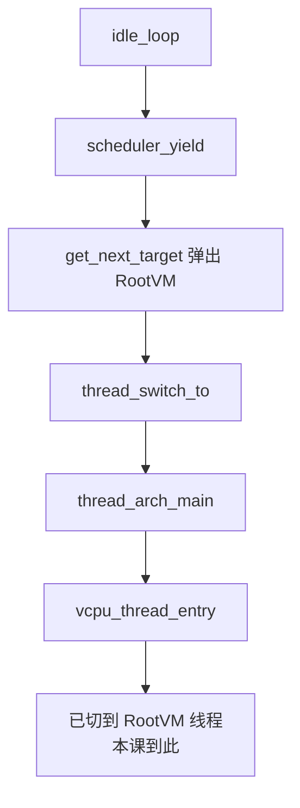

# 第 16 课 · `thread_switch_to`；idle yield 如何切到 RootVM

上一课：FPRR 能从本 CPU 的就绪表里选出下一条线程。本课只解决两件事：**`thread_switch_to` 怎样换到那条线程**；以及 **idle yield 怎样切到已经 poweron 的 RootVM**。不讲 VGIC，也不讲 WFI。

---

## 1. `thread_switch_to`：先发事件，再换栈和 TLS

`scheduler_schedule()` 自己会 `preempt_disable`（第 17 课）。选出 `target ≠ current` 之后：

```c
error_t
thread_switch_to(thread_t *thread, ticks_t schedtime)
{
	assert_preempt_disabled();
	trigger_thread_save_state_event();
	error_t err = trigger_thread_context_switch_pre_event(thread, schedtime);
	thread_t *prev = thread_arch_switch_thread(thread, &schedtime);
	// context_switch_post / load_state ...
	object_put_thread(prev);
}
```

顺序只记四步：

1. **save_state**：各模块把旧线程还在用的硬件状态存进 `thread_t`。
2. **context_switch_pre**：还可以反悔（返回错误则不切）。
3. **`thread_arch_switch_thread`**：换栈、换 `TPIDR_EL2`（当前线程指针）、跳到新 PC。汇编细节本课不跟。
4. 跳过去之后分两条：这条线程**跑过**，就从上次的 `br` 回来，继续 `context_switch_post` / `load_state`，并 `object_put` 旧线程；**第一次**则 PC 指向 `thread_arch_main`（第 14 课 activate 时写的），post / put 在那里做。

`thread_arch_main` 不是业务函数本身：

```c
static noreturn void
thread_arch_main(thread_t *prev, ticks_t schedtime)
{
	trigger_thread_context_switch_post_event(prev, schedtime, 0);
	object_put_thread(prev);
	thread_func_t thread_func =
		trigger_thread_get_entry_fn_event(thread->kind);
	if (thread_func != NULL) {
		preempt_enable();
		thread_func(thread->params);
	}
	thread_exit();
}
```

kind 决定入口：idle → `idle_loop`；VCPU → `vcpu_thread_entry`。入口函数是 `thread_get_entry_fn` 这条选择器事件选出来的（第 7 课的广播，按 kind 选一个）。

对 VCPU，`vcpu_thread_entry` 接着会 `thread_exit_to_user` 进 guest。**本课停在「已经切到这条 VCPU 线程」**；guest 里怎么跑、中断怎么注入，是第 22 课起。

---

## 2. 端到端：idle yield 选出 RootVM

第 13 课结尾：Boot CPU 进了 `idle_loop`，启动锁已解开，RootVM VCPU 已在本 CPU 的 runqueue 上。

```c
static noreturn void
idle_loop(uintptr_t unused_params)
{
	preempt_disable();
	do {
		scheduler_yield();
		while (!idle_yield()) {
			// 没人可跑：等唤醒（WFI 是第 24 课）
		}
	} while (1);
}
```

逐步：

1. `scheduler_yield()` 把 idle 的时间片清零，再 `scheduler_schedule()`。
2. `get_next_target` 从 bitmap 里弹出 RootVM VCPU（表上有人，就不会回退 idle）。
3. `thread_switch_to`：Boot CPU 的栈和 TLS 换成这条 VCPU 的。
4. 首次：`thread_arch_main` → `vcpu_thread_entry`。RootVM 这条线程现在占着物理 CPU。

若 yield 回来了，说明队列空。`idle_yield()` 再问各模块要不要睡；真睡醒是中断/IPI 把某条 VCPU 重新入队之后。怎么睡是第 24 课。



三件不要混：

1. **切到 VCPU 线程 ≠ guest 已经在跑第一条指令。** 入口还要 `exit_to_user`；本课不跟。
2. **idle yield 回来 = 此刻没人可跑**，不是「调度器坏了」。
3. **不要把 VGIC、WFI 扯进来。** 唤醒路径以后再跟。

---

## 本课你要带走的三句话

1. **`thread_switch_to` 要求抢占关掉**：先 save / pre 事件，再换栈和 `TPIDR_EL2`，从新线程的 post / load 继续。
2. **新线程第一次的 PC 是 `thread_arch_main`**，再用 `thread_get_entry_fn` 按 kind 找到 `idle_loop` 或 `vcpu_thread_entry`。
3. **idle yield 把时间片清零再 schedule**：就绪表上已有 RootVM VCPU，就会切过去。

---

## 小练习

请用自己的话回答下面两题（一两句就行）：

1. 为什么新线程第一次运行不直接跳进 `vcpu_thread_entry`，而要先经过 `thread_arch_main`？
2. Boot CPU 已经在 `idle_loop` 里。`vcpu_poweron` 只清掉 `VCPU_OFF`、把线程入队，为什么还要等 `scheduler_yield` 才会切到 RootVM？

回答：
1.
2.

答完后，下一课收 L2：**三把「不能跑」的锁**——block、抢占、RCU 各挡什么。

---

## 关键源文件

| 文件 | 作用 |
|------|------|
| `hyp/core/thread_standard/src/thread.c` | `thread_switch_to` |
| `hyp/core/thread_standard/aarch64/src/thread_arch.c` | `thread_arch_switch_thread` / `thread_arch_main` |
| `hyp/core/scheduler_fprr/src/scheduler_fprr.c` | `scheduler_schedule` / `scheduler_yield` |
| `hyp/core/idle/src/idle.c` | `idle_loop` |
| `hyp/vm/vcpu/aarch64/src/aarch64_init.c` | `vcpu_thread_entry` |
| [第 13 课](第13课.md) | 为何此时 RootVM 已在就绪表上 |
| [第 15 课](第15课.md) | yield 之后谁被选中 |
