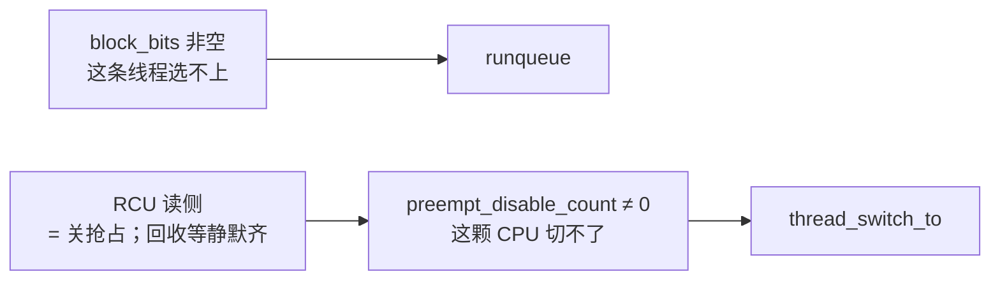

# 第 17 课 · 三把「不能跑」的锁

上一课：idle yield 已经能切到 RootVM 线程。本课只解决一件事：**还有哪些闸会让「不能跑 / 不能切」**。不讲完整 irq 子系统，也不讲 GICv3 寄存器。

---

## 1. 第一把：`block_bits`——这条线程不能被选

`can_be_scheduled()` 看 `scheduler_block_bits` 是否全空。有任何一位，就不进 runqueue（第 15 课）。`scheduler_block` / `unblock` 置清某一位；**同名 block 不嵌套**，一次 unblock 就清掉。

本课先记住已经见过的三位：

| bit | 谁挂上 | 谁清掉 | 含义 |
|-----|--------|--------|------|
| `SCHEDULER_BLOCK_THREAD_LIFECYCLE` | create | activate | 对象还没激活 |
| `SCHEDULER_BLOCK_IDLE` | idle 的 create | **不清** | 待机线程，永不入队 |
| `SCHEDULER_BLOCK_VCPU_OFF` | VCPU 的 create | `vcpu_poweron` | Guest 还没上电 |

以后还会碰到 `VCPU_WFI`（guest 在等中断，第 24 课）等。本课只要建立这张表：**挡的是「能不能被选中」**，不是「当前 CPU 能不能切」。

`block` 当前线程并不会马上换人，调用方还要接着 `scheduler_schedule()` / `yield`。远程 CPU 上正在跑的目标也不会立刻被打断，需要的话另发 IPI。

---

## 2. 第二把：preempt——这颗 CPU 现在不能切

第 11 课的启动锁是 `preempt_disable_count` 里的 `cpu_init` 位。启动结束后，日常用的是**嵌套计数**：`preempt_disable` 加一（并关本地 IRQ），减到 0 才真正开抢占。

切线程的窗口必须关抢占：

- `scheduler_schedule` / `thread_switch_to` **全程要求 preempt disabled**（`schedule` 自己会 disable/enable）。
- idle 循环自己 `preempt_disable` 再 yield。
- 中断里若计数仍大于 0，只 `scheduler_trigger()` 推迟；计数已经是 0，才直接 `scheduler_schedule()`。GICv3 怎么认领中断是第 22 课，本课只记这句分工。

所以启动锁解开之后，也不是「随时随地乱切」。能切的点是明确的：`schedule` 调用点、以及可抢占时 IRQ 返回前。

---

## 3. 第三把：RCU——读侧关抢占，回收等到齐

RCU 解决的是：**可能有人正拿着某个对象指针，不能马上释放**。

- `rcu_read_start()` 内部就是 `preempt_disable()`，表示「我可能正看着」。`rcu_read_finish()` 再 enable。
- 所以 `scheduler_yield` / `schedule` **禁止在 RCU 读侧里调用**（`scheduler.h` 写明了）。读侧等于把第二把锁按住。
- 释放走 `rcu_enqueue`：挂到本 CPU 的批次上，等所有 CPU 都过一次**静默点**（切走过、进了 idle、或已经不在 EL2 跑 hyp）——这就是「等到齐」。齐了才真正回收。

`scheduler_schedule` 在选 target 时包着 `rcu_read_start` / `finish`，正是为了拿着 target 指针时它不会被回收。拿稳了再 `thread_switch_to`。

三件不要混：

1. **block 挡的是线程，preempt 挡的是这颗 CPU。** 就绪表上有人，抢占关着也切不过去。
2. **RCU 不是第四套调度器。** 读侧靠关抢占；回收靠等所有 CPU 静默。
3. **不要去跟 GICv3、不要去跟完整 irq 分发。** 本课只需要：关着抢占时中断最多 `scheduler_trigger()` 推迟。

---

## 本课你要带走的三句话

1. **`block_bits` 全空才能被选中**；LIFECYCLE / IDLE / VCPU_OFF 是已经见过的三位。
2. **`preempt_disable` 让这颗 CPU 不能切线程**；`schedule` / `thread_switch_to` 必须在关抢占下做。
3. **RCU 读侧等于关抢占，回收要等所有 CPU 静默齐**；所以不能在读侧里 yield。

---

## 小练习

请用自己的话回答下面两题（一两句就行）：

1. 一条 VCPU 已经在本 CPU 就绪表上，但当前 `preempt_disable_count != 0`。它会被 `get_next_target` 选中吗？会不会立刻 `thread_switch_to`？
2. 为什么 `scheduler_yield()` 不能在 `rcu_read_start()` 和 `rcu_read_finish()` 之间调用？

回答：
1.
2.

答完后，L2 结束。下一课进入 **L3 内存与隔离**：四个角色各管什么，以及 **memdb 怎样用 CAS 换主人**（还不到 Stage-2 PTE）。

---

## 关键源文件

| 文件 | 作用 |
|------|------|
| `hyp/core/scheduler_fprr/src/scheduler_fprr.c` | `can_be_scheduled`、block / unblock |
| `hyp/interfaces/scheduler/include/scheduler.h` | block API；yield 禁止在 RCU 读侧 |
| `hyp/core/preempt/src/preempt.c` | disable 计数；中断里 postpone vs schedule |
| `hyp/core/rcu_bitmap/src/rcu_bitmap.c` | `rcu_read_start` / `enqueue` |
| [第 11 课](第11课.md) | 启动锁是同一套 count 上的 `cpu_init` 位 |
| [第 14 课](第14课.md) | LIFECYCLE / VCPU_OFF 何时挂上 |
| [第 15 课](第15课.md) | block 非空就不入队 |
