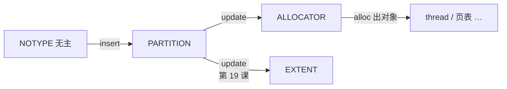

# 第 18 课 · 四个角色；memdb 用 CAS 换主人

L2 已经能把 VCPU 线程调度到物理 CPU 上。本课进入 L3，只解决两件事：**partition / memdb / memextent / addrspace 各回答什么问题**；以及 **memdb 怎样用 CAS 换主人**。不讲 Stage-2 PTE 格式。

---

## 1. 四个角色，四个问题

第 3 课：Guest 自己的 VA→IPA 是 Stage-1（Guest 内核管）；IPA→PA 是 Stage-2（Gunyah 管）。L3 只跟 Stage-2 这一段，以及「这页 PA 现在归谁」。

第 9 课已经见过 partition 和 memdb。L3 把舞台上的四个角色一次对齐：

| 概念 | 角色 | 它回答 |
|------|------|--------|
| **partition** | 资源会计 / 对象从哪分配 | 这页 PA 属于哪个账户？ |
| **memdb** | 全局 PA→owner 账本 | 这页 **当前** owner 是谁、是哪种 type？ |
| **memextent** | 可映射的一段 PA（cap 看得见） | 哪段 PA 能被 map 进 VM？ |
| **addrspace** | 一个 VM 的 Stage-2（含 VMID） | 这个 IPA 上映射了什么？ |

口诀：**partition 是账户，memdb 是账本，memextent 是可捐赠的权证，addrspace 是 VM 看见的 IPA 世界。**

第 9 课的 allocator 仍在：它是 partition 账户里用来 `alloc` 的堆。L3 把它看成 partition 内部的一种 owner 角色（`MEMDB_TYPE_ALLOCATOR`），不再单列成第五个。

`hyp/interfaces/memdb/memdb.tc`：

```text
define memdb_type enumeration {
	NOTYPE = 0;
	PARTITION;
	ALLOCATOR;
	EXTENT;
	TRACE;
};
```

典型换主人顺序：RAM 加入 partition → `PARTITION`；进 heap → `ALLOCATOR`；activate memextent → `EXTENT`。**map 进 addrspace 不再改 memdb**——映射记在 memextent 和 Stage-2 页表里。权证怎么 activate、PTE 怎么写，是第 19–20 课。

---

## 2. memdb：整段对上旧主人，才过户

接口（`hyp/interfaces/memdb/include/memdb.h`）：

```c
error_t memdb_insert(partition_t *partition, paddr_t start, paddr_t end,
		     uintptr_t object, memdb_type_t obj_type);

error_t memdb_update(partition_t *partition, paddr_t start, paddr_t end,
		     uintptr_t object, memdb_type_t obj_type,
		     uintptr_t prev_object, memdb_type_t prev_type);
```

实现上 **insert = 从 `NOTYPE` 做 update**（`hyp/mem/memdb_bitmap/src/memdb.c`）。update 要求整段连续都属于 `prev_object/prev_type`，否则 `ERROR_MEMDB_NOT_OWNER`——不允许「这段里掺了别人的页还硬改」。这就是课名里的 CAS：比对旧值，对得上才换成新值。

两个容易踩的点：

1. **`partition` 参数永远是 `partition_get_private()`**（给账本节点分配内存，代码里有 assert），**不是「页的主人」**。主人在 `object` / `obj_type` 里。
2. 第 9 课启动时：镜像先 `insert` 给 hyp partition，bootmem 再 `update` 成 `ALLOCATOR`；`partition_add_ram_range` 则 `insert` 给那个 owner partition。第 13 课给 root 登记其余 RAM，也是 insert，不是从 hyp 过户。



三件不要混：

1. **账户 ≠ 账本。** partition 是「谁」；memdb 按物理页记「现在归谁、是哪种 type」。
2. **configure / 填表 ≠ 过户。** 过户只发生在 `memdb_insert` / `update` 成功时。
3. **不要在本课读 Stage-2 PTE。** addrspace 本课只作为第四个角色出现；怎么 `map` 是第 20 课。

---

## 本课你要带走的三句话

1. **四个角色**：partition 管账户，memdb 管当前主人，memextent 是可 map 的权证，addrspace 是 VM 的 IPA 世界。
2. **`memdb_insert` 就是从 `NOTYPE` 做 `update`**；`update` 必须整段已经属于声明的旧主人，否则 `ERROR_MEMDB_NOT_OWNER`。
3. **`partition` 参数是给账本自己分配节点的纸**（永远是 hyp private），主人写在 `object` / `type` 里。

---

## 小练习

请用自己的话回答下面两题（一两句就行）：

1. 一页 RAM 已经在某个 partition 名下（type = `PARTITION`）。有人拿另一段「一半是这个 partition、一半还是无主」的范围去 `memdb_update` 成 `EXTENT`，会怎样？为什么？
2. 调用 `memdb_insert(..., object=root_partition, PARTITION)` 时，第一个参数为什么仍必须是 `partition_get_private()`，而不是 `root_partition`？

回答：
1.
2.

答完后，下一课只跟权证：**memextent 是什么；为什么 configure 不换主人，activate 才过户**。

---

## 关键源文件

| 文件 | 作用 |
|------|------|
| `hyp/interfaces/memdb/include/memdb.h` | insert / update 契约 |
| `hyp/interfaces/memdb/memdb.tc` | `memdb_type`：PARTITION / ALLOCATOR / EXTENT / … |
| `hyp/mem/memdb_bitmap/src/memdb.c` | insert = update from NOTYPE；对不上旧主人就失败 |
| [第 3 课](第3课.md) | Stage-1 预备；本课开始管 IPA→PA 的归属 |
| [第 9 课](第9课.md) | 启动期 partition → memdb；本课补上后两个角色和 CAS |
| [第 13 课](第13课.md) | 其余 RAM insert 给 root，不是从 hyp update 过来 |
