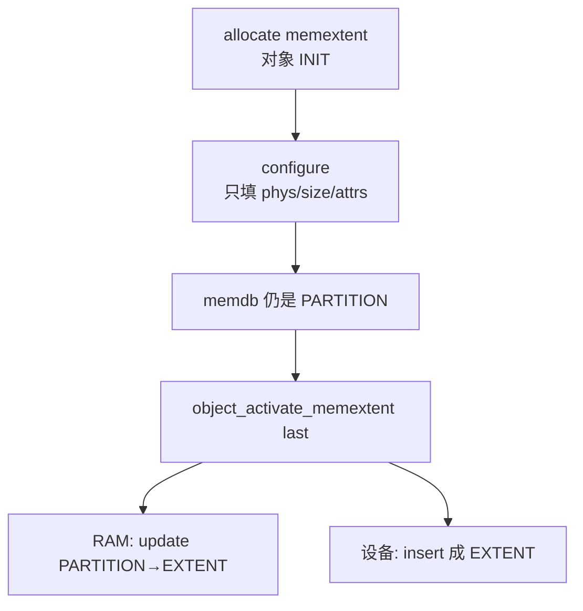

# 第 19 课 · memextent 是权证；activate 才过户

上一课：四个角色对齐了，memdb 用 CAS 换主人。本课只解决两件事：**memextent 是什么**；以及 **为什么 configure 不换主人，activate 才过户**。不讲 addrspace 怎么把映射循环写进 Stage-2。

---

## 1. memextent：一段 PA 的权证

memextent 不是「已经 map 进 VM 的那张页表」，而是一张 **cap 看得见的权证**：声明「哪段物理内存可以由谁来 map」。没有这张权证，addrspace 写不出合法的 Stage-2 PTE。

对外路径和线程对象一样，走第 14 课那条链：

1. `partition_allocate_memextent` → 对象停在 `INIT`（RM 侧对应 hypercall 造 cap，再 `hypercall_memextent_configure`）
2. `memextent_configure(me, phys_base, size, attrs)` —— **只填字段，memdb 仍是 PARTITION**
3. `object_activate_memextent` → 按 type 广播 `memextent_activate`；basic 走到 `memextent_activate_basic`

`memextent_configure`（`hyp/mem/memextent/src/memextent.c`）校验对齐、type、memtype、access，然后写下 `phys_base` / `size` / `memtype` / `access`。这里 **没有** `memdb_update`。

---

## 2. activate 才过户

`memextent.ev` 里 `object_activate_memextent` 是 **last**：过户一旦成功，别的 handler 失败再撤会很麻烦，所以它必须排在最后。

`memextent_activate_basic`：

```c
if (me->device_mem) {
	ret = memdb_insert(..., (uintptr_t)me, MEMDB_TYPE_EXTENT);
} else {
	ret = trigger_memextent_change_ownership_event(
		partition, NULL, me, me->phys_base, me->size);
	// 默认：memdb_update(..., EXTENT, partition, PARTITION)
}
```

| 来源 | memdb 怎么变 |
|------|----------------|
| 普通 RAM（无 parent） | `PARTITION` → `EXTENT` |
| 设备内存 | 直接 `insert`（原先可能不在 partition 账上） |
| 派生 extent | parent `EXTENT` → child `EXTENT` |

默认过户 handler 是 `memextent_handle_memextent_change_ownership`：`from_me == NULL` 时，旧主人是那个 partition，新主人是这张 extent。`partition` 参数仍是账户；真正写账本时分配节点用的还是 hyp private（第 18 课）。

**configure 填表，activate 过户。** 只 configure、没 activate，`memdb_lookup` 仍看到 `PARTITION`，Guest 也还没有 IPA。

本课先跟 **basic、无 parent 的 RAM**。sparse 按页拆分捐赠、derive 细节，先不要铺开。

**attach ≠ map**，先记这张表，映射循环是第 20 课：

| 调用 | 进哪套页表 | 谁看见 |
|------|------------|--------|
| `memextent_attach` | `pgtable_hyp_map`（EL2 Stage-1） | hypervisor 自己 |
| `memextent_map` | `pgtable_vm_map`（Stage-2） | Guest（经 IPA） |



三件不要混：

1. **填表 ≠ 过户。** configure 之后账本没变。
2. **extent 对象从堆里分配 ≠ 那页 PA 归这个对象。** PA 所有权是 activate 时才 `memdb_update` 过去的。
3. **不要在本课跟 `addrspace_map` 的循环。** 权证过户完，还没有 IPA。

---

## 本课你要带走的三句话

1. **memextent 是可 map 的权证**，不是 Stage-2 页表本身。
2. **`memextent_configure` 只填 phys/size/attrs**，memdb 仍是 `PARTITION`。
3. **`object_activate_memextent` 才过户**：普通 RAM 走 `memdb_update(PARTITION→EXTENT)`。

---

## 小练习

请用自己的话回答下面两题（一两句就行）：

1. 一页 RAM 已经 `memextent_configure` 但还没 activate。此时 `memdb_lookup` 会看到什么 type？Guest 能通过某个 IPA 访问它吗？
2. 为什么 `object_activate_memextent` 在 `.ev` 里写成 `priority last`？

回答：
1.
2.

答完后，下一课只跟一件事：**addrspace 怎样把这张权证写成 Stage-2 PTE**。

---

## 关键源文件

| 文件 | 作用 |
|------|------|
| `hyp/interfaces/memextent/include/memextent.h` | configure / map / attach 契约 |
| `hyp/mem/memextent/memextent.ev` | activate last；`change_ownership` |
| `hyp/mem/memextent/src/memextent.c` | configure；activate 编排 |
| `hyp/mem/memextent/src/memextent_basic.c` | `memextent_activate_basic` |
| `hyp/mem/memextent/src/hypercalls.c` | RM 侧 `hypercall_memextent_configure` |
| [第 14 课](第14课.md) | 对象链：init / create / activate |
| [第 18 课](第18课.md) | memdb CAS；本课是 PARTITION→EXTENT 那一次 |
