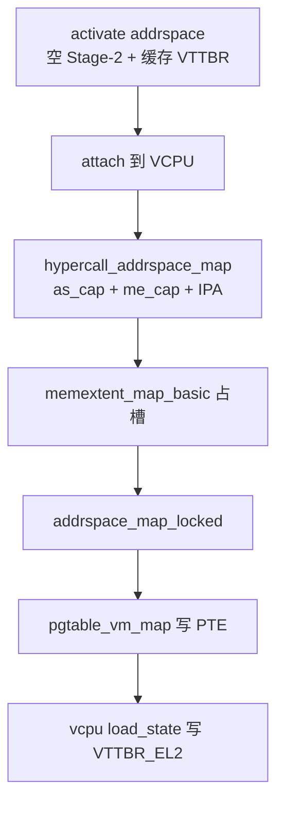

# 第 20 课 · addrspace 把权证写成 Stage-2 PTE

上一课：权证 activate 之后，那页 PA 的主人已经是 memextent。本课只解决一件事：**addrspace 怎样把这张权证写成 Stage-2 PTE**。不讲 hyp 自己内部堆怎么映射。

---

## 1. 先有空的 Stage-2，再往上写 PTE

创建路径：

```text
partition_allocate_addrspace
  → addrspace_configure(as, vmid)
  → object_activate_addrspace
      → pgtable_vm_init   // 空的 Stage-2 根表，并缓存好 VTTBR 值
  → addrspace_attach_thread   // thread->addrspace 指过去
```

`addrspace_configure` 只记下 VMID（0 和越界非法）。真正建页表在 activate：`pgtable_vm_init` 从该 addrspace 所属 partition 分配根表。RootVM 这条链在 `addrspace_handle_rootvm_init` 里走完，再把 cap 交给 RM。

没有 attach 到 VCPU 上，后面切上来也装不了 VTTBR。`addrspace_handle_object_activate_thread` 会检查：VCPU 必须已经挂好 addrspace。

---

## 2. hypercall 把 cap 换成一次 map

Guest / RM 侧：

```c
hypercall_addrspace_map(cap_id_t addrspace_cap, cap_id_t memextent_cap,
			vmaddr_t vbase, ...)
{
	// lookup 两个 cap（要有 MAP 权利）
	ret = memextent_map(memextent, addrspace, vbase, map_attrs, map_flags);
}
```

CapID 怎么找到对象是第 26 课。本课只要：调用方口袋里是两张号码牌，hyp 里才是指针。

再往下：

```text
memextent_map
  → memextent_map_basic          // 占一个 mapping slot
  → memextent_do_map
  → addrspace_map                // start → map_locked → commit
  → addrspace_map_locked
  → pgtable_vm_map               // 写 Stage-2 PTE
```

`vbase` 是 **IPA**，不是 Guest VA，也不是 PA。PTE 写的是 IPA→PA + Stage-2 属性。**memdb 在这一步不再改**——第 18 课说过，map 记在 extent 的 mappings 和页表里。

basic 类型同时最多记 `MEMEXTENT_MAX_MAPS = 4` 个 addrspace 映射；槽满了返回 `ERROR_MEMEXTENT_MAPPINGS_FULL`。有 children 的 extent 会先 `memdb_range_walk`，只 map 仍属于自己的连续段。本课先按「整段 basic、无 parent」记。

VCPU 被切上来时：

```c
addrspace_handle_vcpu_load_state(void)
{
	pgtable_vm_load_regs(&thread->addrspace->vm_pgtable); // MSR VTTBR_EL2
}
```

这是第 16 课 `load_state` 广播里的一员。没有这一步，Stage-2 根表地址没装进硬件，Guest 访存会在 EL2 变成 abort。



三件不要混：

1. **IPA ≠ Guest VA ≠ PA。** `vbase` 是 IPA。
2. **map 不改 memdb。** 主人还是那张 extent。
3. **不要在本课跟 hyp 内部堆映射。** EL2 自己怎么 `hyp_aspace_allocate`，是第 21 课。

---

## 本课你要带走的三句话

1. **addrspace 是一个 VM 的 Stage-2**：activate 时 `pgtable_vm_init` 建空根表，attach 到 VCPU 上。
2. **`hypercall_addrspace_map` 拿两张 cap**，最终 `pgtable_vm_map` 把 IPA→PA 写成 PTE；`vbase` 是 IPA。
3. **切上 VCPU 时 `load_state` 写 `VTTBR_EL2`**，Guest 访存才走这张 Stage-2。

---

## 小练习

请用自己的话回答下面两题（一两句就行）：

1. `hypercall_addrspace_map` 的 `vbase` 是 Guest VA、IPA 还是 PA？如果填成 Guest VA，Stage-2 会对上 Guest 内核以为的地址吗？
2. 页表已经 `pgtable_vm_map` 写好了，但 VCPU 切上来时没跑 `addrspace_handle_vcpu_load_state`。Guest 访存会怎样？

回答：
1.
2.

答完后，下一课把两套地址空间分开，再把 **一页 RAM 的 7 步**串起来。

---

## 关键源文件

| 文件 | 作用 |
|------|------|
| `hyp/mem/addrspace/src/addrspace.c` | configure、activate、`map_locked`、load VTTBR |
| `hyp/mem/addrspace/src/hypercalls.c` | `hypercall_addrspace_map` |
| `hyp/interfaces/addrspace/include/addrspace.h` | `addrspace_map` = start / locked / commit |
| `hyp/mem/memextent/src/memextent.c` | `memextent_map` |
| `hyp/mem/memextent/src/memextent_basic.c` | `memextent_map_basic` / `memextent_do_map` |
| [第 3 课](第3课.md) | Stage-1 是 Guest 自己的 VA→IPA；本课是 Stage-2 |
| [第 16 课](第16课.md) | `load_state` 何时跑 |
| [第 19 课](第19课.md) | 权证已经过户；本课只写 PTE |
