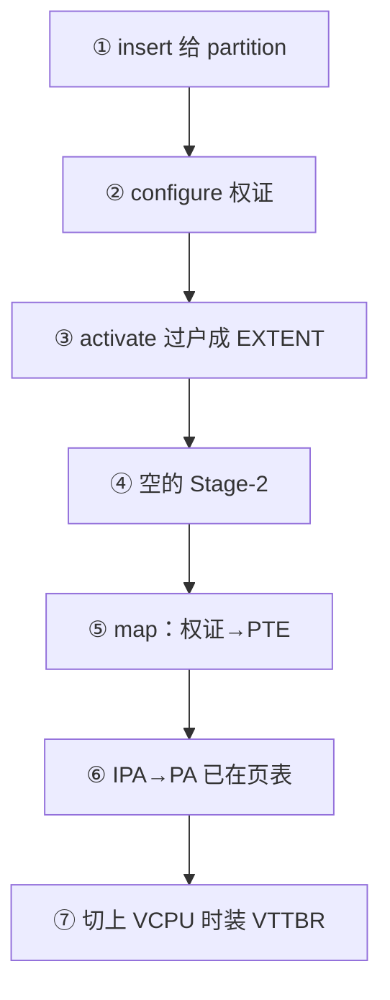

# 第 21 课 · hyp_aspace ≠ guest addrspace；一页 RAM 的 7 步

上一课：权证已经写成 Stage-2 PTE。本课只解决两件事：**hyp 自己的地址空间和 guest 的 addrspace 不是同一套**；以及 **把一页 RAM 从归属到映射的 7 步串起来**。不讲 SMMU，也不通读内存捐赠 API。

---

## 1. 两套页表，两个观众

| | hyp_aspace | guest addrspace |
|--|------------|-----------------|
| 谁用 | Hypervisor EL2 | Guest VM |
| API | `pgtable_hyp_*` | `pgtable_vm_*` |
| 地址 | EL2 VA | IPA |
| 寄存器 | TTBR_EL2 | **VTTBR_EL2** |
| 直通 PA | `partition_phys_map`（physaccess 窗口） | 只能走 Stage-2 |

`hyp_aspace_allocate()` 给 hyp 自己划一段 EL2 VA（栈、设备寄存器窗口等都从这里拿）。`memextent_attach` 的 VA 必须落在这段里，然后 `pgtable_hyp_map` 让 EL2 看见那页 PA。

`partition_phys_map` 更直：`VA = PA + offset`，是 hyp 给自己开的「物理窗口」，**不是**把页给 Guest。造 RootVM 时 `copy_rm_env_data_to_rootvm_mem` 就是用这个窗口把 env 拷进 RootVM 的物理页。

同一页 PA 完全可以：hyp 用 Stage-1 attach 看见一份，Guest 用 Stage-2 map 看见一份。两套页表，两个观众。只做 attach、不做 map，Guest 看不见。

---

## 2. 一页 RAM 的 7 步

把第 9、13、18、19、20 课串成一条：

```text
[1] partition_add_ram_range
      → memdb_insert(..., owner_partition, PARTITION)

[2] partition_allocate_memextent + memextent_configure
      → 只填 phys/size；memdb 仍是 PARTITION

[3] object_activate_memextent
      → memextent_activate_basic
      → memdb_update(..., me, EXTENT, partition, PARTITION)

[4] 创建并 activate addrspace
      → pgtable_vm_init（空 Stage-2）

[5] hypercall_addrspace_map(as_cap, me_cap, ipa, ...)
      → memextent_map → addrspace_map → pgtable_vm_map

[6] Stage-2 PTE：IPA → PA
      memdb 不再改；映射在 extent + 页表里

[7] vcpu load_state 写 VTTBR_EL2
      guest VA →(S1, Guest) IPA →(S2, Gunyah) PA
```



有 children 的 extent 在第 5 步会 `memdb_range_walk`，只 map 仍属于自己的连续段。本课先按「整段 basic、无 parent」记。SMMU、按页 donate，先不要铺开。

不要混淆的几件事：

1. **configure 不换主人**，activate 才 `memdb_update`。
2. **memdb owner ≠ 已经 map 进 VM**。`EXTENT` 只说明「这页现在是这张权证的」。
3. **partition 拥有 memextent 对象 ≠ 拥有那页 PA**。对象从 heap 分配；PA 所有权是 activate 时过户的。
4. **IPA ≠ Guest VA ≠ PA。** `addrspace_map` 的 `vbase` 是 IPA。
5. **hyp_aspace 不是 guest addrspace。** 地图上的 L3 是第 18–21 课，不是第 3 课。

---

## 本课你要带走的三句话

1. **hyp_aspace 是 EL2 自己的 Stage-1**（TTBR_EL2），guest `addrspace` 是 Stage-2（VTTBR_EL2）；`partition_phys_map` 只服务 hypervisor。
2. **一页 RAM 的主路径是 7 步**：insert 账户 → configure 权证 → activate 过户 → 建空 Stage-2 → map 写 PTE → 账本不再改 → 切上时装 VTTBR。
3. **attach 给 hyp 看、map 给 Guest 看**；只 attach 不 map，Guest 没有这条 IPA。

---

## 小练习

请用自己的话回答下面两题（一两句就行）：

1. `memextent_attach` 和 `memextent_map` 各把页写进哪套页表？只做 attach、不做 map，Guest 看得见这页吗？
2. 按上面 7 步，哪一步会改 memdb？哪一步第一次让 Guest 能用某个 IPA 访存（假定 VTTBR 已经装上）？

回答：
1.
2.

答完后，L3 结束。下一课进入 **L4 中断虚拟化**：为什么物理 IRQ 会进 EL2，以及向量表怎样把 CPU 接进来。

---

## 关键源文件

| 文件 | 作用 |
|------|------|
| `hyp/mem/hyp_aspace/armv8/src/hyp_aspace.c` | EL2 VA 分配 |
| `hyp/core/partition_standard/armv8/src/phys_access.c` | `partition_phys_map`：VA = PA + offset |
| `hyp/vm/rootvm/src/rootvm_init.c` | `copy_rm_env_data_to_rootvm_mem` 用物理窗口 |
| `hyp/mem/memextent/src/memextent_basic.c` | attach → `pgtable_hyp_map` |
| [第 3 课](第3课.md) | Stage-1 预备；和本课的 Stage-2 / hyp_aspace 分开记 |
| [第 9-12 课](第9-12课.md) | 第 1 步 insert |
| [第 18 课](第18课.md) | 四个角色、CAS |
| [第 19 课](第19课.md) | 第 2–3 步 |
| [第 20 课](第20课.md) | 第 4–7 步 |
