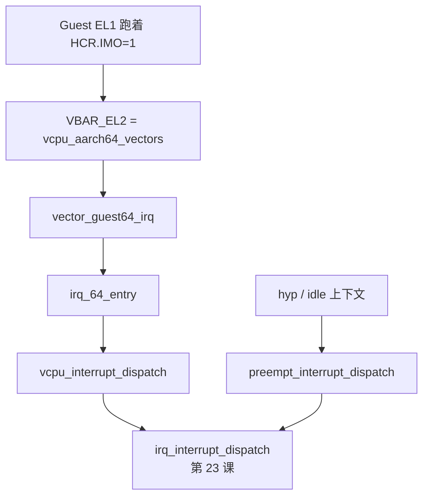

# 第 22 课 · 为什么物理 IRQ 进 EL2；向量表怎么进来

L3 把一页 RAM 送到 Guest 能用的 IPA 上了。本课进入 L4，只解决两件事：**为什么物理 IRQ 会进 EL2**；以及 **向量表怎样把 CPU 接进 hyp**。不讲 `ICH_LR` 怎么注入。

---

## 1. 物理 IRQ 被 HCR 改道到 EL2

第 4 课：设备来的 IRQ 是异步的。没有 hypervisor 时，EL1 内核自己收。有了 Gunyah，VCPU 初始化时固定打开 `HCR_EL2.IMO/FMO/AMO`（物理 IRQ / FIQ / SError 改路由到 EL2），并且 **关掉** 软件假中断位 `VI/VF`：

```c
// hyp/vm/vcpu/aarch64/src/aarch64_init.c
HCR_EL2_set_FMO(&el2_regs->hcr_el2, true);
HCR_EL2_set_IMO(&el2_regs->hcr_el2, true);
HCR_EL2_set_AMO(&el2_regs->hcr_el2, true);
HCR_EL2_set_VF(&el2_regs->hcr_el2, false);
HCR_EL2_set_VI(&el2_regs->hcr_el2, false);
```

切到 VCPU 时 `vcpu_context_switch_load()` 会写 `HCR_EL2`，并把 `VBAR_EL2` 设成 `vcpu_aarch64_vectors`。

课上先记住这一句：**Guest 看到的中断靠 ICH_LR 呈现给 ICV，不是 hyp 在 HCR 上竖一根 VI 旗。** `HCR.VI` 在这份代码里是关的。物理设备来的 SPI，先被 EL2 认领，再由软件决定写哪条虚拟 LR——怎么写是第 23 课。

本课只为 **Forwarded SPI** 这条链垫入口。VM timer 那种软件 `virq_assert` 后半段同一条 `vgic_deliver`，只是 `is_hw=false`。

---

## 2. 进来走哪一格：`vcpu_aarch64_vectors`

文件：`hyp/vm/vcpu/armv8-64/src/vectors.S`。第 4 课已经见过格子里是入口指令。现在把 Guest 三条路和 hyp 自己的路对齐：

| Guest 入口 | 汇编 | C |
|------------|------|---|
| Sync（HVC / WFI / abort…） | `vector_guest64_sync` | `vcpu_exception_dispatch` |
| IRQ | `vector_guest64_irq` → `irq_64_entry` | `vcpu_interrupt_dispatch` |
| SError | `error_64_entry` | `vcpu_error_dispatch` |

IRQ 路径：

```asm
vector vector_guest64_irq
	save_guest_context_vcpu_zero_0_13_irq
	b	irq_64_entry
```

```asm
function irq_64_entry local
	save_guest_context_vcpu_zero_14_29_irq
	bl	vcpu_interrupt_dispatch
	b	vcpu_exception_return
```

`vcpu_interrupt_dispatch` 先 `thread_entry_from_user`，再 `irq_interrupt_dispatch()`。认领 INTID、决定注入，是第 23 课。

若物理 IRQ 打在 hyp 自己身上（例如正在跑 idle、用的不是这张 guest 向量表），走 core 向量 → `preempt_interrupt_dispatch()` → **同一份** `irq_interrupt_dispatch()`。认领物理中断的核心不因「当时在跑 guest 还是 idle」分成两套。



三件不要混：

1. **物理 IRQ 进 EL2，是因为 `HCR.IMO`，不是因为 `HCR.VI`。** VI 在代码里是关的。
2. **向量表格子里是入口指令**（第 4 课），不是函数指针表。
3. **不要在本课读 `ICH_LR` 怎么填。** 本课停在「CPU 已经进了 `vcpu_interrupt_dispatch`」。

---

## 本课你要带走的三句话

1. **VCPU 打开 `HCR.IMO/FMO/AMO`**，物理 IRQ 被改道到 EL2；`HCR.VI` 是关的。
2. **切上 VCPU 时写下 `VBAR_EL2 = vcpu_aarch64_vectors`**，Guest IRQ 走 `vector_guest64_irq` → `irq_64_entry`。
3. **Guest 路径和 idle 路径最后都进 `irq_interrupt_dispatch`**；认领和注入是下一课。

---

## 小练习

请用自己的话回答下面两题（一两句就行）：

1. 有人说「hypervisor 只要在 `HCR_EL2` 上置 `VI`，Guest 就能看到中断」。这份代码为什么不这么做？
2. Guest 正在 EL1 跑，来了一条物理 SPI。CPU 先跳进哪段汇编？最终会进哪个 C 函数？

回答：
1.
2.

答完后，下一课只跟：**怎样认领这条物理中断**，以及 **`virq_assert` 怎样把它写进 `ICH_LR`**。

---

## 关键源文件

| 文件 | 作用 |
|------|------|
| `hyp/vm/vcpu/aarch64/src/aarch64_init.c` | 打开 IMO，关掉 VI |
| `hyp/vm/vcpu/aarch64/src/context_switch.c` | 切上时装 HCR、`VBAR_EL2` |
| `hyp/vm/vcpu/armv8-64/src/vectors.S` | `vcpu_aarch64_vectors` / `irq_64_entry` |
| `hyp/vm/vcpu/aarch64/src/trap_dispatch.c` | `vcpu_interrupt_dispatch` |
| `hyp/core/preempt/src/preempt.c` | hyp 自己的 IRQ：`preempt_interrupt_dispatch` |
| [第 4 课](第4课.md) | 中断 vs 陷入；向量表格子里是指令 |
| [第 16 课](第16课.md) | 切上 VCPU 会 `load_state`；其中就包括写 HCR / VBAR |
