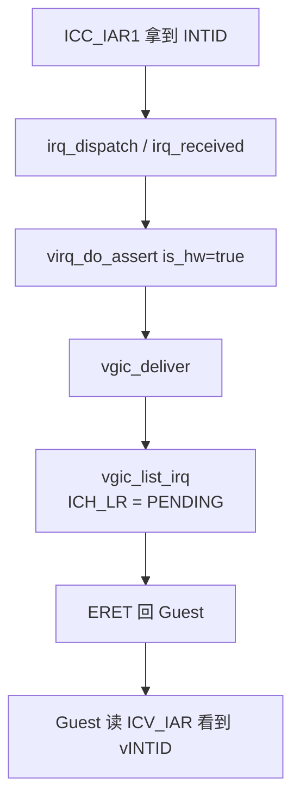

# 第 23 课 · 认领物理中断；`virq_assert` → ICH_LR 注入

上一课：物理 IRQ 已经进了 EL2，CPU 停在 `vcpu_interrupt_dispatch`。本课只解决两件事：**怎样认领这条物理中断**；以及 **`virq_assert` 怎样把它写成 `ICH_LR`**。不讲 WFI，也不深挖维护中断。

---

## 1. 认领：`irq_interrupt_dispatch`

```c
void
vcpu_interrupt_dispatch(void)
{
	thread_entry_from_user(THREAD_ENTRY_REASON_INTERRUPT);
	preempt_disable_in_irq();

	if (irq_interrupt_dispatch()) {
		(void)scheduler_schedule();
	}

	preempt_enable_in_irq();
	thread_exit_to_user(THREAD_ENTRY_REASON_INTERRUPT);
}
```

`irq_interrupt_dispatch()`（`hyp/core/irq/src/irq.c`）循环调用 `irq_interrupt_dispatch_one()`：

1. `platform_irq_acknowledge()` → `gicv3_irq_acknowledge()`，读 **`ICC_IAR1_EL1`** 拿到 INTID。
2. 返回 `ERROR_RETRY`：平台已经当 IPI/SGI 处理完，再 ack 下一条。
3. 返回 `ERROR_IDLE`：没有更多 pending，退出循环。
4. 返回 OK：按 INTID 查 `irq_range`，广播 `irq_dispatch[range_type]`。
5. handler 返回 **true**：hyp 自己处理完，`platform_irq_deactivate`。返回 **false**：转发给 Guest，**先别 DIR**（硬件 listed 的 SPI 要等 Guest EOI 再联动 deactivate）。

普通 SPI 的 range type 是 `IRQ_RANGE_TYPE_HWIRQ`，落到 `irq_handle_irq_dispatch`：查出 `hwirq_t`，再广播 `irq_received[hwirq->action]`。

事件接线（`hyp/vm/vgic/vgic.ev`）：

```text
subscribe irq_received[HWIRQ_ACTION_VGIC_FORWARD_SPI]
	handler vgic_handle_irq_received_forward_spi(hwirq)

subscribe irq_received[HWIRQ_ACTION_VGIC_MAINTENANCE]
	handler vgic_handle_irq_received_maintenance()
```

维护中断（hyp 自己的 GICH IRQ）走 true 那条；本课主路径 **Forwarded SPI** 成功时返回 false。

---

## 2. 注入：`virq_do_assert` → `vgic_deliver` → ICH_LR

```c
bool
vgic_handle_irq_received_forward_spi(const hwirq_t *hwirq)
{
	bool_result_t ret =
		virq_do_assert(&hwirq->vgic_spi_source, false, true);
	// is_hw = true → delivery state 带 hw_active
	return deactivate;  // 失败才 true（关掉这条 SPI）
}
```

`virq_do_assert`：找到 VIC 和目标 VCPU，组好 `assert_dstate`（edge / level / **hw_active**），调用 `vgic_deliver`。软件源（VM timer）走公开的 `virq_assert()`，内部同样是 `virq_do_assert(..., is_hw=false)`。

`vgic_deliver`（`hyp/vm/vgic/src/deliver.c`）的决策，本课只记主干：

- 已在某个 LR 里 → `vgic_redeliver`
- 有空 LR → `vgic_list_irq`，把这条 vIRQ **listed**
- LR 满了 → `vgic_flag_locked`（记在 search bitmap，以后再塞）
- 需要时 `vcpu_wakeup` / `vcpu_wakeup_self`（叫醒睡着的 VCPU 是第 24 课）

写入 List Register：

```c
ICH_LR_EL2_base_set_HW(&status->lr.base, is_hw);
if (is_hw) {
	ICH_LR_EL2_HW1_set_pINTID(&status->lr.hw,
				  hwirq_from_virq_source(source)->irq);
}
ICH_LR_EL2_base_set_vINTID(&status->lr.base, virq);
ICH_LR_EL2_base_set_State(&status->lr.base, ICH_LR_EL2_STATE_PENDING);
if (to_self) {
	vgic_write_lr(lr);   // → gicv3_write_ich_lr
}
```

`is_hw=true` 时 LR 带着物理 pINTID，Guest EOI 可以联动物理 deactivate。所以 forwarded SPI 的 handler **常常返回 false**：hyp 此刻不能 DIR，否则 Guest 侧 ICV 还没认领，物理 IRQ 已经被关掉了。

Guest 内核把 ICV_* 当成「自己的 GIC CPU interface」：`ICV_IAR` 认领 vINTID，LR 从 PENDING → ACTIVE → EOI 后 INVALID。Guest 不需要知道 EL2 写过 ICH_LR。

VIC / vic_base 一句话：**vic 是虚拟中断控制器对象；vic_base 是绑定 hypercall 的胶水；真正注入在 vgic。**



三件不要混：

1. **ack 物理 INTID ≠ Guest 已经看见 vIRQ。** 还要写 ICH_LR。
2. **handler 返回 false 不是失败。** 对 forwarded SPI，成功就是先不 deactivate。
3. **不要去跟 WFI、不要去跟维护中断里每一类 MISR。** 本课停在「LR 已经 PENDING」。

---

## 本课你要带走的三句话

1. **hyp 用 `ICC_IAR1` 认领物理 INTID**，再按 `hwirq->action` 广播；转发 SPI 成功时不 DIR。
2. **`virq_do_assert` → `vgic_deliver` → `vgic_list_irq`** 把 vIRQ 写成 `ICH_LR.PENDING`；硬件源带 pINTID。
3. **Guest 用 ICV 看见 vIRQ**，不知道 EL2 写过 ICH_LR；hyp 的 ERET 只是回到 Guest。

---

## 小练习

请用自己的话回答下面两题（一两句就行）：

1. 为什么转发 SPI 的 handler 常常返回 false（先不 deactivate 物理 IRQ）？如果 hyp 立刻 DIR，Guest 侧会出什么问题？
2. VM timer 那种软件中断也走 `vgic_deliver`，和 forwarded SPI 相比，`ICH_LR` 上最关键的一位差别是什么？

回答：
1.
2.

答完后，下一课只跟 **WFI**：VCPU 线程睡着，vIRQ 再叫醒。

---

## 关键源文件

| 文件 | 作用 |
|------|------|
| `hyp/vm/vcpu/aarch64/src/trap_dispatch.c` | `vcpu_interrupt_dispatch` |
| `hyp/core/irq/src/irq.c` | `irq_interrupt_dispatch` / `_one` |
| `hyp/platform/gicv3/src/gicv3.c` | `gicv3_irq_acknowledge` 读 `ICC_IAR1` |
| `hyp/vm/vgic/vgic.ev` | `irq_received` 接线 |
| `hyp/vm/vgic/src/distrib.c` | `virq_do_assert` / forward SPI |
| `hyp/vm/vgic/src/deliver.c` | `vgic_deliver` / `vgic_list_irq` |
| `hyp/vm/vcpu/armv8-64/src/return.S` | `vcpu_exception_return` → `eret` |
| [第 4 课](第4课.md) | IRQ 是设备来的 |
| [第 17 课](第17课.md) | 中断里可能 `schedule` 或只 `trigger` |
| [第 22 课](第22课.md) | 为什么会进到这份 dispatch |
