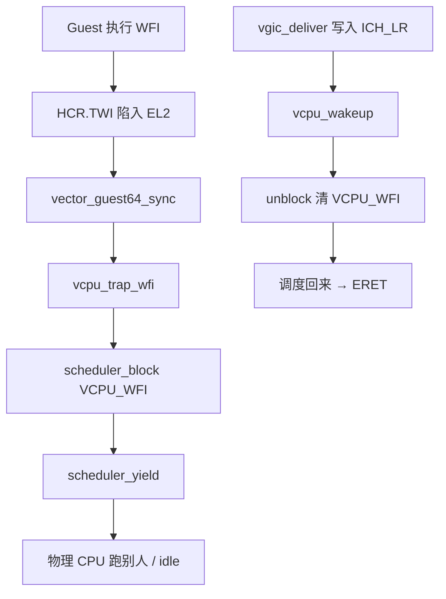

# 第 24 课 · WFI：线程睡着，vIRQ 再叫醒

上一课：`ICH_LR` 已经写成 PENDING。本课只解决一件事：**Guest 执行 WFI 之后，VCPU 线程怎样睡着，vIRQ 怎样再叫醒**。不讲 PSCI 全路径，也不扫所有 vdevice。

---

## 1. WFI 为什么会进 EL2

第 22 课：Guest 的 IRQ 走 `vector_guest64_irq`。WFI **不是**那条路。它是一条指令，属于 **Sync** 陷入（第 4 课）。

VCPU 初始化时固定打开 `HCR_EL2.TWI`（Trap WFI）：

```c
// hyp/vm/vcpu/aarch64/src/aarch64_init.c
HCR_EL2_set_TWI(&el2_regs->hcr_el2, true);
```

Guest 一执行 WFI，CPU 进 `vector_guest64_sync`。它不是 Gunyah 的 `hvc #0x6000+`（那是第 25 课），于是落到 `vcpu_exception_dispatch`。`ESR_EL2` 的 EC 是 `WFIWFE`，再 `trigger_vcpu_trap_wfi_event`。

订阅者里，本课只要两条：

| 谁 | 做什么 |
|----|--------|
| `vgic_handle_vcpu_trap_wfi` | 先清一轮 LR / 维护；否则 Guest 可能「等一个永远不来的铃」 |
| `vcpu_handle_vcpu_trap_wfi` | 决定这条 VCPU 线程睡不睡 |

---

## 2. 睡着：挂上 `VCPU_WFI` 再 yield

```c
// hyp/vm/vcpu/aarch64/src/wfi.c
scheduler_block(current, SCHEDULER_BLOCK_VCPU_WFI);
scheduler_unlock_nopreempt(current);
(void)scheduler_yield();
```

第 17 课那张表里预告过的 `SCHEDULER_BLOCK_VCPU_WFI`，就是这一位：`can_be_scheduled()` 看见它，这条线程就不进就绪表。`yield` 之后，物理 CPU 去跑别人，或者回到 idle。

Guest 以为自己在「等中断」；hyp 眼里是：**一条普通线程被 block 了**。

中间还有一条快路径：本 CPU 上暂时没别人可跑、且允许 idle 时，可能先 `idle_yield()`、先不挂 block。真正「睡着等铃」仍然是挂上 `VCPU_WFI` 再 `yield`。本课按这条主路径记。

---

## 3. 叫醒：`vcpu_wakeup` 清掉那一位

第 23 课 `vgic_deliver` 把 vIRQ listed 之后，若目标 VCPU 需要醒：

```c
void
vcpu_wakeup(thread_t *vcpu)
{
	trigger_vcpu_wakeup_event(vcpu);
	if (scheduler_unblock(vcpu, SCHEDULER_BLOCK_VCPU_WFI)) {
		scheduler_trigger();
	}
}
```

`unblock` 清掉 `VCPU_WFI`。若因此重新可调度，`scheduler_trigger()` 让调度器尽快把它选回来（第 15–16 课）。ERET 回 Guest 之后，Guest 从 WFI 的下一条接着跑；若 `PSTATE.I` 允许，它会看见 ICV 上已经 PENDING 的 vIRQ。

自己正在跑、刚被注入：走 `vcpu_wakeup_self()`，主要是挡住「刚 trap 进来又立刻再睡」。



三件不要混：

1. **WFI 走 Sync，不走第 22 课的 IRQ 向量。** 睡着靠 trap；叫醒靠注入时的 `vcpu_wakeup`。
2. **睡着的是 VCPU 线程，不是整颗物理 CPU。** 物理 CPU 可以去跑别的线程或 idle。
3. **不要在本课跟 PSCI、不要扫所有 vdevice。** 本课停在「`VCPU_WFI` 挂上 / 清掉」。

---

## 本课你要带走的三句话

1. **Guest 的 WFI 因 `HCR.TWI` 陷入 EL2**，走 Sync，不是 IRQ 向量。
2. **睡着 = `scheduler_block(VCPU_WFI)` 再 `yield`**，这条线程不再被选中；物理 CPU 去跑别人或 idle。
3. **注入时 `vcpu_wakeup` 清掉 `VCPU_WFI`**，调度回来再 ERET；Guest 随后才在 ICV 上看到那条 vIRQ。

---

## 小练习

请用自己的话回答下面两题（一两句就行）：

1. Guest 执行 WFI 之后，物理 CPU 在跑什么？这条 VCPU 为什么暂时不会被 `get_next_target` 选中？
2. 一条 vIRQ 被 `vgic_deliver` 写进 `ICH_LR` 时，哪一个函数让睡着的 VCPU 重新可调度？它清的是哪一位？

回答：
1.
2.

答完后，L4 结束。下一课进入 **L5**：Guest 的 HVC 有两套——Gunyah 的 immediate，和 SMCCC 的 `hvc #0`。

---

## 关键源文件

| 文件 | 作用 |
|------|------|
| `hyp/vm/vcpu/aarch64/src/aarch64_init.c` | 打开 `HCR.TWI` |
| `hyp/vm/vcpu/aarch64/src/trap_dispatch.c` | `ESR_EC_WFIWFE` → `vcpu_trap_wfi` |
| `hyp/vm/vcpu/aarch64/src/wfi.c` | 挂 `VCPU_WFI`；`vcpu_wakeup` |
| `hyp/vm/vgic/src/deliver.c` | 注入时 `vcpu_wakeup`；WFI 上的维护 |
| `hyp/vm/vcpu/armv8-64/src/vectors.S` | WFI 进 `vector_guest64_sync` |
| [第 4 课](第4课.md) | 指令陷入是 Sync |
| [第 17 课](第17课.md) | `block_bits` 挡的是「能不能被选中」 |
| [第 23 课](第23课.md) | `vgic_deliver` 写 LR 之后才会 wakeup |
