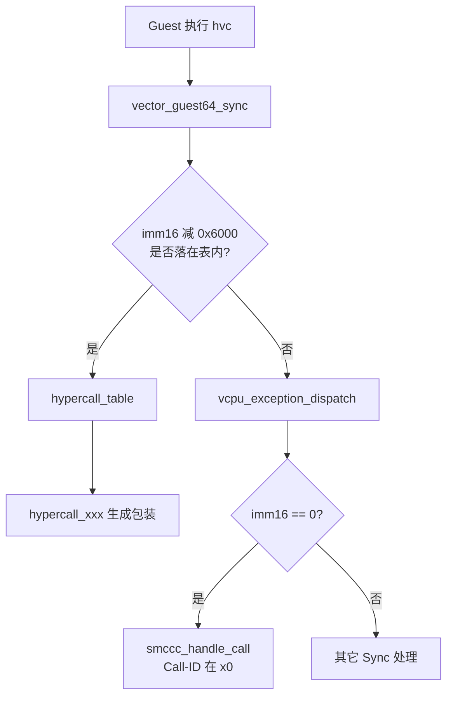

# 第 25 课 · 两条 HVC 世界

上一课：VCPU 能睡着、能被 vIRQ 叫醒，L4 收尾。本课进入 L5，只解决一件事：**Guest 的 HVC 有两套，不要混进同一张表**。不扫整份 API 列表。

---

## 1. 先分开：immediate 在哪

`hvc` 指令自带 16 位 immediate（`imm16`）。Gunyah 用它分流：

| | `hvc #0` | `hvc #0x6000` … `#0x61ff` |
|--|----------|---------------------------|
| 规范 | ARM SMCCC | Gunyah 自己的 hypercall |
| Call-ID 在哪 | **`x0` 的 Function ID** | **指令 immediate** |
| 谁处理 | `smccc_handle_vcpu_trap_hvc64` | `vectors.S` 里的 `hypercall_table` |
| 例子 | PSCI `CPU_ON` | `doorbell_send` = `hvc #0x6012`（第 27 课） |

`tools/hypercalls/hypercall.py` 写死：`abis['aarch64'] = abi_aarch64(0x6000)`。实际 Call-ID = `0x6000 + call_num`。参数和返回走 AAPCS64 的 `x0–x7`；`x0=0` 为 OK。未用的结果寄存器不保证保留。

Guest Linux 的电源/PSCI 走左边；「创建对象 / 按铃 / map 内存」走右边。不要把两类 HVC 排进同一张表。

---

## 2. 范围内：向量里直接跳表

Guest Sync 入口一上来就解码（`hyp/vm/vcpu/armv8-64/src/vectors.S`）：

```asm
.macro hypercall_decode_native ...
	mrs	x18, ESR_EL2
	ubfx	x18, x18, 0, 16          // ISS = imm16
	sub	x18, x18, HYPERCALL_BASE // 0x6000
	cmp	x18, HYPERCALL_NUM
	b	hypercall_64_entry
```

在范围内：按下标跳 `hypercall_table`，进生成的 C wrapper：`thread_entry_from_user` → `hypercall_<name>(...)` → `thread_exit_to_user`。Call-ID 已经在指令里，**不必再读 `x0` 来认是哪一号**。

---

## 3. 范围外：`imm16==0` 才交给 SMCCC

不在 `0x6000–0x61ff` 里，宏落到普通 sync 异常 `vcpu_exception_dispatch`。其中 `imm16==0`：

```c
// hyp/vm/smccc/aarch64/src/smccc_64.c
if (ESR_EL2_ISS_HVC_get_imm16(&iss) == 0) {
	handled = smccc_handle_call(true);   // Function ID 在 x0
}
```

所以 `hvc #0` **不会**进 `hypercall_table`。PSCI 的编号在 `x0`，和 Gunyah 的 immediate 不是同一套。



三件不要混：

1. **Call-ID 位置不同。** Gunyah 在 immediate；SMCCC 在 `x0`。
2. **范围内的 HVC 在向量里就被摘走**，不会先当普通异常再分发。
3. **不要在本课通读 API 列表。** 本课只要会分流；号码牌怎么找到对象是第 26 课。

---

## 本课你要带走的三句话

1. **Gunyah hypercall 的 Call-ID 在 `hvc` 的 immediate 里**（`0x6000–0x61ff`），不是在 `x0`。
2. **`hvc #0` 是 SMCCC**：向量不认，落到 `smccc_handle_vcpu_trap_hvc64`，Function ID 在 `x0`。
3. **两套不要排进同一张表**：PSCI 走左边；创建对象 / map / 按铃走右边。

---

## 小练习

请用自己的话回答下面两题（一两句就行）：

1. Guest Linux 调 PSCI `CPU_ON`，和 RM 调 `doorbell_send`，各执行哪条 `hvc`？Call-ID 分别放在哪里？
2. `hvc #0x6012` 怎样被认出是 Gunyah hypercall？如果有人写成 `hvc #0`、把 `0x6012` 放进 `x0`，会进 `hypercall_table` 吗？

回答：
1.
2.

答完后，下一课只跟：**CapID / 两级 CSpace**——Guest 口袋里的号码牌，怎样在 hyp 里找到对象。

---

## 关键源文件

| 文件 | 作用 |
|------|------|
| `tools/hypercalls/hypercall.py` | HVC base `0x6000`、寄存器约定 |
| `hyp/vm/vcpu/armv8-64/src/vectors.S` | `hypercall_decode_native` / 跳表 |
| `hyp/core/api/` | 生成的 `hypercall_table` / wrapper |
| `hyp/vm/smccc/aarch64/src/smccc_64.c` | `hvc #0` |
| `docs/api/gunyah_api.md` | 只读 ABI 段，不要通读全文 |
| [第 13 课](第13课.md) | RootVM env 里已经在发 CapID |
| [第 20 课](第20课.md) | `hypercall_addrspace_map` 就是右边这套 |
| [第 22 课](第22课.md) | Sync 入口；本课把 HVC 从里面拆出来 |
