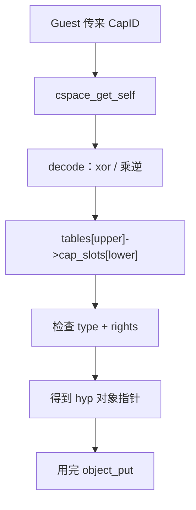

# 第 26 课 · CapID / 两级 CSpace

上一课：HVC 已经分流。本课只解决一件事：**Guest 口袋里的号码牌，怎样在 hyp 里找到对象**。不讲 doorbell 怎么发送。

---

## 1. 三层：Object / Capability / CapID

第 13 课写进 RootVM env 的是 `cspace_capid` / `partition_capid` / `vcpu_capid`，不是指针。文档原话（`docs/api/gunyah_api.md`，只读 CapID 段）：

> Capabilities are objects within a Capability Space (CSpace). These are not directly accessible to hypervisor clients (VMs). Instead, a VM uses Capability IDs (CapID) which index into a CSpace.

| 层 | 在哪 | Guest 可见 |
|----|------|------------|
| **Object**（partition / thread / doorbell / memextent…） | hyp 堆 | 否 |
| **Capability**（slot：对象指针 + rights + state） | 某 CSpace 的表 | 否 |
| **CapID** | 寄存器大小的不透明整数 | **是**（唯一句柄） |

同一对象可以有多份 cap，权利可以不同。拷贝用 `cspace_copy_cap_from`，拷贝出来的不是 master cap，rights 被 mask 收紧。

CapID **只在所属 CSpace 内有意义**。两个 VM 上相同的数字不是同一份 capability；也不要当成 hyp 指针或全局对象 ID。

创建套路（`partition_standard` 模板）：lookup 源 partition（要 `OBJECT_CREATE`）→ lookup 目标 cspace（要 `CAP_CREATE`）→ `partition_allocate_*` → `cspace_create_master_cap` → **还给 Guest 的只有那个整数**。

---

## 2. 两级表：号码牌怎么落到 slot

实现：`hyp/core/cspace_twolevel/`。Guest 看见的 CapID **不是**裸下标：

```c
// VM visible cap-IDs are randomized.
static cap_id_t
cspace_encode_cap_id(const cspace_t *cspace, cap_value_t val)
{
	uint64_t v = (uint64_t)cap_value_raw(val);
	return (cap_id_t)((v * cspace->id_mult) ^ cspace->id_rand_base);
}
```

内部才是 16 位：`upper_index` 8 bit + `lower_index` 8 bit → `cspace->tables[upper]->cap_slots[lower]`。每个 cspace 开机时抽自己的 `id_mult` / `id_rand_base`，所以 CapID 跨启动、跨 cspace 都不可猜。

查找：

```c
object_ptr_result_t
cspace_lookup_object(cspace_t *cspace, cap_id_t cap_id, object_type_t type,
		     cap_rights_t rights, bool active_only)
{
	cspace_lookup_cap_slot(cspace, cap_id, &cap);  // 先解码再下标
	cspace_check_cap_data(cap_data, type, rights); // 类型 + 权利
	return object_ptr_result_ok(cap_data.object);
}
```

当前线程的表：

```c
cspace_t *
cspace_get_self(void)
{
	return thread_get_self()->cspace_cspace;
}
```

几乎每个 hypercall 开头都是：`cspace_get_self()` + `cspace_lookup_<obj>(..., CAP_RIGHTS_...)`。指针只在这一次调用内存活，用完 `object_put_*`。Guest 侧没有任何「缓存对象地址」的合法做法。

第 13 课 `cspace_attach_thread(root_cspace, root_thread)` 的意义现在清楚了：RootVM 的 VCPU 做 HVC 时，查的就是 root cspace 那张表。



三件不要混：

1. **CapID 不是指针，也不是全局对象编号。** 离开这张 CSpace 就没意义。
2. **lookup 会挡权利。** 号码对、类型对，缺权利照样失败。
3. **不要在本课跟 doorbell 发送。** 本课停在「号码牌 → 指针」；按铃是第 27 课。

---

## 本课你要带走的三句话

1. **Object 住在 hyp，Capability 住在 CSpace，Guest 只拿 CapID。**
2. **CapID 经随机编码，内部才是两级下标**（8+8 bit）；每个 cspace 有自己的乘数和底。
3. **hypercall 用 `cspace_get_self()` + `lookup` 换成指针**，用完 `object_put`；指针从不还给 Guest。

---

## 小练习

请用自己的话回答下面两题（一两句就行）：

1. 为什么两个 VM 里出现相同数值的 CapID，也不意味着它们指向同一个对象？
2. `cspace_lookup_object` 从 CapID 到对象指针，中间至少要过哪两步？缺权利会在哪一步被挡住？

回答：
1.
2.

答完后，下一课只跟：**doorbell**——同一份 hyp 对象上，两份权利不同的 cap；并点一下 L6 可以往哪走。

---

## 关键源文件

| 文件 | 作用 |
|------|------|
| `docs/api/gunyah_api.md` | CapID / Rights（不要通读全文） |
| `hyp/core/cspace_twolevel/src/cspace_twolevel.c` | 编码、lookup、copy cap |
| `hyp/core/cspace_twolevel/cspace.tc` | 两级表结构 |
| `hyp/core/partition_standard/templates/hypercalls.c.tmpl` | create + master cap |
| [第 13 课](第13课.md) | RootVM env 里的 CapID；`cspace_attach_thread` |
| [第 14 课](第14课.md) | 对象链；本课只讲怎么用号码牌找到它 |
| [第 20 课](第20课.md) | `addrspace_cap` / `memextent_cap` 就是这样 lookup 的 |
| [第 25 课](第25课.md) | 这些 lookup 发生在 Gunyah 那条 HVC 里 |
