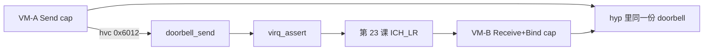

# 第 27 课 · doorbell；L6 只点方向

上一课：CapID 已经能在本 CSpace 里换成对象指针。本课只解决两件事：**doorbell 是同一份 hyp 对象上的多份 cap**；以及 **L6 只点方向，选一条即可**。不写 VirtIO / SMMU 实现。

---

## 1. 同一对象，两份不同权利的 cap

doorbell 和 msgqueue 都是 **hyp 里的一份共享对象**。VM A / B 各持指向它的、权利不同的 CapID。不共享 Guest 内存，不传指针。

Rights（`docs/api/gunyah_api.md`）：Send `0x1` / Receive `0x2` / Bind `0x4`。

```c
// hyp/ipc/doorbell/src/hypercalls.c
hypercall_doorbell_send_result_t
hypercall_doorbell_send(cap_id_t doorbell_cap, uint64_t new_flags)
{
	cspace_t *cspace = cspace_get_self();
	doorbell_ptr_result_t p = cspace_lookup_doorbell(
		cspace, doorbell_cap, CAP_RIGHTS_DOORBELL_SEND);
	res = doorbell_send(doorbell, (doorbell_flags_t)new_flags);
	object_put_doorbell(doorbell);
}
```

内核语义（`hyp/ipc/doorbell/src/doorbell.c`）：

```c
doorbell_send(doorbell_t *doorbell, doorbell_flags_t new_flags)
{
	flags |= new_flags;
	bool edge_only =
		(flags & atomic_load_relaxed(&doorbell->enable_mask)) == 0U;
	atomic_store_relaxed(&doorbell->flags, flags);
	(void)virq_assert(&doorbell->source, edge_only);
}
```

`virq_assert` 就是第 23 课的注入路径。故事可以缩成：

1. Root/VM0 创建 doorbell 对象，得到 master cap。
2. 给 VM-A 拷贝 **Send** cap，给 VM-B 拷贝 **Receive + Bind** cap。
3. B 把自己的 VIC 绑上去（`doorbell_bind_virq`，`hvc #0x6010`）。
4. A 调 `doorbell_send`（`hvc #0x6012`）→ hyp 改 flags → `virq_assert` → B 的 VCPU 收到 vIRQ。
5. B 再 `doorbell_receive`（`0x6013`）读/清 flags。

没有 Send 权利的 CapID，在第 26 课那步 `lookup` 就会失败；A 没法冒充 B 去收铃，也没法自己 bind。

**Msgqueue** 同构，只是多一个有界环形缓冲和一对 VIRQ（send 侧空位、recv 侧有数据）。数据经 `user_ptr_t`（Guest VA）由 hyp 拷进对象缓冲。Call-ID：send `0x601B`，receive `0x601C`。本课记住「对象在 hyp、两边各持 cap」即可，不必跟缓冲区实现。



和前几课怎么接上：

- 第 13 课 RootVM env 里的 CapID，就是后续 hypercall 要传的号码牌。
- 第 20 课 `hypercall_addrspace_map(addrspace_cap, memextent_cap, ipa, …)`：两个参数都是 CapID。
- 第 23–24 课：doorbell 最终落到 `virq_assert` → ICH_LR；睡着的 VCPU 再被 `vcpu_wakeup` 叫醒。IPC 不是另一套中断。
- 第 25 课：这些调用都走 `hvc #0x6000+`。
- 第 16 课：做 hypercall 的是 **当前这条 VCPU 线程**；`cspace_get_self()` 读的是它 attach 的那张表。

---

## 2. L6 只点方向（选一条）

地图上的 L6 是平台与设备虚拟化，主题多，**不单独成课**。学完 L5 之后按兴趣跟 **一条** 端到端即可，例如：

| 方向 | 入口 |
|------|------|
| VirtIO | `hyp/vm/virtio*` |
| SMMU | `hyp/platform/smmuv3/`（DMA 隔离，和 L3 的 Stage-2 成对） |
| FF-A | `hyp/platform/ffa/` |
| 定时器 / SoC | `hyp/vm/arm_vm_timer/`、`hyp/platform/soc_qemu/` |
| 代码生成 | `tools/codegen/`、`tools/hypercalls/`、`tools/events/` |

完成标准：能独立跟一条路径（比如 virtio 或内存捐赠），而不是把 `hyp/vm/` 扫一遍。

三件不要混：

1. **跨 VM 通信不是共享 Guest 指针。** 共享的是 hyp 对象；两边各持 cap。
2. **doorbell 的铃是 vIRQ**，复用第 23 课，不是第三套中断控制器。
3. **不要在本课写 VirtIO / SMMU。** L6 只点方向。

---

## 本课你要带走的三句话

1. **跨 VM IPC = 同一 hyp 对象上的多份 cap**：权利可以不同；lookup 按权利挡。
2. **`doorbell_send` 最终 `virq_assert`**，复用第 23 课的注入；睡着的接收方走第 24 课的 `vcpu_wakeup`。
3. **L6 不单独成课**：按兴趣选一条（VirtIO / SMMU / FF-A / 定时器 / 代码生成）跟到底即可。

---

## 小练习

请用自己的话回答下面两题（一两句就行）：

1. VM-A 只有 doorbell 的 Send 权利。它能不能 bind 这条门铃到自己的 VIC、自己给自己注入 vIRQ？lookup 会在哪一步挡住？
2. 为什么说 doorbell 不是「另一套中断」？A 按铃之后，B 侧实际走到第 23 课的哪一步？

回答：
1.
2.

到这里，大纲上的 L0–L5 主线已经按课走完。L6 按兴趣选一条即可；也可以按能力纵切（安全隔离 / 执行 / 中断 / API）再跟一遍。

---

## 关键源文件

| 文件 | 作用 |
|------|------|
| `hyp/ipc/doorbell/src/hypercalls.c` | `doorbell_send` / `bind` / `receive` |
| `hyp/ipc/doorbell/src/doorbell.c` | flags + `virq_assert` |
| `hyp/interfaces/doorbell/doorbell.hvc` | Call-ID：bind `0x10`，send `0x12` |
| `hyp/ipc/msgqueue/src/hypercalls.c` | 同构；send `0x1B` / receive `0x1C` |
| `docs/api/gunyah_api.md` | Doorbell Rights（不要通读全文） |
| [第 23 课](第23课.md) | `virq_assert` → ICH_LR |
| [第 24 课](第24课.md) | 接收方若在 WFI，会被 wakeup |
| [第 25 课](第25课.md) | `hvc #0x6012` 走 Gunyah 那套 |
| [第 26 课](第26课.md) | Send / Bind 权利在 lookup 时检查 |
