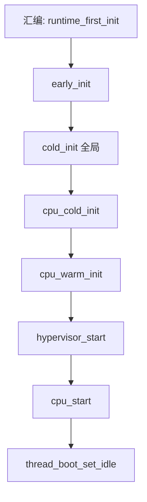

# 第 7 课 · `boot.ev` 事件总序；`trigger_*` 是广播

上一课跟到汇编把 MMU / TPIDR 垫好，然后 `b boot_cold_init`。本课只解决两件事：**启动事件按什么总序排**；以及 **`trigger_*` 是按优先级广播，不是单呼一个函数**。`.ev` 怎么写 `subscribe`、partition 怎么实现，是第 8–9 课。

---

## 1. 合同：`boot.ev` 里的总序

接口在 `hyp/interfaces/boot/boot.ev`。注释说：事件按**文件里列出的顺序**触发；某一次上电不必跑完全部。

Boot CPU 冷启动会把这条链（除 `boot_runtime_warm_init`）跑完，然后进 idle：

```text
boot_runtime_first_init     // 已在汇编里触发（第 6 课）
boot_cpu_early_init
boot_cold_init              // 全局数据结构；只 Boot CPU 一次
boot_cpu_cold_init          // 每颗 CPU 第一次上电
boot_cpu_warm_init          // 每次上电
boot_hypervisor_start       // 高层服务 / RootVM；只 Boot CPU 一次
boot_cpu_start              // 收尾，然后进 idle
```

C 侧总控在 `hyp/core/boot/src/boot.c` 的 `boot_cold_init()`：

```c
noreturn void
boot_cold_init(cpu_index_t cpu)
{
	__stack_chk_guard = ...;

	trigger_boot_cpu_early_init_event();
	trigger_boot_cold_init_event(cpu);
	trigger_boot_cpu_cold_init_event(cpu);

	TRACE_AND_LOG(... "Hypervisor cold boot" ...);

	trigger_boot_cpu_warm_init_event();
	trigger_boot_hypervisor_start_event();
	trigger_boot_cpu_start_event();

	thread_boot_set_idle();   // 不再返回
}
```



读法：上面先发生。`runtime_first_init` 不在这个 C 函数里，已经在汇编里跑过了。注释还强调：这些事件跑完后，idle 循环**马上可能切到某个 VCPU**。

并非每颗 CPU、每次上电都跑完全表：`boot_cold_init`（事件）和 `boot_hypervisor_start` 只在 Boot CPU 第一次上电跑。副核 / 热启动少跑哪几步，第 11–12 课对着三条入口再看。

---

## 2. `trigger_*` 不是单呼

看到 `trigger_boot_cold_init_event(cpu)`，不要当成「调用 partition 的某一个 init」。它更像广播：把「`boot_cold_init` 发生了」发给**所有订阅者**，按预先排好的优先级一个接一个跑。

`boot.c` **不知道**有哪些模块会来。构建时扫描各模块的 `*.ev`，生成一张分发表；运行时 `trigger_*` 按这张表逐项调用。featureset 选出要编译进镜像的模块，等于选出「这次广播会叫到谁」——合同（`boot.ev`）不用改。

| | 单呼 | 广播（Gunyah 启动） |
|--|------|---------------------|
| `boot.c` 要不要 `#include` 各模块 | 要 | 不要 |
| 新增模块 | 改总控 | 自己 `subscribe` 即可 |
| 谁先谁后 | 写在调用顺序里 | 写在各 `.ev` 的 `priority` |

三件不要混：

1. **事件名 ≠ 某一个 C 函数。** `boot_cold_init` 既是事件，也是总控函数名；函数里 `trigger_boot_cold_init_event` 才会广播给订阅者。
2. **广播仍是同步、按序的。** 不是多核同时跑同一条事件链上的各个 handler；是当前 CPU 上一个 handler 返回再调下一个。
3. **不要去抠 `.ev` 语法和 partition 实现。** 本课只要建立：总序在 `boot.ev`；`trigger_*` 点名，干活的是订阅者。

---

## 本课你要带走的三句话

1. **总序写在 `boot.ev`**：Boot CPU 冷启动按 early → cold → cpu_cold → cpu_warm → hypervisor_start → cpu_start，最后进 idle。
2. **`trigger_*` 是广播**：按优先级调用所有订阅者，不是单呼一个函数。
3. **`boot.c` 不绑定具体模块**：谁来订阅由各模块的 `.ev`（以及 featureset 选了哪些模块）决定。

---

## 小练习

请用自己的话回答下面两题（一两句就行）：

1. Boot CPU 冷启动时，`boot_runtime_first_init` 和 `boot_hypervisor_start` 哪个更早？哪个只跑一次、偏「高层服务」？
2. `trigger_boot_cold_init_event(cpu)` 会不会只调一个 init 函数？`boot.c` 需不需要列出 partition / memdb 的名字？

回答：
1.
2.

答完后，下一课打开 `.ev`：**怎样 `subscribe`**，以及 **优先级数字怎样排出谁先谁后**。

---

## 关键源文件

| 文件 | 作用 |
|------|------|
| `hyp/interfaces/boot/boot.ev` | 启动事件合同（总序 + 每条事件何时跑） |
| `hyp/core/boot/src/boot.c` | `boot_cold_init`：按总序 `trigger_*` |
| `config/featureset/` | 选哪些模块进镜像（从而谁会订阅） |
| [第 6 课](第6课.md) | `runtime_first_init` 已在汇编里触发 |
