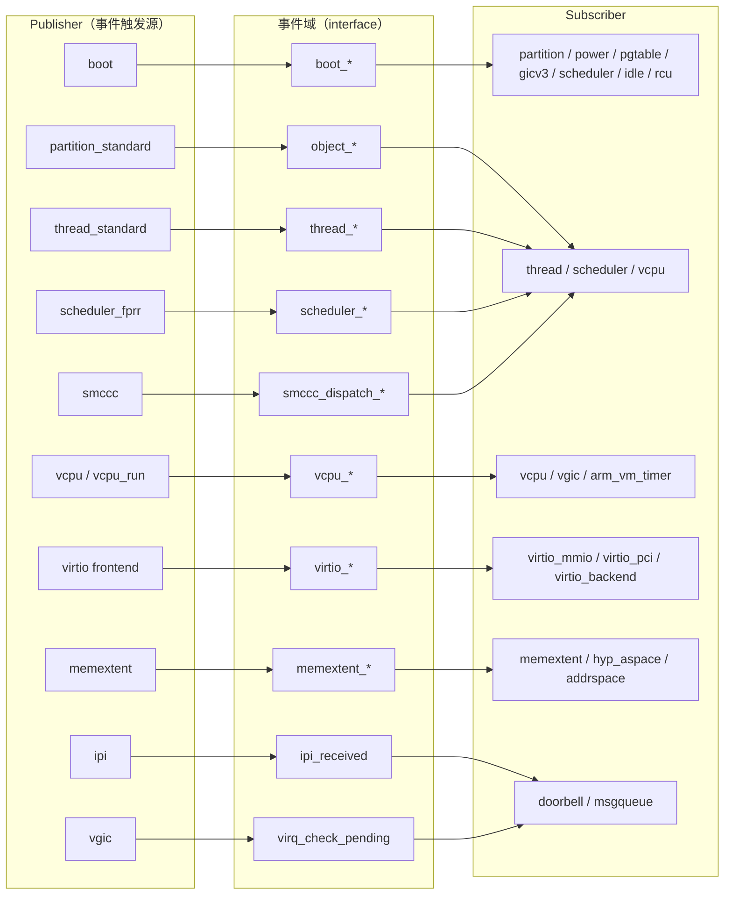
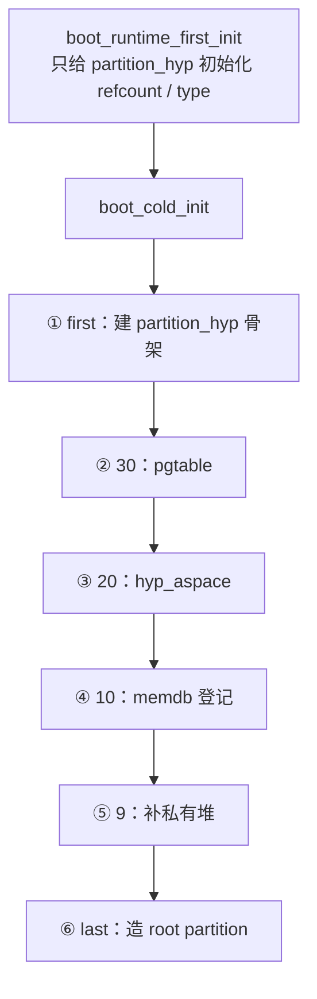

# 第 8 课 · `.ev` 如何 subscribe；优先级如何排出发顺序

上一课：`trigger_*` 是广播。本课只解决两件事：**订阅写在各模块自己的 `.ev` 里**；以及 **优先级数字怎样排出谁先谁后**。一页 RAM 怎样记进 `partition` / `memdb`，是第 9 课。

---

## 1. 订阅写在模块自己的 `.ev` 里

Gunyah 是编译期拼装：每个模块在自己的 `*.ev` 里 `subscribe` 某个事件；`tools/events/` 扫这些文件，生成分发表。运行时 `trigger_*` 按表调用。

核心关键字不多：

| 关键字 | 作用 |
|--------|------|
| `subscribe <事件名>` | 我要订阅这个事件 |
| `handler <函数名>` | 被调用的函数；省略则按 `<模块>_handle_<事件>` 找 |
| `priority <值>` | 调用顺序；`first` / `last` 是两端 |

同一个模块可以在**同一事件上挂多个 handler**，各有自己的优先级。`partition_standard` 就是这样：

`hyp/core/partition_standard/partition.ev`：

```text
subscribe boot_cold_init()
	priority first

subscribe boot_cold_init
	handler partition_standard_boot_add_private_heap()
	// must run after hyp_aspace (20) and memdb (10)
	priority 9

subscribe boot_cold_init
	handler partition_standard_boot_create_root_partition()
	priority last
```

读法：partition 把「建骨架 / 补堆 / 造 root partition」拆成三个 handler，插进同一条 `boot_cold_init` 广播里。`boot.c` 一行都不用改。

`memdb_bitmap` 的 `memdb.ev` 则是一条：

```text
subscribe boot_cold_init()
	priority 10
```

省略 `handler`，生成器去找 `memdb_bitmap_handle_boot_cold_init`。

失败回滚（`unwinder`）也是 `.ev` 里的字段：某条事件链中途失败时，已成功的 handler 按**相反顺序**撤销。本课记下名字即可，不跟具体回滚路径。

把启动链之外、整个 hypervisor 里「谁发布、谁订阅」的全景看一眼，建立「`subscribe` 不是 boot 专属」的印象：



读法：每一行就是一条「某模块 `trigger_*` → 某事件域 → 若干模块 `subscribe`」。本课只跟最上面那条 `boot_*`；其余各行是后面课程的对象链、调度、内存、中断、IPC——但**写法完全一样**：都是各模块在自己的 `.ev` 里 `subscribe`，构建期拼进分发表。

---

## 2. 数字越大越早

生成规则在 `tools/events/ir.py`：未写 priority 当作 **0**；排序键是 `(-priority, handler 名)`。所以：

| 写法 | 实际值 | 何时跑 |
|------|--------|--------|
| `first`（或 `max`） | +∞ | 最早 |
| 数字 **20** | 20 | 比 10 早 |
| 数字 **10** | 10 | 比 9 早、比 20 晚 |
| 不写 / `default` | 0 | 比正数晚 |
| `last`（或 `min`） | −∞ | 最晚 |

**数字越大越早。** 同为 0 的 handler 按函数名排；**非 0 的相同数字是编译错误**，不要依赖「同优先级谁先」。

把 `boot_cold_init` 上本课用到的几档排出来（`partition` / `memdb` 怎么登记，第 9 课再走）：

| 顺序 | 优先级 | 谁 |
|------|--------|-----|
| 1 | first | partition 建 `partition_hyp` |
| 2 | 30 | `pgtable`（已经 `partition_get_private()`） |
| 3 | 20 | `hyp_aspace` |
| 4 | 10 | memdb 登记归属 |
| 5 | 9 | partition 补私有堆 |
| 6 | last | 造 root partition |

注释已经把依赖写在 `.ev` 里：补堆必须在 aspace(20) 和 memdb(10) 之后，所以写 `9`。

这是 **启动依赖设计**，不是这个函数「算法上必须第一个」。`boot_cold_init` 里后面的人已经假定 hyp 的 private partition 可用：`pgtable`（30）一上来就 `partition_get_private()`。所以建 `partition_hyp` 必须 `first`（+∞），才能排在所有订户前面，包括以后新加、没声明依赖的模块。



口诀：**先有 `partition_hyp` → 再页表/映射 → 再 `memdb` 登记 → 再补堆 → 最后造 root partition。** 反过来会断：没有 `partition_hyp`，页表没有 private partition 可用，memdb 没有 owner 可写。

refcount 为什么不在这里做：`boot_runtime_first_init` 只允许「让 C 能跑」的最小初始化（idle 要用 refcount）。把 partition 标 ACTIVE、接管 bootmem，要等 `boot_cold_init` 才合法。

三件不要混：

1. **不是「数字越大越晚」。** 生成器按 `-priority` 排，20 在 10 前面。
2. **`first` / `last` 不是数字 1 和 999。** 它们是正负无穷。
3. **不要在本课走完一页 RAM。** 顺序表只为说明优先级；`partition` / `memdb` 的登记是第 9 课。

---

## 本课你要带走的三句话

1. **订阅在各模块 `.ev` 里写 `subscribe`**；构建期生成分发表，`boot.c` 不用点名。
2. **同一模块、同一事件可以挂多个 handler**，各写各的 `priority`。
3. **数字越大越早**；`first` 最早，`last` 最晚，默认 0。

---

## 小练习

请用自己的话回答下面两题（一两句就行）：

1. `partition_standard` 为什么在 `boot_cold_init` 上写了三次 `subscribe`，而不是一个函数里做完？
2. `hyp_aspace` 是 20、`memdb` 是 10：哪个先跑？如果把 memdb 改成 25，会出什么概念上的问题？

回答：
1.
2.

答完后，下一课只跟一件事：**启动期一页 RAM 记在哪个 `partition` 名下**，以及 `memdb` 如何登记。

---

## 关键源文件

| 文件 | 作用 |
|------|------|
| `hyp/core/partition_standard/partition.ev` | 同一事件多个 handler + 优先级注释 |
| `hyp/mem/memdb_bitmap/memdb.ev` | `priority 10` |
| `hyp/mem/hyp_aspace/hyp_aspace.ev` | `priority 20` |
| `hyp/mem/pgtable/armv8/pgtable.ev` | `priority 30`（必须在 memdb / hyp_aspace 前） |
| `tools/events/parser.py` / `ir.py` | `first`/`last` 与 `(-priority, handler)` 排序 |
| [ev流程图.md](../ev流程图.md) | 事件订阅发布机制的完整流程图集（含五种事件类型 dispatch 语义、对象生命周期链、guest 交互链等） |
| [第 7 课](第7课.md) | `trigger_*` 是广播；本课补上「谁按什么序被叫到」 |
