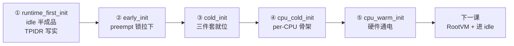
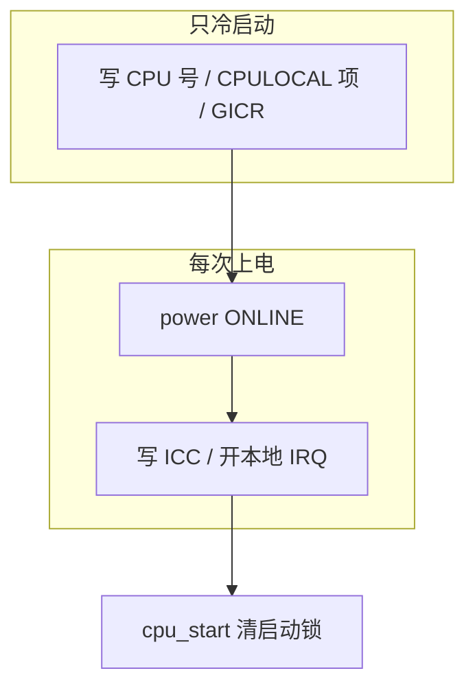

# 第 9-12 课 · Boot CPU 启动链：从假 TPIDR 到硬件通电

上一课排出了 `.ev` 的 `subscribe` 和优先级怎样排出发顺序。本课一口气走完 Boot CPU 从「假 TPIDR」到「硬件通电」的整条启动链——idle 半成品、preempt 启动锁、partition/memdb/allocator 三件套、per-CPU 骨架、硬件通电，按事件总序从头讲到尾，不回头。不讲 FPRR，也不讲怎样真正切到 VCPU（那是后面的课）。

---

## 0. 先看整条链

Boot CPU 复位后，从汇编进 C，再一路跑到进 idle，中间经过这几个事件（第 7 课的总序）：

```text
boot_runtime_first_init   ← ① idle 半成品 + partition 垫层
boot_cpu_early_init        ← ② preempt 启动锁拉下
boot_cold_init             ← ③ 三件套就位（partition/memdb/allocator）
boot_cpu_cold_init         ← ④ per-CPU 软件骨架 + CPULOCAL
boot_cpu_warm_init         ← ⑤ 硬件通电
boot_hypervisor_start      ← （下一课：造 RootVM）
boot_cpu_start             ← （下一课：解锁 + 进 idle）
```

本课覆盖 ① 到 ⑤。每一步都依赖前一步留下的东西：① 把 TPIDR 写实，② 才能跑 C；② 把启动锁拉下，③④⑤ 才能在半成品期间安全施工；③ 把 allocator 建好，后面造对象才有堆；④ 把 CPU 号写好，⑤ 和后面的日志才知道「哪个 CPU 在说话」。



---

## 1. ① `boot_runtime_first_init`：idle 半成品

这是 `boot.ev` 整条启动链的**第一个事件**，还在汇编里触发（第 6 课）。`aarch64_init` 开完 MMU、切完虚拟栈之后，先故意写一个非法 TPIDR，再 `bl trigger_boot_runtime_first_init_event`：

```99:107:hyp/core/boot/aarch64/src/init_el2.S
	// Set an invalid thread pointer address
	mov	x22, (1 << 63) - 1
	msr	TPIDR_EL2, x22

	// Runtime init sets TPIDR_EL2 and therefore must be called from
	// assembly to separate it from any code that might access
	// _Thread_local variables.
	mov	w0, w20
	bl	trigger_boot_runtime_first_init_event
```

注释写得很直白：这个 `bl` **必须在汇编里**，目的是把它和任何可能访问 `_Thread_local` 的 C 代码隔开。`boot_cold_init` 是普通 C，进去就可能碰 TLS，所以 idle 必须在这一步之前就建好。

### 先理清两个概念：`thread_t` 和 TLS 寻址

在讲「为什么 idle 必须最早」之前，先把两个容易混的概念理清，否则后面会卡住。

**`thread_t` 是软件对象，不是硬件线程。** 它和「CPU 几核几线程」里的「线程」不是一回事。硬件线程（SMT/超线程）是 CPU 硅片上的执行上下文，数量硬件定死；`thread_t` 是内存里的软件对象，想要多少造多少。一个物理 CPU 核同一时刻只执行一个 `thread_t` 的指令流，但可以有很多个 `thread_t` 存在等着被轮到——调度器在它们之间切换，让 CPU 轮流跑。**「当前线程」就是此刻这个核正在执行的那个 `thread_t`**，切线程就是换「当前线程」是谁。

**`TPIDR_EL2` 是 TLS 区的基地址，不是「EL2 的基地址」。** 名字里的 `EL2` 只是说「这个寄存器是 EL2 特权级用的那个 TPIDR」，不是「指向 EL2 的什么」。它存的只有一件事：当前线程的 TLS 区基地址。

**TLS 寻址和普通寻址是两套独立的体系。** 「寻址」就是算出变量在内存里的地址再去访问它。普通全局变量、函数，地址是链接脚本定死、MMU 翻译的，所有线程共享，用 `adrp` / `bl` 这些指令直接访问，**不碰 TPIDR**。`_Thread_local` 变量每个线程各一份、地址不固定，才需要 `TPIDR_EL2` 当基地址：

```asm
mrs  x1, TPIDR_EL2            ; 取当前线程 TLS 区基地址（每线程不同）
add  x1, x1, :tprel_lo12:current_thread  ; 加上编译期算好的偏移
ldr  x0, [x1]                 ; 基地址+偏移 = 这一份的地址，读出来
```

同一个变量名，线程 A 跑时 `TPIDR_EL2` 是 `P_A`，算出来读 `P_A` 那份；线程 B 跑时是 `P_B`，读 `P_B` 那份。**指令一模一样，只是 `TPIDR_EL2` 的值不同，结果就指向不同的那份。** 这就是 TLS 的全部魔法——所以切线程时 `TPIDR_EL2` 必须换，否则 `_Thread_local` 会读到上一个线程的那一份。

**「每核一个 idle」是调度策略，不是硬件本质。** idle 线程仍然是软件 `thread_t`，只是用 `scheduler_affinity` 字段绑死到自己的核上跑（idle 创建时 `idle_params.scheduler_affinity = boot_cpu_index` 就是干这个）。为什么每核一个：一个 `thread_t` 同一时刻只能在一个核上跑，如果全局只有一个 idle，两颗核同时空闲就要抢同一个，没法分配。所以每核造一个、各跑各的。idle 的职责是「这颗核没事干时的本地占位」，本来就不需要跨核迁移，绑死到自己的核是合理的。注意只有 idle 是绑死的，VCPU 线程的 affinity 可以更灵活。

### 为什么 idle 必须最早

根因是 TLS 的实现机制，不是调度需求。上一小节讲过，`_Thread_local` 变量靠 `TPIDR_EL2` 寻址，`TPIDR_EL2` 存的是「当前线程」的 TLS 区基地址。`boot_cold_init` 里（以及它调用的所有 C）随时可能碰 `_Thread_local`——`partition_get_private()`、preempt 计数器、trace/log 全是。所以进 `boot_cold_init` 之前，`TPIDR_EL2` 必须已经指向一个合法的 `thread_t` 对象——也就是必须先有一个「当前线程」。

但 `boot_cold_init` 之前唯一能跑 C 的地方就是 `boot_runtime_first_init` 的 handler；而 handler 自己又不能碰 TLS（合同禁止），所以 handler 里只能用「手动塞字段」的方式造 thread，不能调任何依赖 TLS 的 API。这就是为什么 idle 必须当特例，不能走后面第 14 课那条正常对象创建链。

### 事件分发：idle 排最后

`trigger_boot_runtime_first_init_event` 按各模块 `.ev` 的 priority 依次广播（第 7-8 课）：

```260:270:build_preview/events/boot.c
trigger_boot_runtime_first_init_event(cpu_index_t boot_cpu_index)
{
    allocator_boot_handle_boot_runtime_first_init();
    trace_boot_init();
    aarch64_handle_boot_runtime_init();
    log_init();
    partition_standard_handle_boot_runtime_first_init();
    prng_simple_handle_boot_runtime_first_init();
    vcpu_handle_boot_runtime_init();
    idle_handle_boot_runtime_first_init(boot_cpu_index);
}
```

读这张表的关键：

- `allocator_boot` 先把链接脚本预留的 `heap_private_start` 那块静态堆切成 bootmem 池子。这是后面 idle 能 `bootmem_allocate` 的前提。
- `partition_standard` 只做 **refcount + type** 两行，让 `partition_get_private()` 返回的 `partition_hyp` 有合法引用计数——idle 触发 `object_init_thread` 时要用。**注意它没标 ACTIVE、没建 allocator**，那是 `boot_cold_init` 的事（第 3 节）。
- `idle` 在 `.ev` 里写了 `priority last`，所以排在最后，前面这些垫层都齐了它才动手。

```7:8:hyp/core/idle/idle.ev
subscribe boot_runtime_first_init(boot_cpu_index)
	priority last
```

### idle 逐行

`idle_handle_boot_runtime_first_init`（`hyp/core/idle/src/idle.c`）：

```64:98:hyp/core/idle/src/idle.c
idle_handle_boot_runtime_first_init(cpu_index_t boot_cpu_index)
{
	void_ptr_result_t ret;
	thread_t	 *boot_thread;

	// Allocate boot CPU idle thread and TLS out of bootmem.
	ret = bootmem_allocate(thread_size, thread_align);
	if (ret.e != OK) {
		panic("Unable to allocate boot idle thread");
	}

	boot_thread = (thread_t *)ret.r;

	assert(thread_size >= sizeof(*boot_thread));
	errno_t err_mem = memset_s(boot_thread, thread_size, 0, thread_size);
	if (err_mem != 0) {
		panic("Error in memset_s operation!");
	}

	thread_create_t idle_params = idle_default_params;

	idle_params.scheduler_affinity = boot_cpu_index;
	idle_params.thread	       = boot_thread;

	partition_t *hyp_partition = partition_get_private();
	trigger_object_init_thread_event(idle_params, hyp_partition);

	boot_thread->cpulocal_current_cpu = boot_cpu_index;

	// This must be the last operation in boot_runtime_first_init.
	thread_switch_boot_thread(boot_thread);
}
```

逐行点：

- `bootmem_allocate(thread_size, thread_align)`：从 bootmem 池子里抠一块。`thread_size` 是整个 TLS 区大小（比 `sizeof(thread_t)` 大），因为 `_Thread_local` 变量都挂在 thread 对象后面。**不是** `partition_allocate_thread`——allocator 还没建（第 3 节才建）。
- `memset_s` 全清零：TLS 区也得清零，否则后面读 `_Thread_local` 会读到脏数据。
- `trigger_object_init_thread_event`：**只做部分初始化**。注意是 `object_init_thread`，不是 `object_create_thread`。栈、调度器字段、就绪表链接这些 `object_create` 才做的事，这里都没有。这一步要挂 refcount，所以前面 `partition_standard` 必须先把 `partition_hyp.header.refcount` 初始化好。
- `cpulocal_current_cpu = boot_cpu_index`：手动塞 CPU 号。因为此时还不能调 `cpulocal_get_index()`（`boot.ev` 合同明文禁止 handler 碰 CPU-local）。
- `idle_params.scheduler_affinity = boot_cpu_index`：把这条 idle 用 affinity 绑死到 Boot CPU（上一小节讲过「每核一个 idle」就是这么来的）。
- `thread_switch_boot_thread` 是最后一句。

### `thread_switch_boot_thread`：把 TPIDR 写实

这是最后一句，是一小段汇编（`hyp/core/thread_standard/aarch64/src/thread_init.S`）：

```9:16:hyp/core/thread_standard/aarch64/src/thread_init.S
function thread_switch_boot_thread
	mov	x1, xzr
	add	x1, x1, :tprel_hi12:current_thread
	add	x1, x1, :tprel_lo12_nc:current_thread
	sub	x1, x0, x1
	msr	TPIDR_EL2, x1
	ret
```

算出 `current_thread` 这个 `_Thread_local` 变量相对 TPIDR 的偏移（`:tprel_hi12:` / `:tprel_lo12_nc:` 是 TLS 偏移重定位），然后让 `TPIDR_EL2 = boot_thread - 偏移`。这样以后任何 `current_thread` 的访问，`[TPIDR_EL2 + 偏移]` 就正好落在 `boot_thread` 上。

用上一小节的寻址公式套一下就明白：TLS 寻址是 `mrs TPIDR_EL2; add 偏移; ldr`。要让 `ldr` 读到 `boot_thread` 这个地址上的值，就得让 `TPIDR_EL2 + 偏移 == boot_thread`，所以 `TPIDR_EL2 = boot_thread - 偏移`。汇编里 `sub x1, x0, x1` 就是算这个减法，`msr TPIDR_EL2, x1` 写进去。

**这就是「切到合法当前线程」的物理含义**——TPIDR 从非法值 `0x7fff…ffff` 变成一个让 TLS 寻址正好落到 `boot_thread` 上的值。之前 `mrs TPIDR_EL2; add; ldr` 算出来是非法地址会崩；现在算出来正好是 `boot_thread`，读到的就是这条 idle 线程的指针。`ret` 回到汇编，汇编再 `b boot_cold_init`，此时普通 C 可以放心碰 TLS 了。

注意它不是「跳进 idle_loop」。它只是把「当前线程指针」写实，执行流还在 boot 路径上往下走。真正跳进 `idle_loop` 是最后的 `thread_boot_set_idle`（下一课）。

### 半成品窗口

从这里到后面补全之间，有一段**半成品窗口**：能跑、TLS 合法，对象不完整（没有栈、没有调度字段、没进就绪表）。`idle.c` 顶部注释：*we perform part of the boot with an incomplete idle thread structure*。

补全发生在 `boot_hypervisor_start` 上的 `idle_thread_init()`（下一课）：Boot CPU 那条只补 `object_create`（栈、调度字段等）；其他核的 idle 这时才能走正常 `partition_allocate_thread`——用的 allocator 正是第 3 节建好的那个。

---

## 2. ② `boot_cpu_early_init`：preempt 启动锁拉下

汇编 `b boot_cold_init` 进 C 后，`boot_cold_init()` 的第一句就是 `trigger_boot_cpu_early_init_event()`。这条事件上要盯的订阅者是 `preempt`——它在这里拉下一把「启动锁」，一直锁到链尾 `boot_cpu_start` 才解。

`hyp/core/preempt/preempt.ev`：

```text
subscribe boot_cpu_early_init
	acquire_preempt_disabled

subscribe boot_cpu_start
	priority last
	release_preempt_disabled
```

`preempt_disable_count` 是 `_Thread_local` 的一个字，里面不止嵌套计数：还有 `cpu_init` 位。early 时把这一位置上；`boot_cpu_start` 的 **last** handler 再清掉。

```c
preempt_disable_count |= preempt_cpu_init;   // early
preempt_disable_count &= ~preempt_cpu_init;  // start, last
```

判断「能不能抢占」看的是 `preempt_disable_count` 这个字**整体是否为 0**。嵌套计数和 `cpu_init` 位共用这一个字：`preempt_disable` / `preempt_enable` 只动嵌套计数那几位，碰不到 `cpu_init`。所以 early 置上 `cpu_init` 之后，就算某段代码把嵌套计数减到 0，`cpu_init` 位还在，整个字仍非 0，抢占不会真正打开。这把锁要一直留到 `boot_cpu_start` 的 last handler 把 `cpu_init` 清掉才算完工。

为什么要留这把锁：启动期间很多结构还是半成品（第 1 节的 idle、第 3 节的 partition 都没补全），一旦被抢占切到另一个上下文，回来时这些半成品可能已经对不上。施工期总闸拉下，完工才允许真正开抢占。

这把锁从链头（early）锁到链尾（start）。中间会经过 `cpu_warm`、`hypervisor_start`（下一课），但锁的语义本节已经齐。

---

## 3. ③ `boot_cold_init`：三件套就位

启动锁拉下后，`boot_cold_init()` 触发 `trigger_boot_cold_init_event(cpu)`。这条事件只在 Boot CPU 第一次上电跑一次，用来建全局数据结构。本节的核心是 **partition / memdb / allocator 三件套就位**——从这一刻起，任何对象都能走标准链被造出来（第 14 课会讲那条链）。

### 三个角色先分开

| 词 | 本课怎么用 |
|------|------|
| **partition** | 内存资源的**归属单位**（`partition_t`）。是账户「谁」 |
| **memdb** | 按物理页记账的表：`PA → (owner 对象, type)`。`memdb_insert` 写入，`memdb_update` 更改归属 |
| **allocator** | partition 里用来 `alloc` 的堆 |

```text
查「这页归谁」     →  memdb（账本）
账户「这个谁」     →  partition
从这个账户里 alloc →  allocator
```

启动默认就有两个账户：

| 账户 | 谁造的 | 给谁用 |
|------|------|------|
| `partition_hyp` | 静态变量，`boot_cold_init` 的 first 里激活 | hypervisor 自己：idle、页表、内部对象 |
| **root partition** | 从 hyp 的堆里 `partition_allocate_partition` 造出来 | Root VM / RM；其余平台 RAM 下一课才登记进来 |

### `partition_hyp` 这段地址从哪来

**没有谁在运行时给它再「分配」一段地址。** 它把已经加载好的 hypervisor 镜像占用的那截物理内存认领过来。

```text
1. 链接脚本定镜像长什么样、物理从哪开始
2. Bootloader 把 hyp 镜像加载到那块 PA
3. 启动代码用 image_phys_start .. image_phys_last 认领
4. memdb insert：owner = partition_hyp
```

`partition_hyp` **不是全机内存的总账户。** 它只接管 hyp 自己那一块：

```text
整机物理 RAM
 ├── hyp 镜像 / bootmem / 私有堆  →  partition_hyp（一直留着给 hypervisor）
 └── 其余平台 RAM                 →  下一课直接登记给 root（从未先归 hyp）
```

### 跟着四个 handler 走一页

**`priority first`：建 `partition_hyp`。** `partition_standard_handle_boot_cold_init`（`hyp/core/partition_standard/src/init.c`）：

- `partition_hyp` 是**静态变量**。此刻还没有 allocator，不能 `malloc`。
- 标 ACTIVE、初始化 `mapped_ranges` 链表。
- 用 bootmem 分配一个 `mapped_range` 节点，记下镜像这段的 VA/PA 对应。这是映射关系，**还不是 memdb 里的 owner**。
- `allocator_init`，再 `bootmem_allocate_remaining`：bootmem 剩下的内存一次性交给 hyp 的 allocator。之后不再用 bootmem。

注意 `partition_hyp` 的 refcount 在第 1 节的 `boot_runtime_first_init` 就初始化好了（注释 `needed for idle thread init`），这里才标 ACTIVE、建 allocator。同一个静态变量横跨两个事件。

**`priority 30` 然后 `20` 然后 `10`：先页表，再映射，再写 memdb。** `pgtable`（30）已经 `partition_get_private()`，所以 first 必须。`hyp_aspace`（20）把 hyp 的地址空间补全。memdb 登记时要用 `partition_image_virt_to_phys()`，所以必须排在它们后面。

`memdb_bitmap_handle_boot_cold_init`：

```c
memdb_insert(..., image_phys_start .. image_phys_last,
             hyp_partition, MEMDB_TYPE_PARTITION);

memdb_update(..., bootmem 那段,
             allocator, MEMDB_TYPE_ALLOCATOR,   // 新 owner
             hyp_partition, MEMDB_TYPE_PARTITION); // 旧 owner
```

- `memdb_insert`：镜像占用的物理页，owner 写成 `partition_hyp`。
- `memdb_update`：bootmem 那一段的 owner 从 `PARTITION` 改成 `ALLOCATOR`。

没有 first 的 `partition_hyp`，这里没有 owner 可写。

**`priority 9`：补超过 2MiB 的私有堆。** 汇编阶段的 MMU 往往只映射了前 2MiB RW。剩下的要等 aspace 和 memdb 都好了，再 `partition_add_heap` 补进 hyp 的 allocator。

**`priority last`：从堆里造 root partition。** `partition_standard_boot_create_root_partition`：从 hyp 的 allocator **分配**出一个 `partition_t`，激活，再 `partition_mem_donate` 把一块启动堆从 hyp 转到这个 root partition。必须 last：前面得先把 hyp 的 allocator 填够。

一句话：**先有** `partition_hyp`**，memdb 稍后才写。** first 结束时 memdb 还是空的；到 10 才 `insert` / `update`。

### owner 是什么：当前角色，不是线程

memdb 里的 owner **不是线程**。线程是消费者：从某个 partition 的堆里 `alloc`，对象头上记 `header.partition`。物理页在账本里记的是资源对象。

| 现在的 owner | 这页现在处于什么状态 | 接下来典型能做的事 |
|------|------|------|
| **PARTITION** | 在某个内存账户名下，还没进堆 | 加进堆、donate 给另一个 partition |
| **ALLOCATOR** | 已经在这个账户的堆里 | `partition_alloc` 分出去给对象 |
| **NOTYPE** | 无主 | 还没登记 |

**type 表示当前角色，不是未来承诺。** 角色变了就 `memdb_update`；对不上旧 owner 会失败。启动时 bootmem 那段就是完整例子：先 PARTITION，再改成 ALLOCATOR。

三件不要混：

1. **映射关系 ≠ memdb 里的 owner。** `mapped_range` 说 VA/PA 怎么对；memdb 说这页物理内存的 owner 是谁。
2. `insert` **是新登记一段 PA 的 owner，**`update` **是改角色。**
3. **启动路径里不要把 idle、不要把 Stage-2 扯进来。** 本节只到 `partition_hyp` / root 两个 partition，以及 memdb 里对应的记录。

### 三件套 = 后面的基线

三件套就位的意义：**从这一刻起，任何对象都能走 `partition_allocate_thread → object_init → object_create → object_activate` 这条标准链被造出来**（第 14 课讲）。后面造的所有东西——per-CPU 骨架、GICR、RootVM 的 cspace/线程/Stage-2——全都从某个 partition 的 allocator 抠内存、挂 refcount、分配栈、映射、登记 memdb。

idle 是唯一一个不在这条链上的对象（第 1 节）：它早于基线（用 bootmem）、半成品（只做 object_init）、补全又晚于基线（等 allocator）。它必须当特例，因为它是基线本身的前提——没有它把 TPIDR 写实，本节的 C 碰 TLS 就崩，三件套根本建不出来。

---

## 4. ④ `boot_cpu_cold_init`：per-CPU 软件骨架

三件套就位后，`boot_cold_init()` 触发 `trigger_boot_cpu_cold_init_event(cpu)`。口诀先记一半：**cold = 建 per-CPU 软件骨架（只冷启动）**。另一半 warm = 通电，是第 5 节。

这条事件在 Boot CPU 和其他 CPU 的**第一次**上电都会跑；热启动不跑——房子还在，不必再砌墙。

`boot.ev` 写：用来初始化 CPU-local 数据结构。典型动作是写 `CPULOCAL_*` 数组里「本 CPU 那一项」，不是去碰系统寄存器。

### CPULOCAL：一排柜子，钥匙在线程上

ARM64 没有一块「方便读的当前 CPU 号」寄存器可当 GS。Gunyah 用软件数组模拟：大小 `PLATFORM_MAX_CORES`，用 CPU index 当下标。

`hyp/interfaces/cpulocal/include/cpulocal.h`：

```c
#define CPULOCAL_DECLARE(type, name)  type cpulocal_##name[PLATFORM_MAX_CORES]
#define CPULOCAL(name)                cpulocal_##name[cpulocal_get_index()]
#define CPULOCAL_BY_INDEX(name, i)    cpulocal_##name[cpulocal_check_index(i)]
```

`cpulocal_get_index()` 读的就是写进当前线程的 `cpulocal_current_cpu`。启动期常用 `CPULOCAL_BY_INDEX(..., cpu)`，因为事件把 cpu 号当参数传来，不一定走「当前」。

它要求抢占关掉（`REQUIRE_PREEMPT_DISABLED`）：抢占开着，线程可能被迁到另一颗 CPU，下标会过期。启动链被第 2 节的 `cpu_init` 位锁着，所以 boot handler 里访问是安全的。

切线程之后，`cpulocal_handle_thread_context_switch_post`（`priority first`）会把新线程的字段改成「现在这颗 CPU」，旧线程改成非法。**钥匙牌跟着「当前正在跑的那条线程」**，不是跟某个永远不变的全局。

### `cpulocal` 必须 first

必须 **first** 的是 `cpulocal`：

```c
void
cpulocal_handle_boot_cpu_cold_init(cpu_index_t cpu)
{
	thread_t *self = thread_get_self();
	self->cpulocal_current_cpu = cpulocal_check_index(cpu);
	TRACE_LOCAL(DEBUG, INFO, "CPU {:d} coming online", cpu);
}
```

把 CPU 号写进当前线程（此时就是第 1 节造的那条 idle 半成品）。后面所有 `CPULOCAL(...)` / `cpulocal_get_index()` 都读这个字段。不 first，别人读到的是非法 index。注释还说：这是能调 `TRACE` 的最早点——日志要知道「哪个 CPU 在说话」。

这就是为什么 `boot.c` 把第一句 `TRACE_AND_LOG("Hypervisor cold boot")` 放在 `trigger_boot_cpu_cold_init_event` **之后**。

其余 handler 的共同点：初始化某个 per-CPU 软件状态。例如 GICv3 给本 CPU 的 redistributor 配默认优先级、先关掉本地 IRQ（骨架：电表箱装好、分闸拉下）；定时器 / PSCI 清零本 CPU 那一项。它们都假定 CPU 号已经写好。GICv3 写 `priority 10`，是为了赶在别人 enable IRQ 之前把 redistributor 备好。具体 ICC 系统寄存器、enable IRQ 是 warm，本节不跟。


三件不要混：

1. **cold 不是「冷得像汇编」。** 它是「这颗 CPU 生平第一次」的软件初始化。
2. **CPULOCAL 不是硬件 TLS。** 它是数组 + 线程上的 index。
3. **不要去读 `cpu_warm` 里的 `msr`。** 骨架和通电分开记。

---

## 5. ⑤ `boot_cpu_warm_init`：硬件通电

per-CPU 骨架建好后，`boot_cold_init()` 触发 `trigger_boot_cpu_warm_init_event()`。口诀补全：**cold 建账（只一次），warm 开闸（每次上电）。** 硬件寄存器断电会丢，所以热启动也要再写一遍。

三条入口对比（空虚 = 这条入口不跑）：

| 入口 | 场景 | cpu_cold | cpu_warm | hypervisor_start |
|------|------|----------|----------|------------------|
| `boot_cold_init` | Boot CPU 第一次 | 跑 | 跑 | **跑（仅此）** |
| `boot_secondary_init` | 其他 CPU 第一次 | 跑 | 跑 | 不跑 |
| `boot_warm_init` | 休眠 / 热插拔回来 | 不跑 | 跑 | 不跑 |

`boot_cpu_warm_init` 上要先记住两个 `first` / 高优先级：

- **`power`（first）**：确认本 CPU 已不在 `OFF`，标成 `ONLINE`。后面的人假定「这颗核已经在线上」。
- 然后才是写系统寄存器、`irq_enable_local`。

和 cold 的分工，用 GICv3 就能看清：cold 配的是本 CPU 的 **GICR（redistributor，软件侧分发结构）**；warm 配的是 **ICC_\*（CPU interface 系统寄存器）** 并打开 IPI。前者是账，后者是闸。定时器、VGIC 维护 IRQ 也是同一模式：对象在全局阶段已经有了，warm 只在本 CPU 上 enable。

`boot_cpu_start`（第 2 节那把锁的另一头）在 warm（以及 Boot CPU 上的 `hypervisor_start`）之后触发，**last** 清掉 `cpu_init`。热启动结尾不是 `thread_boot_set_idle`，而是 `thread_boot_restore_frozen`：回到休眠前那条线程，不是回到 idle。



三件不要混：

1. **warm 不分配新对象。** 用 cold / 全局阶段已经建好的，只是重新写寄存器、enable。
2. **不要在本课跟 `rootvm_init`。** `hypervisor_start` 只出现在表里，好区分「谁跑一次」。
3. **热启动只开闸不建账。** cold 那些建好的软件骨架还在，warm 只补会丢的硬件状态。

---

## 本课你要带走的几句话

1. **idle 在 `boot_runtime_first_init` 就从 bootmem 抠出来了**（汇编里触发），早于 `boot_cold_init` 两个事件；只做了部分 `object_init`，靠 `thread_switch_boot_thread` 把 TPIDR 写实，让后面的 C 能碰 TLS。
2. **preempt 启动锁从 `boot_cpu_early_init` 拉到 `boot_cpu_start`**：`cpu_init` 位让整个 `preempt_disable_count` 非零，期间抢占不会真正打开，保护半成品。
3. **`boot_cold_init` 把 partition/memdb/allocator 三件套建好**：这是后面所有对象走标准创建链的基线；idle 是唯一不在这条基线上的对象，因为它是基线的前提。
4. **`boot_cpu_cold_init` 建 per-CPU 软件骨架**（cpulocal first 写 CPU 号），**`boot_cpu_warm_init` 给硬件通电**（每次上电都跑）；cold 建账，warm 开闸。

---

## 小练习

请用自己的话回答下面两题（一两句就行）：

1. 为什么 idle 用 `bootmem_allocate` 而不用 `partition_alloc`？`partition_hyp` 的 refcount 又是哪个 handler、在哪个事件里初始化的？为什么 idle 必须比 `boot_cold_init` 早？
2. preempt 启动锁靠什么机制让 `preempt_enable` 减到 0 也不开抢占？`boot_cpu_cold_init` 和 `boot_cpu_warm_init` 各跑几次、分工是什么？

回答：
1.
2.

答完后，下一课收尾：**造出 RootVM 并 `vcpu_poweron`**，再 **跳进 idle**，L1 启动链结束。

---

## 关键源文件

| 文件 | 作用 |
|------|------|
| `hyp/core/idle/src/idle.c` | idle 早期创建、`idle_thread_init`、注释里的半成品 |
| `hyp/core/idle/idle.ev` | 订阅 `boot_runtime_first_init`（`last`） |
| `hyp/core/boot/aarch64/src/init_el2.S` | 汇编里触发 `boot_runtime_first_init`、写假 TPIDR |
| `hyp/core/thread_standard/aarch64/src/thread_init.S` | `thread_switch_boot_thread`（写实 TPIDR） |
| `hyp/core/preempt/preempt.ev` / `preempt.c` | 启动锁的置 / 清 |
| `hyp/core/partition_standard/src/init.c` | `partition_hyp` 激活、补堆、造 root partition |
| `hyp/mem/allocator_boot/src/bootmem.c` | 启动期 bump 分配器，池子来自链接脚本的私有堆 |
| `hyp/mem/memdb_bitmap/src/memdb.c` | `memdb_insert` / `memdb_update` |
| `hyp/interfaces/cpulocal/include/cpulocal.h` | `CPULOCAL*` 宏 |
| `hyp/core/cpulocal/src/cpulocal.c` | 读/写 `cpulocal_current_cpu`；切线程后更新 |
| `hyp/core/power/src/power.c` | `boot_cpu_warm_init` 的 first：标 ONLINE |
| `hyp/core/boot/src/boot.c` | `boot_cold_init` 总控；触发各事件 |
| `build_preview/events/boot.c` | 事件分发函数（看 priority 顺序） |
| [第 6 课](第6课.md) | 为什么 runtime_first_init 必须在汇编里 |
| [第 7 课](第7课.md) | `boot.ev` 事件总序；`trigger_*` 是按优先级广播 |
| [第 8 课](第8课.md) | `.ev` 怎么 subscribe；优先级数字怎么排 |
| [第 14 课](第14课.md) | 线程对象标准创建链（idle 是它的例外） |
