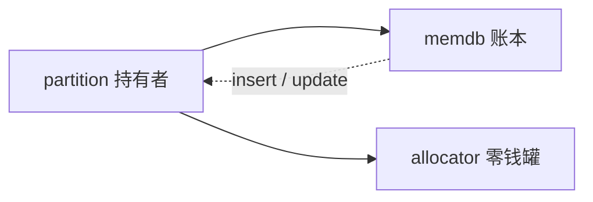

# 第 9 课 · 启动期一页 RAM 的主人：partition → memdb

上一课排出了 `boot_cold_init` 上谁先谁后。本课只解决一件事：**启动期一页 RAM 归谁管**——partition 是持有者，memdb 是归属账本。不讲 idle 线程，也不讲 Stage-2。

---

## 1. 三个角色，先分开

| 词 | 本课怎么用 |
|----|------------|
| **partition** | 持有者：这块 RAM 算哪个分区的 |
| **memdb** | 归属账本：每一页物理内存写着 owner 是谁 |
| **allocator** | 零钱罐：分区里真正拿来 `alloc` 的堆 |

启动期就是按第 8 课的优先级，把这三者搭起来，再把账本填上。Stage-2 / memextent 是第 18–21 课；本课只到「hyp 分区拿着镜像内存，账本上有记录」。

---

## 2. 跟着四个 handler 走一页

### ① `priority first`：建 `partition_hyp`

`hyp/core/partition_standard/src/init.c` 的 `partition_standard_handle_boot_cold_init`：

- `partition_hyp` 是**静态变量**。此刻还没有 allocator，不能 `malloc`。
- 用启动期 bump 分配器 **bootmem** 抠一个 `mapped_range` 节点，记下镜像这段的虚/物对应。这是映射关系，**还不是账本上的归属**。
- `allocator_init`，再 `bootmem_allocate_remaining`：bootmem 剩下的一次性过户给 hyp 的 allocator。bootmem 退役。

类比：先搭脚手架。静态分区是地基，bootmem 是临时工棚，allocator 是正式仓库。

### ② `priority 20` 然后 `10`：映射能换算，memdb 才记账

`hyp_aspace`（20）把 hyp 的地址空间补全。memdb 登记时要用 `partition_image_virt_to_phys()`，所以必须排在它后面。

`memdb_bitmap_handle_boot_cold_init`（`hyp/mem/memdb_bitmap/src/memdb.c`）：

```c
memdb_insert(..., image_phys_start .. image_phys_last,
             hyp_partition, MEMDB_TYPE_PARTITION);

memdb_update(..., bootmem 那段,
             allocator, MEMDB_TYPE_ALLOCATOR,   // 新主人
             hyp_partition, MEMDB_TYPE_PARTITION); // 旧主人
```

- `memdb_insert`：镜像内存记在 hyp partition 名下。
- `memdb_update`：bootmem 那一段从「partition 持有」改成「allocator 持有」。

没有 ① 的 `partition_hyp`，这里没有 owner 可写。

### ③ `priority 9`：补超过 2MiB 的私有堆

汇编阶段的 MMU 往往只映射了前 2MiB RW。剩下的要等 aspace 和 memdb 都好了，再 `partition_add_heap` 补进 hyp 的 allocator。所以是 9，晚于 20 和 10。

### ④ `priority last`：从堆里造 root partition

`partition_standard_boot_create_root_partition`：从 hyp 的 allocator **分配**出一个 `partition_t`，激活，再 `partition_mem_donate` 捐一块启动堆给它。必须 last：前面得先把零钱罐喂饱。

Root VM / RM 以后的数据放在这个分区里。整段平台 RAM 要等到 `boot_hypervisor_start` 才捐进来（第 13 课）。



一句话：**持有者先把东西拿在手里，账本稍后补记。** ① 结束时 memdb 还是空的；到 ② 才写上。

三件不要混：

1. **映射关系 ≠ 归属。** `mapped_range` 说虚实怎么对；memdb 说这页物理内存算谁的。
2. **`insert` 是新记一笔，`update` 是改主。** 改主要核对旧主人，对不上会失败。
3. **不要把 idle、不要把 Stage-2 扯进来。** 本课只到 hyp / root 两个 partition 和账本。

---

## 本课你要带走的三句话

1. **partition 是持有者，memdb 是归属账本，allocator 是零钱罐。**
2. **启动期顺序**：先有 `partition_hyp`，再映射，再 `memdb_insert` / `update`，再补堆，最后从堆里造 root partition。
3. **一页 RAM 的主人先变、账本后记**；`update` 才是过户。

---

## 小练习

请用自己的话回答下面两题（一两句就行）：

1. 为什么 memdb 的 handler 不能排在 partition 的 `first` 前面？
2. `memdb_insert` 和 `memdb_update` 各做哪一类事？bootmem 那段为什么要用 `update`？

回答：
1.
2.

答完后，下一课补一条旁路：**idle 线程其实比 `boot_cold_init` 更早就建了**，而且当时是半成品。

---

## 关键源文件

| 文件 | 作用 |
|------|------|
| `hyp/core/partition_standard/src/init.c` | `partition_hyp`、补堆、造 root partition |
| `hyp/mem/memdb_bitmap/src/memdb.c` | `memdb_insert` / `memdb_update` |
| [第 3 课](第3课.md) | VA/PA 预备；本课的 memdb 管的是物理页归属，不是 Stage-1 页表 |
| [第 8 课](第8课.md) | 这四个 handler 的优先级从哪来 |
