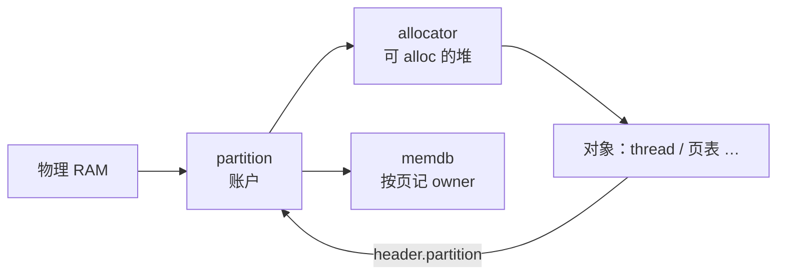

# 第 9 课 · 启动期一页 RAM 归谁：partition → memdb

上一课排出了 `boot_cold_init` 上谁先谁后。本课只解决一件事：**启动期一页物理内存记在哪个 `partition` 名下，以及 `memdb` 如何登记**。不讲 idle 线程，也不讲 Stage-2。

---

## 1. 三个角色，先分开

| 词 | 本课怎么用 |
|----|------------|
| **partition** | 内存资源的**归属单位**（`partition_t`）。是账户「谁」，不是「从 A 到 B 的一段 PA」，也不是虚拟机，也不是线程 |
| **memdb** | 按物理页记账的表：`PA → (owner 对象, type)`。`memdb_insert` 写入，`memdb_update` 更改归属 |
| **allocator** | partition 里用来 `alloc` 的堆 |

对应关系：

```text
查「这页归谁」     →  memdb（账本）
账户「这个谁」     →  partition
从这个账户里 alloc →  allocator
```



启动默认就有两个账户：

| 账户 | 谁造的 | 给谁用 |
|------|--------|--------|
| **`partition_hyp`** | 静态变量，`boot_cold_init` 的 first 里激活 | hypervisor 自己：idle、页表、内部对象 |
| **root partition** | 从 hyp 的堆里 `partition_allocate_partition` 造出来 | Root VM / RM；其余平台 RAM 第 13 课才登记进来 |

设计上还可以从一个已有 partition 再分出新账户、再 `donate` 过户。这份代码里 `partition_create_partition` hypercall 仍是 `UNIMPLEMENTED`，所以本课只碰到上面这两个。

Stage-2 / memextent 是第 18–21 课；本课只到「镜像占用的物理页记在 `partition_hyp` 名下，memdb 里有记录」。

---

## 2. `partition_hyp` 这段地址从哪来

**没有谁在运行时给它再「分配」一段地址。** 它把已经加载好的 hypervisor 镜像占用的那截物理内存认领过来。

```text
1. 链接脚本定镜像长什么样、物理从哪开始
2. Bootloader 把 hyp 镜像加载到那块 PA
3. 启动代码用 image_phys_start .. image_phys_last 认领
4. memdb insert：owner = partition_hyp
```

`hyp/arch/aarch64/link.lds`：`image_phys_start = LOADADDR(.text)`，等于平台的 `PLATFORM_LMA_BASE`。RW 区用 `PLATFORM_RW_DATA_SIZE` 预留；其中 `PLATFORM_HEAP_PRIVATE_SIZE` 留给 hyp 私有堆。`partition_hyp` 这个对象本身是静态变量，连它自己都不占堆。

**`partition_hyp` 不是全机内存的总账户。** 它只接管 hyp 自己那一块：

```text
整机物理 RAM
 ├── hyp 镜像 / bootmem / 私有堆  →  partition_hyp（一直留着给 hypervisor）
 └── 其余平台 RAM                 →  第 13 课直接登记给 root
                                    （从未先归 hyp）
```

造 root 时，hyp 只会 **donate 一小块启动堆**（外加从自己堆里分配出 `partition_t` 这个对象）。大头 RAM 不是从 hyp 过户出去的。

---

## 3. 跟着四个 handler 走一页

### ① `priority first`：建 `partition_hyp`

`hyp/core/partition_standard/src/init.c` 的 `partition_standard_handle_boot_cold_init`：

- `partition_hyp` 是**静态变量**。此刻还没有 allocator，不能 `malloc`。
- 用启动期 bump 分配器 **bootmem** 分配一个 `mapped_range` 节点，记下镜像这段的 VA/PA 对应。这是映射关系，**还不是 memdb 里的 owner**。bootmem 的池子就是链接脚本里预留的私有堆（先只用已映射的前 2MiB）。
- `allocator_init`，再 `bootmem_allocate_remaining`：bootmem 剩下的内存一次性交给 hyp 的 allocator。之后不再用 bootmem。

### ② `priority 30` 然后 `20` 然后 `10`：先页表，再映射，再写 memdb

`pgtable`（30）已经 `partition_get_private()`，所以 ① 必须 first。`hyp_aspace`（20）把 hyp 的地址空间补全。memdb 登记时要用 `partition_image_virt_to_phys()`，所以必须排在它们后面。

`memdb_bitmap_handle_boot_cold_init`（`hyp/mem/memdb_bitmap/src/memdb.c`）：

```c
memdb_insert(..., image_phys_start .. image_phys_last,
             hyp_partition, MEMDB_TYPE_PARTITION);

memdb_update(..., bootmem 那段,
             allocator, MEMDB_TYPE_ALLOCATOR,   // 新 owner
             hyp_partition, MEMDB_TYPE_PARTITION); // 旧 owner
```

- `memdb_insert`：镜像占用的物理页，owner 写成 `partition_hyp`。
- `memdb_update`：bootmem 那一段的 owner 从 `MEMDB_TYPE_PARTITION` 改成 `MEMDB_TYPE_ALLOCATOR`。

没有 ① 的 `partition_hyp`，这里没有 owner 可写。

### ③ `priority 9`：补超过 2MiB 的私有堆

汇编阶段的 MMU 往往只映射了前 2MiB RW。剩下的要等 aspace 和 memdb 都好了，再 `partition_add_heap` 补进 hyp 的 allocator。所以是 9，晚于 20 和 10。

### ④ `priority last`：从堆里造 root partition

`partition_standard_boot_create_root_partition`：从 hyp 的 allocator **分配**出一个 `partition_t`，激活，再 `partition_mem_donate` 把一块启动堆从 hyp 转到这个 root partition。必须 last：前面得先把 hyp 的 allocator 填够。

Root VM / RM 以后的数据放在这个 partition 里。整段平台其余 RAM 要等到 `boot_hypervisor_start` 才 `partition_add_ram_range` **直接登记给 root**（第 13 课），不是从 hyp donate 过来。

一句话：**先有 `partition_hyp`，memdb 稍后才写。** ① 结束时 memdb 还是空的；到 ② 才 `insert` / `update`。

---

## 4. owner 是什么：当前角色，不是线程

memdb 里的 owner **不是线程**。线程是消费者：从某个 partition 的堆里 `alloc`，对象头上记 `header.partition`。物理页在账本里记的是资源对象。

本课会碰到的 type（`memdb_type`）：

| 现在的 owner | 这页现在处于什么状态 | 接下来典型能做的事 |
|--------------|----------------------|-------------------|
| **PARTITION** | 在某个内存账户名下，还没进堆 | 加进堆、donate 给另一个 partition |
| **ALLOCATOR** | 已经在这个账户的堆里 | `partition_alloc` 分出去给对象 |
| **NOTYPE** | 无主 | 还没登记 |

`EXTENT` / `TRACE` 以后才会用（第 18 课）。**type 表示当前角色，不是未来承诺。** 角色变了就 `memdb_update`；对不上旧 owner 会失败。启动时 bootmem 那段就是完整例子：先 PARTITION，再改成 ALLOCATOR。

三件不要混：

1. **映射关系 ≠ memdb 里的 owner。** `mapped_range` 说 VA/PA 怎么对；memdb 说这页物理内存的 owner 是谁。
2. **`insert` 是新登记一段 PA 的 owner，`update` 是改角色。** `update` 要核对旧 owner，对不上会失败。
3. **不要把 idle、不要把 Stage-2 扯进来。** 本课只到 `partition_hyp` / root 两个 partition，以及 memdb 里对应的记录。也不要把 partition 理解成「一段已标注所有者的 PA」：账户下面可以挂很多段、而且可以不连续。

---

## 本课你要带走的三句话

1. **`partition` 是内存账户（归属单位），不是一段 PA，也不是线程；`memdb` 按物理页记当前 owner；`allocator` 是账户里用来 `alloc` 的堆。**
2. **`partition_hyp` 只认领链接/加载时就定好的 hyp 镜像那段**；其余 RAM 不经过 hyp，第 13 课直接登记给 root。
3. **先有 `partition_hyp`，再映射，再 `memdb_insert` / `update`。** owner 的 type 是当前角色，换手用 `update`。

---

## 小练习

请用自己的话回答下面两题（一两句就行）：

1. 为什么 memdb 的 handler 不能排在 partition 的 `first` 前面？`partition_hyp` 的地址段是运行时向谁申请的，还是编译/加载时就定了？
2. `memdb_insert` 和 `memdb_update` 各做哪一类事？bootmem 那段为什么要用 `update`？owner 是线程吗？

回答：
1.
2.

答完后，下一课补一条旁路：**idle 线程其实比 `boot_cold_init` 更早就建了**，而且当时对象不完整。

---

## 关键源文件

| 文件 | 作用 |
|------|------|
| `hyp/core/partition_standard/src/init.c` | `partition_hyp`、补堆、造 root partition |
| `hyp/core/partition_standard/partition.ev` | first / 9 / last 三个 handler |
| `hyp/arch/aarch64/link.lds` | `image_phys_start` / `image_phys_last`、RW 预留 |
| `hyp/mem/allocator_boot/src/bootmem.c` | 启动期 bump 分配器，池子来自链接脚本的私有堆 |
| `hyp/mem/memdb_bitmap/src/memdb.c` | `memdb_insert` / `memdb_update` |
| `hyp/interfaces/memdb/memdb.tc` | `memdb_type`：PARTITION / ALLOCATOR / … |
| [第 3 课](第3课.md) | VA/PA 预备；本课的 memdb 管的是物理页的 owner，不是 Stage-1 页表 |
| [第 8 课](第8课.md) | 这几个 handler 的优先级从哪来 |
| [第 13 课](第13课.md) | 其余平台 RAM 登记给 root |
