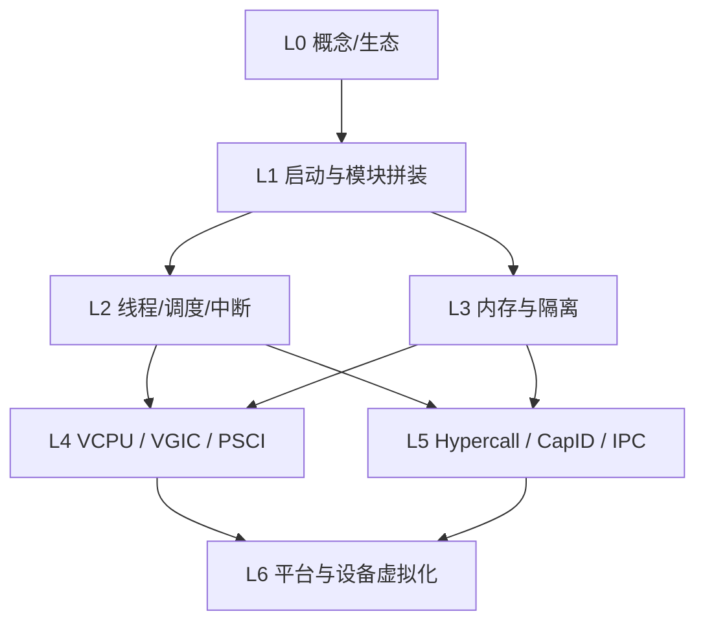

# Gunyah 系统性学习地图

按依赖顺序推进；先跑通一条启动链，再按「隔离 → 执行 → API」扩展。

| 指标 | 值 |
|------|-----|
| 学习阶段 | 7（L0–L6） |
| 课数 | 27（预备 5 + L1–L5 细拆 22）；L6 选做 |
| 建议周数 | 基础薄弱约 20+；有内核/ARM 基础可跳过第 2–5 课 |
| 主战场 | ARM64 EL2 |
| 推荐实验平台 | QEMU |
| 当前进度 | [大纲](../大纲.md) 已定；正文仍是旧 8 课，尚未按新课号重写 |

## 难度图例（红绿灯）

| 灯 | 含义 | 怎么用 |
|----|------|--------|
| 🟢 绿 | 入门：概念/文档为主，路径短 | 可一口气过；卡住就回看术语 |
| 🟡 黄 | 中等：要跟代码链，需一点架构背景 | 建议画数据流；一次只跟一条路径 |
| 🔴 红 | 偏难：跨模块或硬件细节多 | 先拿住一条端到端，再扩；允许反复回看 |

评估是相对本学习地图而言。第 1–5 课按「内核基础薄弱」编写；第 6 课起的红/黄灯仍以有预备课后的主观难度为准。每课只保留 1–2 个核心知识点，见 [大纲.md](../大纲.md)。

## 学习进度

打勾跟进即可（Markdown 任务列表：`- [ ]` → `- [x]`）。建议完成某阶段「完成标准」后再勾该阶段。

### 总览

- [ ] 🟢 L0 — 概念与预备（Type-1 / EL / 页表 / 中断 / 线程）→ 大纲第 1–5 课
- [ ] 🟡 L1 — 启动与模块拼装 → 大纲第 6–13 课
- [ ] 🟡→🔴 L2 — 内核基座 → 大纲第 14–17 课
- [ ] 🔴 L3 — 内存与隔离 → 大纲第 18–21 课
- [ ] 🔴 L4 — VM / VCPU / 中断虚拟化 → 大纲第 22–24 课
- [ ] 🟡 L5 — 对外 API 与 IPC → 大纲第 25–27 课
- [ ] 🔴 L6 — 平台与设备虚拟化（按主题选一条）→ 第 27 课末尾指引，不单独成课

### 课文对照

目标课表 27 课，每课 1–2 个核心知识点。完整表与「本课不讲」见 [大纲.md](../大纲.md)。

**正文尚未按新课号拆写。** 现阶段仍读旧 `第1课.md`–`第8课.md`；下表「现读」指向旧文件。

| 新课 | 阶段 | 核心知识点 | 现读 |
|------|------|------------|------|
| 1 | L0 预备 | Type-1；RM / PVM / SVM | [旧第 1 课](第1课.md) L0 |
| 2–5 | L0 预备 | EL0/1/2；Stage-1 页表；中断 vs 异常；线程直觉 | 待新写 |
| 6–7 | L1 | 入口汇编；`boot.ev` 总序 | [旧第 1 课](第1课.md) |
| 8–10 | L1 | `.ev`+优先级；RAM 归属；idle 半成品 | [旧第 2 课](第2课.md) |
| 11–12 | L1 | 启动锁+cpu_cold；CPULOCAL+cpu_warm | [旧第 3 课](第3课.md) |
| 13 | L1 | RootVM `vcpu_poweron` → idle | [旧第 4 课](第4课.md) |
| 14–17 | L2 | 线程对象；FPRR；切换；三把锁 | [旧第 5 课](第5课.md) |
| 18–21 | L3 | memdb；memextent；Stage-2；7 步串讲 | [旧第 6 课](第6课.md) |
| 22–24 | L4 | 进 hyp；注入 ICH_LR；WFI | [旧第 7 课](第7课.md) |
| 25–27 | L5 | 两条 HVC；CapID；doorbell（L6 点方向） | [旧第 8 课](第8课.md) |

注意：地图阶段 L3 是内存，对应大纲第 18–21 课，不是「第 3 课」。

### L0 检查点 · 🟢

- [ ] 🟢 读完 `README.md` / `docs/terminology.md` / `docs/setup.md`
- [ ] 🟢 巡览 `hyp/{core,mem,vm,platform,ipc,interfaces}`
- [ ] 🟢 能画出：硬件 → Gunyah(EL2) → RootVM(RM) → PVM/SVM

### L1 检查点 · 🟡

- [ ] 🟢 读完 `docs/build.md` / `docs/qemu.md`，了解 `config/featureset/`
- [ ] 🟡 跟通：`init_el2.S` → `boot_cold_init()` → early/cold/warm/start/idle
- [ ] 🟡 搞清线程就绪与 idle，以及 RootVM 如何交接给 RM
- [ ] 🟢 QEMU 构建跑通（`configure.py` + `ninja`）
- [ ] 🟡 能口述 cold boot 事件链，并指出 featureset 如何选模块

### L2 检查点 · 🟡→🔴

- [ ] 🟡 读对应 `hyp/interfaces/` 接口
- [ ] 🟡→🔴 跟过 thread / scheduler / preempt / irq(+GICv3) / RCU / spinlock
- [ ] 🔴 能说明 VCPU 线程如何被调度到物理 CPU

### L3 检查点 · 🔴

- [ ] 🟡 读 `memextent` / `addrspace` 接口
- [ ] 🔴 跟过 memdb → memextent → addrspace → pgtable / hyp_aspace
- [ ] 🔴 能解释一页内存从归属到映射进某个 VM 的路径

### L4 检查点 · 🔴

- [ ] 🟢 读 `docs/linux.md`
- [ ] 🔴 跟过 VCPU context switch / VGIC / VIC / PSCI / RootVM
- [ ] 🔴 能跟一条：中断进入 hyp → 注入 vIRQ → 回到 guest

### L5 检查点 · 🟡

- [ ] 🟡 读 API 文档中的 ABI + CapID（不必通读全文）
- [ ] 🟡 跟过 api / cspace / doorbell / msgqueue / partition
- [ ] 🟡 能用 CapID 讲清：对象在 hyp 内，guest 只拿 capability

### L6 检查点 · 🔴

- [ ] 🔴 按兴趣选一条：FF-A / SMMU / VirtIO / 定时器 / SoC
- [ ] 🟡 了解 `tools/codegen/` 如何生成事件、类型、超调用
- [ ] 🔴 能独立跟一条端到端路径（如 virtio 或内存捐赠）

### 能力纵切（L2 后选做）

- [ ] 🔴 安全隔离线
- [ ] 🔴 执行线
- [ ] 🔴 中断线
- [ ] 🟡 API / IPC 线

## 学习原则

- 每一阶段只跟一条端到端路径：**读代码 → 画数据流 → 在 QEMU 上验证**，不要同时铺开所有模块。
- Gunyah 是**事件驱动 + 可替换模块**：看到 `trigger_*_event` 时，去找对应的 `handle_*`。
- 不要按目录“扫一遍”，而是按依赖跟路径。

## 依赖关系图



箭头表示建议先学 A 再学 B；`L2` 与 `L3`、以及后续部分分支可并行推进。

## 项目定位（速览）

- **Type-1 Hypervisor**：直接跑在硬件之上（ARM EL2 / VHE），不依赖 Linux 等宿主 OS。
- **微内核式**：只提供关键服务，非关键能力尽量下放。
- **本仓库**：`gunyah-hypervisor`（EL2 核心）。完整系统通常还需：
  - [gunyah-resource-manager](https://github.com/quic/gunyah-resource-manager)（Root VM / 策略）
  - [gunyah-c-runtime](https://github.com/quic/gunyah-c-runtime)
  - [gunyah-support-scripts](https://github.com/quic/gunyah-support-scripts)

运行角色关系：

```text
EL2: Gunyah Hypervisor
  └─ Root VM (Resource Manager)：策略 / VM 管理
       ├─ PVM (Primary VM / HLOS)：主系统，如 Linux
       └─ SVM (Secondary VM)：由 PVM 侧发起创建
```

## 仓库结构速查

| 目录 | 作用 |
|------|------|
| `hyp/` | Hypervisor 主体（按子系统分模块） |
| `config/` | 平台 / CPU / featureset / quality 配置 |
| `tools/` | 构建、代码生成（事件、超调用、类型、寄存器等） |
| `docs/` | 术语、构建、QEMU、Linux、API |
| `configure.py` | 配置与构建入口（配合 Ninja） |

`hyp/` 分层：

| 子目录 | 内容 |
|--------|------|
| `core/` | 启动、线程、调度、中断、RCU、capability、partition、定时器 |
| `mem/` | 地址空间、页表、内存所有权、memextent、分配器 |
| `vm/` | VCPU、VGIC、VirtIO、PSCI、RootVM、虚拟设备 |
| `platform/` | GIC、SMMU、FF-A、定时器、SoC（QEMU/FVP） |
| `ipc/` | doorbell、msgqueue |
| `interfaces/` | 模块间接口与类型（`.tc` / `.hvc` / `.ev`） |
| `arch/` | 架构相关（主要 aarch64） |

---

## 分阶段路径

### L0 — 概念与全局地图（第 0 周）· 🟢

**难度**：🟢 绿 — 以文档与术语为主，建立全局图即可。

**目标**：弄清 Type-1、EL2、PVM/SVM/RM，以及本仓库在整套生态里的位置。

**先读**

- `README.md`
- `docs/terminology.md`
- `docs/setup.md`（知道配套仓库即可）
- `CHANGELOG.md`（当前能力边界）

**代码入口**

- 目录巡览：`hyp/{core,mem,vm,platform,ipc,interfaces}`

**完成标准**：能自己画出：硬件 → Gunyah(EL2) → RootVM(RM) → PVM/SVM

**对应课文**：大纲第 1–5 课（现读 [旧第 1 课](第1课.md) L0；第 2–5 课待新写）

---

### L1 — 启动与模块拼装（第 1–2 周）· 🟡

**难度**：🟡 黄 — 文档/构建偏绿；`init_el2.S` 与事件拼装是本阶段陡坡。

**目标**：从复位入口跟到 idle；理解 event handler / 模块化如何拼出运行时。

**先读**

- `docs/build.md`
- `docs/qemu.md`
- `config/featureset/`

**代码入口**

- `hyp/core/boot/aarch64/src/init_el2.S`
- `hyp/core/boot/src/boot.c` → `boot_cold_init()`
- `hyp/core/globals/`
- `hyp/core/thread_standard/src/init.c`

**完成标准**：能口述 cold boot 事件链，并指出 featureset 如何选模块

**对应课文**：大纲第 6–13 课（现读旧第 1–4 课）

#### 第一条必跟的代码链（启动）

| 步骤 | 位置 | 难度 | 你要搞清楚的事 |
|------|------|------|----------------|
| 1. EL2 入口 | `hyp/core/boot/aarch64/src/init_el2.S` | 🔴 | 复位后如何进入 Hypervisor |
| 2. Cold init | `boot.c` → `boot_cold_init()` | 🟡 | 事件链：early → cold → warm → start → idle |
| 3. 线程就绪 | `thread_standard` / `idle` | 🟡 | 为何最终进入 idle 线程 |
| 4. RootVM | `hyp/vm/rootvm/` | 🟡 | 谁创建第一个 VM、如何把控制交给 RM |

构建示例（QEMU）：

```bash
./configure.py platform=qemu featureset=gunyah-rm-qemu quality=debug
ninja
```

---

### L2 — 内核基座（第 3–5 周）· 🟡→🔴

**难度**：🟡→🔴 — thread/scheduler/preempt 偏黄；irq+GICv3、RCU 偏红。

**目标**：线程、调度、抢占、中断、同步原语——Hypervisor 的微内核层。

**先读**

- `hyp/interfaces/` 下对应接口定义

**代码入口**

- `hyp/core/thread_standard/`
- `hyp/core/scheduler_fprr/`
- `hyp/core/preempt*/`
- `hyp/core/irq*/` + `hyp/platform/gicv3/`
- `hyp/core/rcu_*/` + `spinlock_*/`

**完成标准**：能说明 VCPU 线程如何被调度到物理 CPU 上

**对应课文**：大纲第 14–17 课（现读 [旧第 5 课](第5课.md)）

---

### L3 — 内存与隔离（第 6–8 周）· 🔴

**难度**：🔴 红 — 所有权模型 + Stage-2 映射，建议画「一页内存」端到端图。

**目标**：理解所有权、Stage-2、addrspace —— 安全隔离的核心。

**先读**

- `hyp/interfaces/memextent/`
- `hyp/interfaces/addrspace/`

**代码入口**

- `hyp/mem/memdb*/`
- `hyp/mem/memextent*/`
- `hyp/mem/addrspace/`
- `hyp/mem/pgtable/`
- `hyp/mem/hyp_aspace/`

**完成标准**：能解释一页内存从归属到映射进某个 VM 的大致路径

**对应课文**：大纲第 18–21 课（现读 [旧第 6 课](第6课.md)）

---

### L4 — VM / VCPU / 中断虚拟化（第 9–11 周）· 🔴

**难度**：🔴 红 — context switch 与 VGIC 代码密度高；先跟通一条注入路径再扩。

**目标**：客户机如何真正跑起来：上下文切换、VGIC、PSCI。

**先读**

- `docs/linux.md`

**代码入口**

- `hyp/vm/vcpu/aarch64/src/context_switch.c`
- `hyp/vm/vgic/`
- `hyp/vm/vic_base/`
- `hyp/vm/psci*/`
- `hyp/vm/rootvm/`

**完成标准**：能跟一条：中断进入 hyp → 注入 vIRQ → 回到 guest

**对应课文**：大纲第 22–24 课（现读 [旧第 7 课](第7课.md)）

---

### L5 — 对外 API 与 IPC（第 12–13 周）· 🟡

**难度**：🟡 黄 — CapID / CSpace 概念清晰；坑在「不要通读整份 API」。

**目标**：从 guest 视角看 Hypercall；跨 VM 通信对象模型。

**先读**

- `docs/api/gunyah_api.md`（先读 ABI + CapID，不要一上来通读全文）

**代码入口**

- `hyp/core/api/`
- `hyp/core/cspace_*/`
- `hyp/ipc/doorbell/`
- `hyp/ipc/msgqueue/`
- `hyp/core/partition_standard/`

**完成标准**：能用 CapID 讲清：对象在 hyp 内，guest 只拿 capability

**对应课文**：大纲第 25–27 课（现读 [旧第 8 课](第8课.md)）

要点：

- HVC immediate 范围约 `0x6000`–`0x61ff`，Call-ID 编在指令 immediate 里
- CapID 是 capability space 中的索引；guest 不直接碰 hyp 内部对象

---

### L6 — 平台与设备虚拟化（第 14 周+）· 🔴

**难度**：🔴 红 — 主题多且依赖平台细节；只深挖一条（如 VirtIO 或 SMMU）。

**目标**：按兴趣深挖：FF-A、SMMU、VirtIO、定时器、SoC 适配。

**先读**

- 按主题选 `docs/` + `interfaces/`

**代码入口**

- `hyp/platform/ffa/` | `smmuv3/` | `soc_qemu/`
- `hyp/vm/virtio*/` | `vpci/` | `arm_vm_timer/`
- `tools/codegen/`（事件、类型、超调用生成）

**完成标准**：能独立跟一条端到端路径（例如 virtio 或内存捐赠）

**对应课文**：不单独成课；方向见大纲第 27 课（现读 [旧第 8 课](第8课.md) 末尾）

---

## 能力纵切（学完 L2 后按需选）

学完内核基座后，可按兴趣选一条纵切深入，而不必严格串行：

| 纵切 | 难度 | 路径 |
|------|------|------|
| 安全隔离线 | 🔴 | memdb → memextent → addrspace/pgtable → Stage-2 → abort 处理 |
| 执行线 | 🔴 | thread → scheduler → VCPU context switch → trap/exception → return guest |
| 中断线 | 🔴 | GICv3 → irq core → VIC/VGIC → vIRQ 注入 → PSCI/电源 |
| API / IPC 线 | 🟡 | HVC ABI → CapID/CSpace → object/partition → doorbell/msgqueue |

## 常见弯路

- 一上来通读完整 `docs/api/gunyah_api.md`
- 还没懂启动/内存就扎进所有 `virtio_*`
- 同时铺开太多模块，没有一条能讲清楚的路径

## 今天就能开始

1. 先看 [大纲.md](../大纲.md)。正文未拆完之前，按大纲「现读」列对照旧 8 课。
2. 读：`README.md` → `docs/terminology.md` → `docs/build.md`
3. 跟启动链：`init_el2.S` → `boot_cold_init()` → 事件链 early/cold/warm/start/idle

---

*地图基于本仓库目录与 `docs/`；配套 Resource Manager / Runtime 建议在 L1 跑通 QEMU 后并行了解。*
