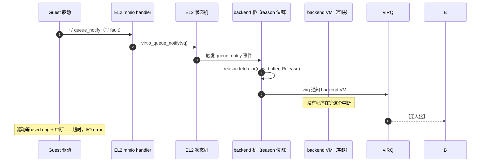
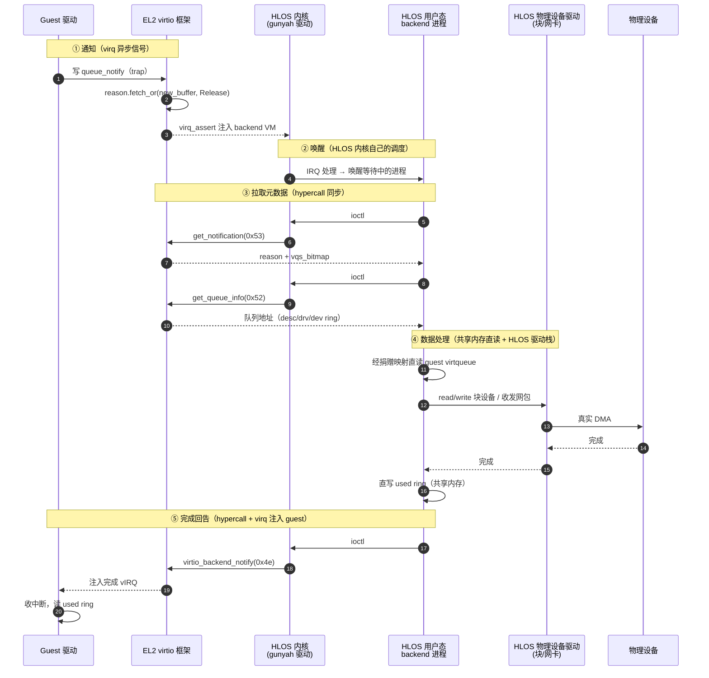

# Gunyah 里的 virtio 流程调研

> 本文是 2026-09-23 围绕"Gunyah（C 版）能不能让 guest 通过 virtio 用上硬盘/网卡"的一次完整讨论的总结，
> 并修正了此前几份调研报告中的偏差。
>
> 证据来源（均已逐文件/逐命令验证）：
> - C 版 Gunyah：本地 `D:\work\gunyah-hypervisor`（`hyp/vm/virtio*`、`hyp/interfaces/virtio_backend/virtio_backend.hvc`）
> - C 版 RM：`10.42.27.86:.../gunyah-src/resource-manager`（`src/vm_config/vm_config.c`、`src/guest_interface.c`）
> - Rust 版 xhyper 三仓（2026-09-23 拉新后）：xhyper `main@d67e6f5e`、xhyper-mgr `main@0a39089`、xhyper-abi `main@cba464c`
> - 关联设计文档：`docs/superpowers/specs/2026-09-23-xhyper-el2-virtio-design.md`（xhyper EL2 virtio 实现设计）
> - 插图需 Mermaid 渲染支持（GitHub / VS Code Markdown Preview Mermaid）

---

## 执行摘要：谁干什么（三段式）

Gunyah 的 virtio 架构是经典微内核三层在 virtio 场景的投影——**关键在内核、
编排在中层、重活委派给用户态**：

| 层 | 职责 | 现状 |
|---|---|---|
| **EL2（hyper）** | virtio 安全核心：transport、状态机、桥对象、virtq、capability 校验 | ✅ OSS 已做（5645 行） |
| **Root VM（RM/mgr）** | backend **生命周期编排**：create/configure/bind_virq/activate/deactivate/cleanup、capability 路由、DT 生成、内存捐赠、中断接线、失败补偿 | ✅ OSS 已做（管理面），xhyper-mgr 休眠待唤醒 |
| **HLOS（PVM/Host）** | backend **任务执行**：拉取请求、处理 virtqueue、读写 guest 内存、对接真实驱动栈做 I/O、写 used ring、notify 回 EL2 | ❌ **OSS 空缺**——生产由闭源 HLOS 用户态 daemon 补 |

两点精度（避免被宽解）：

1. Root VM 的"调度"是**生命周期 + 资源编排**，不是 runtime CPU 调度——backend
   真跑起来后由 backend VM 自己的 OS（HLOS 内核调度器）排。这也是为什么 backend
   不能塞进 Root VM（mgr 是 no_std 裸机、无驱动栈，方案 C 已否决）。
2. 数据面 runtime **两边分担**：EL2 跑每次 trap（状态机推进 + reason 位图 +
   virq 通知）；HLOS 跑 payload（描述符处理 + 真实 I/O）；EL2 再收 `notify(0x4e)`
   给 guest 注入完成 vIRQ。"任务执行在 HLOS"对重 I/O 而言成立，但 per-access
   trap 处理仍在 EL2。

下面 §1 起是对这个三段式的逐层证据展开。

---

## 1. 一句话结论

**框架生产级、数据面留白**：开源 Gunyah 能陪 guest 的 virtio 驱动一路走到 `DRIVER_OK`
（设备枚举成功、驱动初始化完成），但**第一个 I/O 请求会永远挂起**——virtio 链路的
最后一步（backend 程序）在开源树里不存在，而且这是**有意留白的交付边界**：合同
（ABI/对象模型/通知机制）是冻结的生产级，"设备的肉"留给部署方/产品侧。

---

## 2. 全链路流程：一台 virtio 设备从"被发现"到"第一次 I/O"

### 2.1 发现：guest 看到的"硬件世界"是 RM 写出来的

ARM 没有硬件自发现机制，内核靠 **DT（Device Tree，设备树）** 知道机器上有什么设备。
guest 的 DT 不是天生的——RM 在给 guest 造 DT 时**写入 virtio 设备节点**：

```text
vm_config.c:1426   node->generate = strdup("/vsoc/qcom,virtio_mmio");
```

节点内容即设备契约：`compatible = "virtio,mmio"`（驱动按此匹配）、`reg`（config cache
页的 IPA 地址——就是那个"只读 mirror"页）、`interrupts`（frontend vIRQ 接到 guest 的 GIC）。
没有这个节点，guest 内核根本不会 probe 设备，后面的一切都无从谈起。

### 2.2 probe 与协商：读不 trap，写才进 EL2

guest Linux 标准 `virtio_mmio` 驱动 probe 时：

- **读**（magic/device_id/features 等 common 寄存器）：直接命中 guest Stage-2 里的
  **只读映射**（同一页物理内存，guest 侧 RO）——**连 trap 都不进 EL2**，零成本；
  页内容由 EL2（唯一写者）维护，所以 guest 读到的永远是新值
- **写**（选 feature、设队列、写 status）：写 RO 映射触发 **permission fault** 进
  EL2 的 vdevice handler，走三态派发（`Unhandled` / `Fault` / `Emulated`）

状态机在 EL2 严格按 virtio 规范递进（`frontend.c` 的 `virtio_write_status`）：

```text
写 0 → 复位请求（置 NEEDS_RESET + 清队列 ready + 通知 backend，读 status 阻塞等复位完成）
ACK → DRIVER → FEATURES_OK → DRIVER_OK（触发 driver_ok 通知）→ 运行
任意时刻写 FAILED；guest 自写 NEEDS_RESET 被拒（仅 backend 可设）
```

**到这里一切正常**——设备"成功上线"，`lspci`/`dmesg` 里驱动初始化日志完全正常。

### 2.3 第一次 I/O：通知已发出，无人应答



关键认知：**EL2 转发的是"通知"，不是数据**。数据面是**拉模式**——backend 收到
virq 后需要自己：`get_notification`(0x53) 取 reason + vqs_bitmap →
`get_queue_info`(0x52) 取队列地址 → 经捐赠映射自己读写 guest 内存 → 处理完写
used ring → `notify`(0x4e) 让 EL2 给 guest 注入完成中断。

所以"卡在最后一步"的准确形状：**设备枚举一切正常，第一个读写请求挂死**。

### 2.4 完整往返：backend 落 HLOS 时的形态

把 §2.3 里那个"空缺"补上，一次 I/O 完整往返是这样的（生产形态；OSS 里没人写这段）：



**一次 I/O 用了三种完全不同的机制**，不是单一的消息或接口调用：

| 阶段 | 机制 | 说明 |
|---|---|---|
| ① 异步唤醒 | **virq（虚拟中断）** | EL2 给 backend VM 注入一个虚拟中断，HLOS 内核像收普通设备中断一样收它。**不是 msgq 消息**——Gunyah 的 msgq 是另一套 IPC（给 RM↔HLOS 的 RPC 用），virtio backend 不走它 |
| ③ 元数据/控制交换 | **hypercall（同步拉模式）** | backend 主动调 `get_notification`/`get_queue_info` 拉 reason 和队列地址；处理完调 `notify` 推回。在 HLOS 用户态经 ioctl → gunyah 内核驱动 → hypercall |
| ④ 批量数据 | **共享内存直读直写** | guest 的 virtqueue 内存经 memextent 捐赠映射进了 backend VM 的地址空间——backend 像访问自己内存一样读写，**没有 per-access hypercall**。这正是高性能的关键 |

这和 KVM 的 `irqfd`+`ioeventfd`+内存映射是同一套思路（信号/控制/数据分离）。Gunyah 没现成的 irqfd/ioeventfd 等价物——这是 xhyper 调研里识别出的**性能缺口**，需要补。

### 2.5 HLOS 的驱动依赖：两层都要

物理设备要真正动起来，HLOS 上必须有**两类驱动**，缺一不可：

1. **Gunyah 接口驱动**（Linux 内核侧）：把 hypercall ABI 暴露给用户态（`/dev/gunyah` 一类的 ioctl）、收 backend virq、管理捐赠内存映射。这是 backend 机制的"地基"——没它，backend 进程没法调 hypercall、收不到唤醒中断。Gunyah OSS 这块在上游 Linux 内核的 `drivers/virt/gunyah/`；xhyper 对应的是 Host Linux 内核里的 `/dev/xhyper` UAPI（设计文档里标为 Stage 3 的跨仓依赖）。
2. **物理设备驱动**（HLOS 原本就有的）：backend 进程不直接碰硬件——它只是个"协议翻译 + 调度"层，把 guest 的 virtio 请求翻译成 HLOS 的常规 I/O 调用（`read/write` 块设备、收发 socket/tap 网包），**真正和硬件打交道的是 HLOS 自己的块/网卡驱动**（NVMe/UFS/SATA/以太网驱动等），跑真实 DMA。

**这就是 backend 必须落 HLOS、不能落 Root VM 的根本原因**：HLOS 有现成的、成熟的物理设备驱动栈可复用；Root VM（mgr）是 no_std 裸机，没有任何驱动——往里塞 backend 等于要重写一遍 Linux 驱动栈，就是"方案 C"被否决的核心论据。backend 进程本身很薄（就是 virtio 协议 ↔ HLOS 系统调用之间的胶水），重活全让 HLOS 已有驱动干。

---

## 3. 五层能力盘点：谁现成、谁空缺

| 层 | 状态 | 证据 |
|---|---|---|
| Guest 驱动 | ✅ 现成 | 标准 Linux virtio-mmio/pci 驱动，零改动 |
| EL2 框架（transport + 状态机 + 桥对象 + virtq 辅助） | ✅ 生产级 | `hyp/vm/virtio*` 7 模块、5645 行 |
| RM 管理面 | ✅ 现成 | `vm_config.c` 解析 virtio_mmio/pci 配置（可指定 device_type 含 BLOCK/NETWORK）、创建 backend 对象、**把 backend capability 拷给配置指定的 backend VM**、生成 DT 节点、绑中断、连同步复位模式都有 |
| 数据面客户端库 | ✅ 现成 | `guest_interface.c` 全套 C 封装（0x49–0x55）——给写 backend 的人预备的合同 |
| **Backend 程序本身** | ❌ **不存在** | 全树只有 input/iommu 两个 **EL2 内** backend；blk/net/gpu/console：没有。通知发了没人接 |

注意措辞：**不是"backend 实现了一半、缺功能"，而是 backend 这个角色本身不存在**——
RM 能把 backend capability 递到某个 VM 手里，但开源树里没有任何代码供那个 VM 接活。
这是一个"合同完备、实现留空"的插槽。

生产里补这个插槽的是 **Qualcomm 产品侧的 HLOS 用户态 backend（闭源）**。两个佐证：

1. 公开的 Gunyah demo（boot Linux SVM）**根本不用 virtio**——用 pl011 console
   proxy + msgq 共享内存
2. `gunyah-src` 里另有 `n90-acpi-passthrough/`——产品在用**透传**补设备面，
   与 virtio 互为印证（混合形态）

---

## 4. ABI 合同：0x49–0x55 全表（已冻结）

`hyp/interfaces/virtio_backend/virtio_backend.hvc`（call_num 为权威编号）：

| call_num | hypercall | 方向 | 作用 |
|---|---|---|---|
| — | `partition_create_virtio_backend` | RM→EL2 | 在 partition cspace 里创建对象 |
| 0x49 | `virtio_backend_configure` | RM→EL2 | transport 类型/memextent/vqs_num/flags |
| 0x4c | `virtio_backend_bind_virq` | RM→EL2 | frontend vIRQ 绑 VIC |
| 0x4d | `virtio_backend_unbind_virq` | RM→EL2 | 解绑 |
| 0x4e | `virtio_backend_notify` | backend→EL2 | 置 interrupt_status/触发 config 更新 |
| 0x4f | `virtio_backend_set_dev_features` | backend→EL2 | 设备 feature 字（须待复位） |
| 0x50 | `virtio_backend_set_queue_size_max` | backend→EL2 | 每 VQ 最大长度（须待复位） |
| 0x51 | `virtio_backend_get_drv_features` | backend→EL2 | 取驱动协商的 feature |
| 0x52 | `virtio_backend_get_queue_info` | backend→EL2 | 取 VQ size/ready/desc/drv/dev |
| 0x53 | `virtio_backend_get_notification` | backend→EL2 | 取 vqs_bitmap + reason（拉模型） |
| 0x54 | `virtio_backend_acknowledge_reset` | backend→EL2 | 确认复位完成 |
| 0x55 | `virtio_backend_update_status` | backend→EL2 | 后端改 status（如 NEEDS_RESET） |

`reason` 位域：`new_buffer` / `reset_request` / `driver_ok` / `failed`；
`notify_flags`：`per_queue` / `config_update`。

---

## 5. 对早期调研的三处修正（逐文件验证）

1. **`virtio_input` / `virtio_iommu` 的 backend 逻辑在 EL2 内部**，不在 RM VM。
   证据：`hyp/vm/virtio_input/src/hypercalls.c` 的 `hypercall_virtio_input_configure`
   是 EL2 侧 handler（`cspace_lookup_virtio_backend` + 直接操作 `virtio_backend_t`）。
   RM 只是经 hypercall 配置它们。
2. **RM 没有任何设备 backend 实现**。`resource-manager/src/` 里 virtio 相关仅在
   `vm_config/vm_config.c` 等（管理面）；数据面客户端库在 `guest_interface.c`，
   无消费者。
3. **`virtio_iommu` 规模修正**：它自带一套 1100+ 行的 `virtio_virtq.c` 请求处理
   引擎（不复用那个 201 行的通用辅助），加主文件合计 1600+ 行，是 EL2 内 backend
   复杂度的上限参照。

---

## 6. virtio 在 Gunyah 里的真实体量（量化）

| 维度 | 数字 | 占比 |
|---|---|---|
| `hyp/vm` 模块 | virtio* 家族 7 / 44 个 | 16% |
| `hyp/vm` 代码行 | 5645 / 28977 行 | **19.5%** |
| hypercall ABI | 18 / 89 条（virtio/vpci/viommu） | **20.2%** |
| top 12 大模块 | virtio 家族占 5 席 | — |

单模块排行：`vgic`(10216) 第一、`vpci`(2684，主要为 virtio-pci 服务) 第二、
`virtio_iommu`(1680) 第四、`virtio_pci`(1018) 第六、`virtio`(745) 第十、
`virtio_backend`(728) 第十一、`virtio_input`(700) 第十二。加 vpci 后"设备虚拟化栈"
约 8300 行 ≈ `hyp/vm` 的 29%。

**定位判断**：virtio 是 Gunyah 的**设备虚拟化主力路径**（Secondary VM 获得可用设备
的几乎唯一通用机制），但**不是内核本体**——不可去的核心是 vcpu/内存归属/中断路由/
能力模型/调度；virtio 的每个模块都建立在这些之上。类比 Linux："驱动占内核代码
大半，但没人说驱动是调度器"。**vgic/memdb 是心脏和血管，virtio 是最大的器官。**

这个体量也是设计哲学的"最大压力测试"：为了守住 TCB 不含 Host Linux，Qualcomm 宁可
自研 5645 行 EL2 代码 + 20% 的 ABI 面，也不把设备面甩给 crosvm 式用户态 VMM——
同时精确控制自研边界（协议与安全关键路径留 EL2，"设备的肉"留给部署方）。

---

## 7. 透传与 virtio：两条平行的路

**做透传不需要 virtio 框架**——透传给 guest 的是真设备（原生驱动 + 真 MMIO + 真
中断），virtio 给 guest 的是假设备（virtio 驱动 + 仿真设备模型）。两条线不互相
依赖，共用的只是地基（对象模型、virq、memextent/addrspace）。

透传真正的前置件是 **SMMU**：设备 DMA 用 guest 编程的地址（IPA），**不经过
Stage-2**，必须由 SMMU 翻译，否则要么失败、要么 DMA 进别的 VM / EL2 内存（安全洞）。
QEMU 上现有"透传"能跑是因为 QEMU 设备的"DMA"是 QEMU 进程写内存后端，不经过硬件
地址翻译——**真硬件透传没有 SMMU 就不成立**。

**virtio 家族里唯一为透传服务的成员是 `virtio_iommu`**：它不是给 virtio 设备用
的 IOMMU，而是让 guest 用标准 Linux virtio-iommu 驱动管理**透传设备**的 DMA 映射
（ATTACH/MAP/UNMAP/INVALIDATE/PROBE → EL2 编程物理 SMMUv3 的 STE/CD/TLB）。
另一条更简单的 DMA 路线是 Gunyah 的 `arm_vm_smmuv2`：把物理 SMMU 直接透给 guest
（guest 跑原生 SMMU 驱动，EL2 只保护关键流）。

| | 透传 | virtio |
|---|---|---|
| 性能 | 极致（零 trap 零仿真） | 有仿真/通知开销 |
| 设备共享 | 差（设备整块划走） | 好（可镜像/共享给多 VM） |
| 灵活调配 | 差（受物理设备数限制） | 好（设备按需创建） |
| 硬件依赖 | **必须有 SMMU** | 无 |
| guest 驱动 | 原生 | virtio（Linux 原生支持） |

生产形态是混合：少量性能关键设备透传，大量设备 virtio。

---

## 8. xhyper 现状对照（2026-09-23 拉新后）

### 8.1 EL2：virtio 零实现，但"派发框架"并非没有

- `hypervisor/` 全树 find/grep virtio = **零**（无任何 virtio transport/状态机/backend）
- 但 EL2 已有多个 **MMIO 三态派发先例**（与 Gunyah vdevice 合同同构）：
  vGIC 的 GICD/GICR aperture、vITS 的 vdevice 窗口、vRTC（PL031/Phytium，DT 与
  ACPI Host 均已跑通）；范围注册经 `ADDRSPACE_CONFIGURE_RANGE(ADD_VMMIO)`
- **vSMMUv2 对象已存在**（`ObjectKind::VirtualSmmuv2` +
  `HYPERCALL_PARTITION_CREATE_VSMMUV2` + attach-addrspace 语义）——透传那条线
  也在铺
- 平台快速扩张：T11206（展锐 UMS9620 类）、rk3588、qemu_virtcca defconfig

### 8.2 ABI：三层缺口定位（修正早期调研"xhyper-abi 数据面缺"的说法）

- **定义层完整**：xhyper-abi 冻结快照（`generated/hypercalls.rs`）已含全部
  11 条 `virtio_backend_*`（0x49–0x55），编号与 Gunyah 逐条一致，位域类型
  一比一移植；EL2 的 `hypervisor/abi` include 的正是这份快照（常量现成）
- **消费层**：mgr 内嵌 `operation.rs` 只封装管理面（mgr 正迁移共享 codegen 输出）
- **实现层**：EL2 runtime 分发表无任何 `VIRTIO_BACKEND_*` handler——要填的全部

### 8.3 mgr：2000+ 行对象编排层（休眠待唤醒）

`virtual_device.rs` 有完整的 realize/compensate/cleanup 事务模型（失败补偿、
回滚），vRTC 域是**活的**（phase-d4-probe 验证）；virtio_mmio/pci/iommu 默认
`Unavailable`（platform 域可显式开启，但开了 EL2 也没实现）。另有
`PhysicalStreamBinding`/`bind_physical_streams`（对标 Gunyah viommu_bind_streams）。

### 8.4 讽刺对比：框架完整 ≠ 交付完整

| | Gunyah（C，OSS） | xhyper + crosvm |
|---|---|---|
| EL2 virtio 框架完成度 | 生产级 | **零** |
| **guest 今天能不能用上 virtio 硬盘** | **不能** | **能**（phase-d4-2：ext4 读写回读） |

xhyper 做到的原因：**crosvm 就是那个 backend 程序**——填的是 Gunyah 留空的同一个
插槽，只是供应链不同（crosvm 走 KVM 式 `VCPU_RUN` + 直接映射 guest 内存，而非
Gunyah 的 hypercall 合同）。Gunyah 把安全关键路径做到生产级、交付闭环留白；
xhyper 用 crosvm 一站式拿走交付闭环、框架层零积累。

---

## 9. 对 xhyper 实现设计的含义

1. **Stage 0 大幅变轻**：不是"从零建 MMIO 派发框架"，而是把 vRTC/vITS 已验证的
   `ADD_VMMIO` + 三态派发**泛化**成多设备动态注册表
2. **Stage 3（backend 宿主）没有免费午餐**——连 Gunyah 都没在 OSS 里解决它：
   这一步没有"实现"可抄，只有"选型"要做（backend 放 Host 用户态精简进程走
   hypercall，对标 Gunyah 生产形态；mgr 内嵌块设备栈已论证为错误方向）
3. **组织信号**：xhyper-abi 在逐块导入 Gunyah ABI 面（vRTC hypercalls、virtual
   ITS、virtio_backend 全家），vRTC/vITS/vSMMUv2 对象相继立起——团队路线就是
   逐对象对标移植 Gunyah，**virtio 是名单上的下一块**
4. 详细设计（分四阶段、组件、机制、门禁、风险）见
   `docs/superpowers/specs/2026-09-23-xhyper-el2-virtio-design.md`

---

## 10. 附录：DT（设备树）速览

DT 是描述"机器上有什么硬件"的数据结构，开机时交给内核。ARM 没有硬件自发现机制
（不像 x86 的 PCI 枚举），所以 bootloader 负责传递一份 DTB（编译后的二进制），
内核解析这棵节点树后按 `compatible` 字符串匹配驱动去 probe。

```dts
virtio@4a000000 {
    compatible = "virtio,mmio";              /* 驱动按这个字符串匹配 */
    reg = <0x0 0x4a000000 0x0 0x200>;        /* MMIO 区地址和大小 */
    interrupts = <0 42 4>;                   /* GIC 42 号 SPI */
};
```

在 virtio 语境里：**guest 发现 virtio 设备的机制就是 DT 节点**，而节点是 RM/mgr
写进 guest DT 的——guest 看到的"硬件世界"由资源管理器定义。另一条硬件描述路线
是 ACPI（xhyper 最近为 T11206 加的 `firmware_defconfig` 路径），对 virtio 设备
来说 DT 是主流发现机制。
